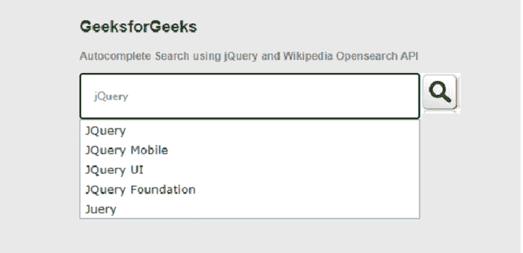

# 使用 jQuery 和维基百科 OpenSearch API 自动完成搜索

> 原文:[https://www . geesforgeks . org/autocomplete-search-use-jquery-and-Wikipedia-open search-API/](https://www.geeksforgeeks.org/autocomplete-search-using-jquery-and-wikipedia-opensearch-api/)

在网页设计中，自动完成功能是一个常见的功能。当用户在搜索文本框中键入一些值时，它会自动以下拉列表的形式显示相关的建议列表，用户可以轻松选择。关于 jQuery 自动完成功能，[参考本文](https://www.geeksforgeeks.org/jquery-autocomplete-selection-event/)。

**方法:**在本文中，我们使用了**维基百科开放搜索 API** 和 jQuery 自动完成 UI。基本的 HTML 代码用于输入文本框中关键字搜索的用户界面。当使用 jQuery 代码时，搜索请求被发送到维基百科，维基百科又根据用户输入返回一个建议列表。数据响应采用 JSON 格式。

**语法:**API 的维基百科 URL

```html
"http://en.wikipedia.org/w/api.php"
```

**设置环境:**了解更多选项设置

```html
https://en.wikipedia.org/w/api.php?action=help&modules=opensearch
```

开发人员可以参考上面的网址链接，并根据应用程序的需要使用许多选项设置。

**jQuery 和 jQuery UI 库:**代码中使用了以下文件。

> <src = " https://Ajax . Google APIs . com/Ajax/libs/jquery ui/1 . 11 . 3/jquery-ui . min . js "></script><src = " " https://Ajax . Google APIs . com/Ajax/libs/jj

**示例:**以下示例通过使用**维基百科 OpenSearch API** 和 jQuery 演示了自动完成搜索功能。HTML 代码提供了一个普通的搜索输入框，当用户输入一些搜索文本时，它会给出建议。

```html
<!DOCTYPE html>
<html>

<head>
    <script src=
"https://ajax.googleapis.com/ajax/libs/jquery/2.1.3/jquery.min.js">
    </script>
    <link rel="stylesheet" href="
https://ajax.googleapis.com/ajax/libs/jqueryui/1.11.3/themes/smoothness/jquery-ui.css" />
    <script src="
https://ajax.googleapis.com/ajax/libs/jqueryui/1.11.3/jquery-ui.min.js">
    </script>

    <style>
        body {
            width: 100%;
            background: #e9e9e9;
            margin: 0 auto;
            padding: 0;
            color: #7faf7f;
            font-family: Arial, sans-serif;
            font-size: 12px;
        }

        #searchID input {
            width: 350px;
            height: 20px;
            margin: 0;
            padding: 15px;
            background: #fff;
            border: 1px solid black;
            color: #727272;
            float: left;
            font: 12px "Lucida Sans Unicode", sans-serif;
            transition: background 0.4s ease-in-out 0s;
        }

        #searchID button {
            width: 45px;
            height: 45px;
            text-indent: -9999em;
            background: url("searchIcon.jpg") #4eac10;
            transition: background 0.3s ease-in-out 0s;
            border: 1px solid #fff;
        }

        #containerID {
            width: 50%;
            margin: 0 auto;
        }

        h2 {
            color: green;
            text-align: left;
        }
    </style>
</head>

<body>
    <div id="containerID">
        <div>
            <h2>GeeksforGeeks</h2>
            <b>
                Autocomplete Search using jQuery
                and Wikipedia Opensearch API
            </b>

            <p></p>

            <form method="get" id="searchID">
                <input type="text" class="searchClass" 
                    id="searchInputID" value="" />
                <button type="submit">Search</button>
            </form>
        </div>
    </div>

    <script type="text/javascript">
        $(".searchClass").autocomplete({
            source: function (request, response) {
                console.log(request.term);
                $.ajax({

                    // Wikipedia API url link
                    url:
                    "http://en.wikipedia.org/w/api.php",
                    dataType: "jsonp",
                    data: {
                        action: "opensearch",
                        // Output format
                        format: "json",
                        search: request.term,
                        namespace: 0,

                        // Maximum number of result
                        // to be shown
                        limit: 8,
                    },
                    success: function (data) {
                        response(data[1]);
                    },
                });
            },
        });
    </script>
</body>

</html>
```

**输出:**
