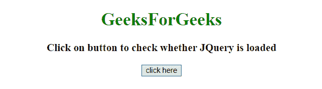
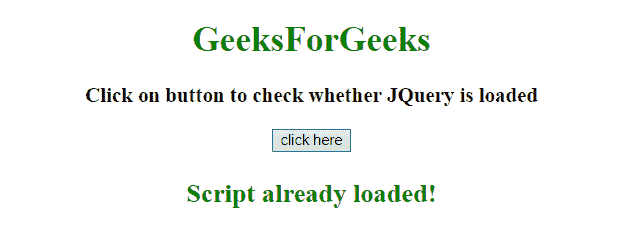
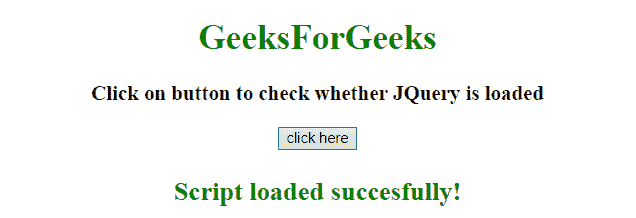

# 检查 jquery 是否已经加载

> 原文:[https://www . geesforgeks . org/check-if-a-jquery-已加载或未加载/](https://www.geeksforgeeks.org/check-if-a-jquery-has-been-loaded-or-not/)

给定一个文档，任务是确定是否已经加载了 JQuery，如果没有，则使用 JavaScript 动态加载。以下是要检查的示例:
**方法:**

*   首先检查它是否已加载。
*   如果没有加载，则动态加载它，创建一个脚本元素，并向其添加类似**(类型，src)** 的属性，然后最终将其追加到头部元素内部的末尾。

**示例 1:** 在本例中，JQuery 已经加载，因此消息**“脚本已经加载！”**在屏幕上打印。

```
<!DOCTYPE HTML>
<html>

<head>
    <title>
        JavaScript 
      | Check if jquery has been loaded, If not then load.
    </title>
    <script src=
"https://ajax.googleapis.com/ajax/libs/jquery/3.4.0/jquery.min.js">
    </script>
</head>

<body style="text-align:center;" 
      id="body">
    <h1 style="color:green;">  
            GeeksForGeeks  
        </h1>
    <p id="GFG_UP" 
       style="font-size: 19px; 
              font-weight: bold;">
    </p>
    <button onClick="GFG_Fun()">
        click here
    </button>
    <p id="GFG_DOWN" 
       style="color: green; 
              font-size: 24px; 
              font-weight: bold;">
    </p>
    <script>
        var up = 
            document.getElementById('GFG_UP');
        var down = 
            document.getElementById('GFG_DOWN');
        up.innerHTML = 
          "Click on button to check whether JQuery is loaded";

        function GFG_Fun() {
            if (!window.jQuery) {
                var el = document.createElement('script');
                el.type = "text/javascript";
                el.src = 
"https://ajax.googleapis.com/ajax/libs/jquery/3.4.0/jquery.min.js";
                document.getElementsByTagName(
                  'head')[0].appendChild(el);
                down.innerHTML = "Script loaded successfully!";
            } else {
                down.innerHTML = "Script already loaded!";
            }
        }
    </script>
</body>

</html>
```

**输出:**

*   **点击按钮前:**
    
*   **点击按钮后:**
    

**例 2:** 脚本元素的 src 属性改为 sc。在这个例子中，JQuery 没有被加载，所以消息**“脚本加载成功！”**加载成功后在屏幕上打印。

```
<!DOCTYPE HTML>
<html>

<head>
    <title>
        JavaScript 
      | Check if jquery has been loaded, If not then load.
    </title>
    <script sc=
"https://ajax.googleapis.com/ajax/libs/jquery/3.4.0/jquery.min.js">
    </script>
</head>

<body style="text-align:center;" 
      id="body">
    <h1 style="color:green;">  
            GeeksForGeeks  
        </h1>
    <p id="GFG_UP" 
       style="font-size: 19px; 
              font-weight: bold;">
    </p>
    <button onClick="GFG_Fun()">
        click here
    </button>
    <p id="GFG_DOWN"
       style="color: green;
              font-size: 24px;
              font-weight: bold;">
    </p>
    <script>
        var up = 
            document.getElementById('GFG_UP');
        var down = 
            document.getElementById('GFG_DOWN');
        up.innerHTML = 
          "Click on button to check whether JQuery is loaded";

        function GFG_Fun() {
            if (!window.jQuery) {
                var el = 
                    document.createElement('script');
                el.type = "text/javascript";
                el.src = 
"https://ajax.googleapis.com/ajax/libs/jquery/3.4.0/jquery.min.js";
                document.getElementsByTagName(
                  'head')[0].appendChild(el);
                down.innerHTML = "Script loaded successfully!";
            } else {
                down.innerHTML = "Script already loaded!";
            }
        }
    </script>
</body>

</html>
```

**输出:**

*   **点击按钮前:**
    
*   **点击按钮后:**
    