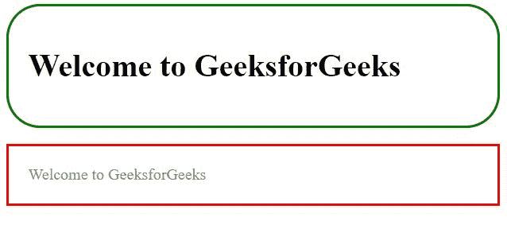
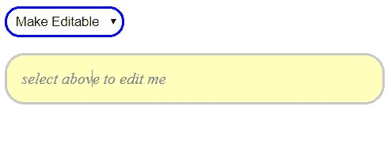

# jQuery 中的内容可编辑变更事件

> 原文:[https://www . geesforgeks . org/content-edited-change-event-in-jquery/](https://www.geeksforgeeks.org/content-editable-change-event-in-jquery/)

一般来说，jQuery 提供各种函数来处理选择器、选择器属性甚至文档等。
而这里使用 jquery 更改事件进行内容编辑。

**jQuery Change 事件:**
当一个元素的值改变时会发生，当用户用鼠标进行选择或当字段失去焦点时，也会立即触发该事件。

**语法:**

```html
$(selector).change(function callback);

```

**内容可编辑:**
内容可编辑主要是所有 HTML 元素的一个属性。
当该属性为真时，该元素将显示可编辑内容。
为假时，内容可编辑禁用。

**属性:**

```html
contenteditable="true"

```

**示例 1:**
我们来看一个示例程序，检查元素是可编辑的还是具有属性*“content editable”*，该属性使用 jQuery change 事件设置为 true 或 false。

```html
<!DOCTYPE html>
<html>

<head>
    <script src=
"https://ajax.googleapis.com/ajax/libs/jquery/3.4.1/jquery.min.js">
  </script>

    <style>
        div {
            padding: 20px;
            outline: none;
        }

        p {
            color: grey;
            outline: none;
            padding: 20px;
        }
    </style>
</head>

<body>

    <div>
        <h1>
          Welcome to GeeksforGeeks
      </h1></div>
    <p contenteditable="true">
      Welcome to GeeksforGeeks
  </p>

    <script>
        //checking div tag as attribute contenteditable 
        $(document).ready(function() {
            $("div").change(function() {
                var conattr = $(this).attr('contenteditable');
                if (typeof conattr !== typeof undefined && conattr !== false) {
                    //if div tag as attribute contenteditable 
                    $(this).css('border', 'solid 2px red');
                } else {
                    //if doesn't have div tag as attribute contenteditable 
                    $(this).css({
                        "border": "solid 2px green",
                        "border-radius": "34px"
                    }).attr('contenteditable', 'true')

                }
            }).trigger("change");
        });
        //checking p tag as attribute contenteditable  
        $(document).ready(function() {
            $("p").change(function() {
                var conattr = $(this).attr('contenteditable');
                if (typeof conattr !== typeof undefined && conattr !== false) {
                    //if p tag as attribute contenteditable 
                    $(this).css('border', 'solid 2px red');
                } else {
                    //if doesn't have p tag as attribute contenteditable 
                    $(this).css({
                        "border": "solid 2px green",
                        "border-radius": "34px"
                    }).attr('contenteditable', 'true')

                }
            }).trigger("change");
        });
    </script>
</body>

</html>
```

**输出:**



**示例 2:**
我们来看一个示例程序，通过使用 jQuery change 事件选择下拉选项，使元素可编辑或不可编辑。

```html
<!DOCTYPE html>
<html lang="en">

<head>
    <meta charset="utf-8">
    <style>
        select {
            border: 2px solid blue;
            border-radius: 15px;
            padding: 5px;
            outline: none;
        }

        p {
            border: 2px solid #c9c9c9;
            border-radius: 20px;
            padding: 15px;
            outline: none;
            background: #ffb;
        }
    </style>
    <script src=
"https://code.jquery.com/jquery-1.10.2.js">
  </script>
</head>

<body>
    <select name="element">

        <option selected="selected" disabled>
          Select to Edit
      </option>
        <option value="true">Make Editable</option>

        <option value="false">Deny Editable</option>

    </select>
    <div></div>
    <script>
        $("select")
            .change(function() {
                var ele01 = "<p contenteditable='";
                $("select option:selected").each(function() {

                    ele01 += $(this).val() + "" + "'>select above to edit me</p>";
                });
                $("div").html(ele01);
                if ($("select").val() == "false" || $("select").val() == "") {
                    $("p").css({
                        "font-weight": "bold",
                        "color": "blue",
                        "font-style": "italic",
                        "cursor": "none"
                    });
                } else {
                    $("p").css({
                        "color": "grey",
                        "font-style": "italic"
                    });
                }
            })
            .change();
    </script>
</body>

</html>
```

**输出:**
