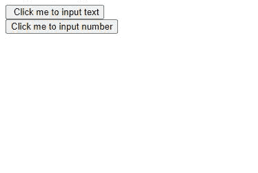
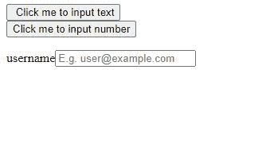
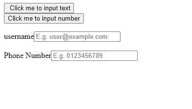

# 使用数据表单和 jQuery 动态创建表单

> 原文:[https://www . geeksforgeeks . org/create-a-form-dynamic-using-d form-and-jquery/](https://www.geeksforgeeks.org/create-a-form-dynamically-using-dform-and-jquery/)

如果你曾经使用过谷歌表单，你可能会想知道它是如何工作的。终端用户如何动态创建表单。如果你曾经想到过这些问题，那么这篇文章可以帮助你。

**先决条件:**

*   HTML 和 CSS 的基础
*   JQuery 的基础

我们将在这里使用的插件是 dform。jQuery.dForm 插件从 JavaScript 对象生成 HTML 标记，并为 HTML 表单生成 JSON。

**你能用数据表单插件做什么？**

*   您可以使用自己的扩展和自定义类型自然地生成 JavaScript 增强的标记。
*   可以用 JSON 和 JavaScript 代替 HTML 标记。
*   这是一种包含 JQuery 用户界面元素的简单方法。
*   服务器端框架的业务对象构成的支架形式。
*   更多详情可参考这里:[点击这里](https://github.com/daffl/jquery.dform)

**这个插件怎么用？**

*   创建一个空文件，将其命名为 index.js，以便在我们的 HTML 文件中使用。
*   [点击这里](https://raw.githubusercontent.com/daffl/jquery.dform/master/dist/jquery.dform-1.1.0.js)复制全文，粘贴到 index.js 中
*   保存 index.js。
*   插件已经可以使用了。

**进场:**

*   我们将使用类型分类器来添加表单输入字段。
*   请参阅代码中的 myFunction1 和 myFunction2，了解已使用的分类器及其属性。每个属性都可以以相同的方式使用。
*   **分类器的类型:**所有的类型分类器都以 JSON 格式发送到函数中。以下是一些类型分类器:

<figure class="table">

| **类型** | **JSON 格式** | **描述** |
| 文本 | {“type”:“text”} | 创建文本输入字段 |
| 数字 | {“类型”:“号码”} | 创建一个 HTML 5 数字输入字段 |
| 密码 | {“键入”:“密码”} | 创建密码输入字段 |
| 容器 | {“type”:“container”}{ "类型":" div"} | 创建一个容器 |
| 隐藏的 | {“类型”:“隐藏”} | 创建隐藏的输入元素 |
| 文件 | {“类型”:“文件”} | 创建文件上传字段 |
| 单选按钮 | {“type”:“radio”} | 创建单选按钮 |
| 多个单选按钮 | {“type”:“radio button”} | 创建一组单选按钮。(与 JSON 中的选项属性一起使用) |
| 检验盒 | {“类型”:“复选框”} | 创建复选框 |
| 复选框 | {“键入”:“复选框”} | 创建一组复选框。(与 JSON 中的选项属性一起使用) |
| 全球资源定位器(Uniform Resource Locator) | { " type ":" URL " } | 创建一个 HTML 5 网址输入字段 |
| 电话 | {“type”:“tel”} | 创建一个 HTML 5 电话号码输入字段 |
| 电子邮件 | {“类型”:“电子邮件”} | 创建一个 HTML 5 电子邮件输入字段 |
| 重置 | {“类型”:“重置”} | 创建重置按钮输入元素 |
| 使服从 | {“类型”:“提交”} | 创建提交按钮输入元素。 |

</figure>

**示例:**下面是说明如何使用这个的基本示例。

## 超文本标记语言

```html
<!DOCTYPE html>
<html>

<body>
    <!-- Including jQuery -->
    <script src=
"https://code.jquery.com/jquery-1.12.4.min.js">
    </script>

    <!-- Including index.js that we 
        had just created -->
    <script type="text/javascript" 
        src="index.js">
    </script>

    <script>
        $(document).ready(function () {

            // Defining  myFunction1 
            $.fn.myFunction1 = function () {
                $("#myform").dform({
                    "html": [{
                        // Other attributes
                        "name": "username",
                        "id": "txt-username",
                        "caption": "username",

                        // Type Classifier
                        "type": "text",
                        "placeholder": 
                        "E.g. user@example.com"
                    },
                    { "type": "br" }
                    ]
                });
            }
            $(".call-btn-text").click(function () {

                // Calling myFunction1 on click 
                $.fn.myFunction1();
            });
        });

        $(document).ready(function () {

            // Defining  myFunction2 
            $.fn.myFunction2 = function () {
                $("#myform").dform({
                    "html": [{
                        // Other attributes
                        "name": "PhoneNumber",
                        "id": "num_phone",
                        "caption": "Phone Number",

                        // Type Classifier
                        "type": "number",
                        "placeholder": "E.g. 0123456789"
                    },
                    { "type": "br" }
                    ]
                });
            }
            $(".call-btn-number").click(function () {

                // Calling myFunction2 on click
                $.fn.myFunction2();
            });
        });
    </script>
    <form>
        <input type="button" class="call-btn-text" 
            value=" Click me to input text">
        <br>
        <input type="button" value=
            "Click me to input number" 
            class="call-btn-number">
        <br>
    </form>
    <form id="myform"></form>
</body>

</html>
```

**输出:**

**点击按钮前:**



当页面加载时

**点击第一个按钮后:**



单击第一个按钮后

**点击第二个按钮后:**



单击第二个按钮后