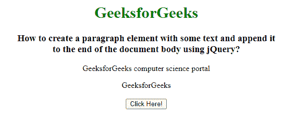
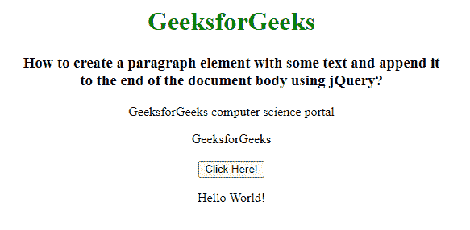

# 使用一些文本创建一个段落元素，并使用 jQuery

将其附加到文档正文的末尾

> 原文:[https://www . geesforgeks . org/create-a-段落-element-with-some-text-and-append-to-end-document-body-use-jquery/](https://www.geeksforgeeks.org/create-a-paragraph-element-with-some-text-and-append-it-to-end-of-document-body-using-jquery/)

在本文中，我们将创建一个包含一些文本的段落元素，并使用 jQuery 将其附加到文档正文的末尾。为了在文档体的末尾追加一些文本，我们使用 **add()** 和 **appendTo()** 方法。jQuery **add()** 方法用于将元素添加到现有的元素组中。此方法可以将元素添加到整个文档中，或者如果定义了上下文参数，则只在上下文元素中添加元素。

**语法:**

```html
$(selector).add(element, context_parameter)
```

jQuery **appendTo()** 是一个内置方法，用于在所选元素的末尾插入一个 HTML 元素。

**语法:**

```html
$(content).appendTo(selector)
```

**示例:**

## 超文本标记语言

```html
<!DOCTYPE html>
<html lang="en">

<head>

    <!-- Import jQuery cdn library -->
    <script src=
"https://ajax.googleapis.com/ajax/libs/jquery/3.3.1/jquery.min.js">
    </script>

    <script>
        $(document).ready(function () {
            $("button").click(function () {
                $("button").add("
                    <p>Hello World!</p>")
                    .appendTo(document.body);
            });
        });
    </script>
</head>

<body style="text-align: center;">
    <h1 style="color: green;">
        GeeksforGeeks
    </h1>

    <h3>
        How to create a paragraph element with
        some text and append it <br>to the end
        of the document body using jQuery?
    </h3>

    <p>GeeksforGeeks computer science portal</p>

    <span>GeeksforGeeks</span>
    <br><br>

    <button>Click Here!</button>
</body>

</html>
```

**输出:**

**点击按钮前:**



**点击按钮后:**

