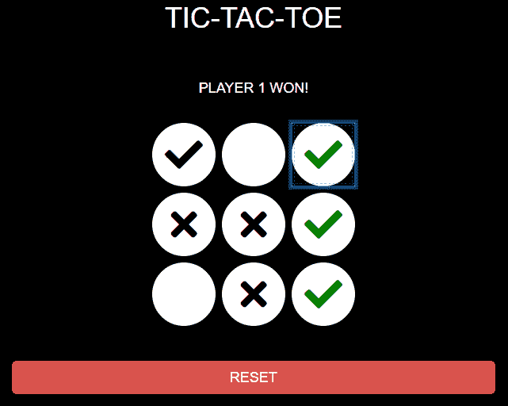

# 使用 jQuery 创建井字游戏

> 原文:[https://www . geeksforgeeks . org/create-a-TIC-tac-toe-game-use-jquery/](https://www.geeksforgeeks.org/create-a-tic-tac-toe-game-using-jquery/)



在这篇文章中，我们将使用 jQuery 实现 2 人井字游戏。通过一些简单的验证和错误检查很容易开发。玩家 1 开始玩游戏，两个玩家连续轮流移动。连续 3-区块链的球员赢得比赛。在这里，我们将只使用简单的逻辑和验证检查在前端实现这个游戏。
**先决条件:**一些前端技术的基础知识，如 [HTML](https://www.geeksforgeeks.org/html-tutorials/) 、 [CSS](https://www.geeksforgeeks.org/css-tutorials/) 、 [jQuery](https://www.geeksforgeeks.org/jquery-tutorials/) 和 [Bootstrap](https://www.geeksforgeeks.org/bootstrap-tutorials/) 。
**开发布局:**首先，我们将开发 3 * 3 网格布局，并在其上应用一些 CSS 效果。它还应该显示一个文本，显示玩家的回合。它还应该包含一个按钮，以便在需要时重置游戏。

*   **HTML 代码:**

## 超文本标记语言

```html
<!DOCTYPE html>
<html lang="en">

<head>
    <meta charset="utf-8" />
    <meta http-equiv="X-UA-Compatible" content="IE=edge, chrome=1" />

    <script src=
"https://code.jquery.com/jquery-3.4.1.slim.min.js">
    </script>
    <link rel="stylesheet" href=
"https://maxcdn.bootstrapcdn.com/bootstrap/3.4.0/css/bootstrap.min.css">
    <script src=
"https://maxcdn.bootstrapcdn.com/bootstrap/3.4.0/js/bootstrap.min.js">
    </script>
    <link rel="stylesheet" href=
"https://use.fontawesome.com/releases/v5.7.0/css/all.css"
          integrity=
"sha384-lZN37f5QGtY3VHgisS14W3ExzMWZxybE1SJSEsQp9S+oqd12jhcu+A56Ebc1zFSJ"
          crossorigin="anonymous">

</head>

<body>

    <!-- Heading -->
    <div class="container-fluid text-center">
        <h1 style="color: white;">TIC-TAC-TOE</h1></div>
    <br>
    <br>
    <div class="container-fluid text-center">

        <!-- Inform area for player's turn -->
        <h4 id="screen" style="color: white;">
          PLAYER 1 TURN FOLLOWS
        </h4>
    </div>
    <br>
    <div class="container-fluid">
        <div class="row">
            <div class="col-lg-4">   </div>
            <div class="col-lg-4">
                <!-- Playing Canvas -->
                <center>
                    <table>
                        <tr>
                            <td colspan="3">
                        </tr>
                        <tr>
                            <td>
                                <button class="sq1 r"></button>
                            </td>
                            <td>
                                <button class="sq2 r"></button>
                            </td>
                            <td>
                                <button class="sq3 r"></button>
                            </td>
                        </tr>
                        <tr>
                            <td>
                                <button class="sq4 r"></button>
                            </td>
                            <td>
                                <button class="sq5 r"></button>
                            </td>
                            <td>
                                <button class="sq6 r"></button>
                            </td>
                        </tr>
                        <tr>
                            <td>
                                <button class="sq7 r"></button>
                            </td>
                            <td>
                                <button class="sq8 r"></button>
                            </td>
                            <td>
                                <button class="sq9 r"></button>
                            </td>
                        </tr>
                    </table>
                    <br>
                    <br>

                    <!-- Reset button for Game -->
                    <input type="button"
                           class="reset btn btn-lg btn-danger btn-block"
                           value="RESET" onClick="reset()" />
                </center>
            </div>
            <div class="col-lg-4">   </div>
        </div>
    </div>
</body>

</html>
```

*   **CSS 代码:**T2]

## 半铸钢ˌ钢性铸铁(Cast Semi-Steel)

```html
<!-- Applying CSS Properties -->
<style>
    body {
        background-color: #000000;
    }

    button {
        height: 80px;
        width: 80px;
        background-color: white;
        border: 0px transparent;
        border-radius: 50%;
        margin: 4px;
        padding: 4px;
    }

    .fa {
        font-size: 48px;
        color: black;
    }

    .reset {
        padding: 8px;
    }

    .reset:hover {
        opacity: 0.8;
    }

</style>
```