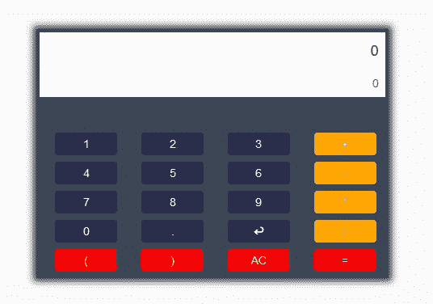
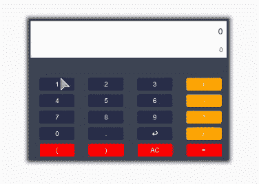
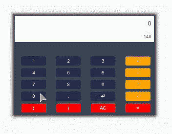
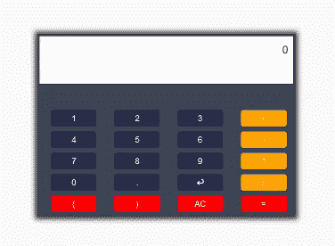

# 使用 jQuery 设计并实现计算器

> 原文:[https://www . geesforgeks . org/design-and-implement-calculator-use-jquery/](https://www.geeksforgeeks.org/design-and-implement-calculator-using-jquery/)

在这篇文章中，我们将使用 jQuery 和 eval()函数实现一个易于构建的计算器。为了简单起见，我们的计算器将只接受屏幕上按钮的输入。

**先决条件:**
HTML、CSS、JavaScript、jQuery、Bootstrap 等前端技术的基础知识。

**程序:**

1.  **开发计算器界面:**
    这里，我们将利用 bootstrap 来节省开发计算器界面的时间。以下是执行相同操作时需要满足的要求:

*   主(表达式)屏幕
*   次级(结果)屏幕
*   输入按钮:数字、评估运算符等。

```html
<!-- Initialize the layout -->
<!DOCTYPE html>
<html lang="en">

<head>
    <meta charset="utf-8" />
    <!-- Required CDN's -->
    <link rel="stylesheet" 
          href=
"https://maxcdn.bootstrapcdn.com/bootstrap/3.4.1/css/bootstrap.min.css">
    <script src=
"https://ajax.googleapis.com/ajax/libs/jquery/3.4.1/jquery.min.js">
    </script>
    <script src=
"https://maxcdn.bootstrapcdn.com/bootstrap/3.4.1/js/bootstrap.min.js">
    </script>
    <style>
        .calculator {
            padding: 4px;
            margin: 4px;
            background-color: #3a4655;
            width: 100%;
            height: auto;
            /* Box shadow for different browsers */
            -webkit-box-shadow: 0px 0px 8px 4px rgba(0, 0, 0, 0.75);
            -moz-box-shadow: 0px 0px 8px 4px rgba(0, 0, 0, 0.75);
            box-shadow: 0px 0px 8px 4px rgba(0, 0, 0, 0.75);
        }

        .form-control {
            border: 0px solid transparent;
            padding: 0px;
            border: 0px;
            border-radius: 0px;
        }

        input[type="text"]:disabled {
            background-color: white;
            text-align: right;
            padding: 8px;
        }

        .design {
            text-align: center;
            border-radius: 4px;
            width: 100%;
            height: auto;
            color: white;
            padding: 4px;
            margin: 4px;
            background-color: #2a2e4b;
        }
    </style>
</head>

<body style="background-color:#f9f9fa;">

    <div class="row">
        <div class="col-sm-2 col-md-4">   </div>
        <div class="col-sm-8 col-md-4">
            <!-- Calculator UI -->
            <br>
            <br>
            <br>
            <br>
            <div class="container calculator">
                <div class="form-input">
                    <input type="text"
                           class="form-control input-lg"
                           id="expression" 
                           value="0"
                           disabled>
                    <input type="text" 
                           class="form-control input-xs" 
                           id="result" 
                           value="0"
                           disabled>
                </div>
                <br>
                <br>
                <div class="container-fluid">
                    <div class="row">
                        <div class="col-sm-3">
                            <div class="design">1</div>
                        </div>
                        <div class="col-sm-3">
                            <div class="design">2</div>
                        </div>
                        <div class="col-sm-3">
                            <div class="design">3</div>
                        </div>
                        <div class="col-sm-3">
                            <div class="design" 
                                 style="background-color:orange;">
                              +
                          </div>
                        </div>
                    </div>
                    <div class="row">
                        <div class="col-sm-3">
                            <div class="design">4</div>
                        </div>
                        <div class="col-sm-3">
                            <div class="design">5</div>
                        </div>
                        <div class="col-sm-3">
                            <div class="design">6</div>
                        </div>
                        <div class="col-sm-3">
                            <div class="design"
                                 style="background-color:orange;">
                              -
                          </div>
                        </div>
                    </div>
                    <div class="row">
                        <div class="col-sm-3">
                            <div class="design">7</div>
                        </div>
                        <div class="col-sm-3">
                            <div class="design">8</div>
                        </div>
                        <div class="col-sm-3">
                            <div class="design">9</div>
                        </div>
                        <div class="col-sm-3">
                            <div class="design"
                                 style="background-color:orange;">
                              *
                          </div>
                        </div>
                    </div>
                    <div class="row">
                        <div class="col-sm-3">
                            <div class="design">0</div>
                        </div>
                        <div class="col-sm-3">
                            <div class="design">.</div>
                        </div>
                        <div class="col-sm-3">
                            <div class="design not"> ? </div>
                        </div>
                        <div class="col-sm-3">
                            <div class="design" 
                                 style="background-color:orange;">
                              /
                          </div>
                        </div>
                    </div>
                    <div class="row">
                        <div class="col-sm-3">
                            <div class="design" 
                                 style="background-color:red;">
                              (
                          </div>
                        </div>
                        <div class="col-sm-3">
                            <div class="design" 
                                 style="background-color:red;">
                              )
                          </div>
                        </div>
                        <div class="col-sm-3">
                            <div class="design not" 
                                 style="background-color:red;">
                              AC
                          </div>
                        </div>
                        <div class="col-sm-3">
                            <div class="design not" 
                                 style="background-color:red;"> 
                              =
                          </div>
                        </div>

                    </div>
                </div>
            </div>
        </div>
        <div class="col-sm-2 col-md-4">   </div>
    </div>
</body>

</html>
```

**输出:**


*   **Implement functionality of expression screen:**
    Now we will implement the following steps accordingly for expression screen to work fine:
    *   按下屏幕时增加按钮的值。
    *   为输入实现退格。
    *   清除表达式屏幕(交流)

    ```html
    <!-- Script for Expression Screen  -->
    <!DOCTYPE html>
    <html lang="en">

    <head>
        <meta charset="utf-8" />
        <!-- Required CDN's -->
        <link rel="stylesheet"
              href=
    "https://maxcdn.bootstrapcdn.com/bootstrap/3.4.1/css/bootstrap.min.css">
        <script src=
    "https://ajax.googleapis.com/ajax/libs/jquery/3.4.1/jquery.min.js">
      </script>
        <script src=
    "https://maxcdn.bootstrapcdn.com/bootstrap/3.4.1/js/bootstrap.min.js">
      </script>
        <style>
            .calculator {
                padding: 4px;
                margin: 4px;
                background-color: #3a4655;
                width: 100%;
                height: auto;
                /* Box shadow for different browsers */
                -webkit-box-shadow: 0px 0px 8px 4px rgba(0, 0, 0, 0.75);
                -moz-box-shadow: 0px 0px 8px 4px rgba(0, 0, 0, 0.75);
                box-shadow: 0px 0px 8px 4px rgba(0, 0, 0, 0.75);
            }

            .form-control {
                border: 0px solid transparent;
                padding: 0px;
                border: 0px;
                border-radius: 0px;
            }

            input[type="text"]:disabled {
                background-color: white;
                text-align: right;
                padding: 8px;
            }

            .design {
                text-align: center;
                border-radius: 4px;
                width: 100%;
                height: auto;
                color: white;
                padding: 4px;
                margin: 4px;
                background-color: #2a2e4b;
            }
        </style>
    </head>

    <body style="background-color:#f9f9fa;">

        <div class="row">
            <div class="col-sm-2 col-md-4">   </div>
            <div class="col-sm-8 col-md-4">
                <!-- Calculator UI -->
                <br>
                <br>
                <br>
                <br>
                <div class="container calculator">
                    <div class="form-input">
                        <input type="text" 
                               class="form-control input-lg" 
                               id="expression" 
                               value="0" 
                               disabled>
                        <input type="text" 
                               class="form-control input-xs" 
                               id="result" value="0" 
                               disabled>
                    </div>
                    <br>
                    <br>
                    <div class="container-fluid">
                        <div class="row">
                            <div class="col-sm-3">
                                <div class="design">1</div>
                            </div>
                            <div class="col-sm-3">
                                <div class="design">2</div>
                            </div>
                            <div class="col-sm-3">
                                <div class="design">3</div>
                            </div>
                            <div class="col-sm-3">
                                <div class="design" 
                                     style="background-color:orange;">
                                  +
                              </div>
                            </div>
                        </div>
                        <div class="row">
                            <div class="col-sm-3">
                                <div class="design">4</div>
                            </div>
                            <div class="col-sm-3">
                                <div class="design">5</div>
                            </div>
                            <div class="col-sm-3">
                                <div class="design">6</div>
                            </div>
                            <div class="col-sm-3">
                                <div class="design"
                                     style="background-color:orange;">
                                  -
                              </div>
                            </div>
                        </div>
                        <div class="row">
                            <div class="col-sm-3">
                                <div class="design">7</div>
                            </div>
                            <div class="col-sm-3">
                                <div class="design">8</div>
                            </div>
                            <div class="col-sm-3">
                                <div class="design">9</div>
                            </div>
                            <div class="col-sm-3">
                                <div class="design" 
                                     style="background-color:orange;">
                                  *
                              </div>
                            </div>
                        </div>
                        <div class="row">
                            <div class="col-sm-3">
                                <div class="design">0</div>
                            </div>
                            <div class="col-sm-3">
                                <div class="design">.</div>
                            </div>
                            <div class="col-sm-3">
                                <div class="design not"
                                     id="backspace">
                                  ? 
                              </div>
                            </div>
                            <div class="col-sm-3">
                                <div class="design" 
                                     style="background-color:orange;">
                                  /
                              </div>
                            </div>
                        </div>
                        <div class="row">
                            <div class="col-sm-3">
                                <div class="design" 
                                     style="background-color:red;">
                                  (
                              </div>
                            </div>
                            <div class="col-sm-3">
                                <div class="design"
                                     style="background-color:red;">
                                  )
                              </div>
                            </div>
                            <div class="col-sm-3">
                                <div class="design not" 
                                     id="allClear" 
                                     style="background-color:red;">
                                  AC
                              </div>
                            </div>
                            <div class="col-sm-3">
                                <div class="design not" 
                                     style="background-color:red;">
                                  =
                              </div>
                            </div>

                        </div>
                    </div>
                </div>
            </div>
            <div class="col-sm-2 col-md-4">   </div>
        </div>
        <script>
            $(document).ready(function() {
                //Adding to the expression
                $(".design").click(function() {
                    if (!$(this).hasClass("not")) {
                        if ($("#expression").val() == 0)
                            $("#expression").val($(this).text());
                        else
                            $("#expression").val($(
                              "#expression").val() + $(this).text());
                    }
                });

                //Backspace
                $('#backspace').click(function() {
                    var value = $("#expression").val();
                    if (!(parseInt(parseFloat(value)) == 0 && value.length == 1))
                        $("#expression").val(value.slice(0, value.length - 1));
                    if (value.length == 1)
                        $("#expression").val("0");
                });
            });

            // All Clear
            $("#allClear").click(function() {
                $("#expression").val("0");
            });
        </script>
    </body>

    </html>
    ```

    **输出:**
    

    *   **Evaluate the result:**
    For this we need to add the following steps in sequenced manner:
    *   提取表达式屏幕的值。
    *   评估表达式屏幕。
    *   报告输出中的错误(如果有)
    *   清除表达式屏幕，并在结果屏幕上追加输出。
    *   每当使用其他输入按钮时，清除主屏幕和副屏幕。

    **最终结果:**

    ```html
    <!-- jQuery Calculator -->
    <!DOCTYPE html>
    <html lang="en">

    <head>
        <meta charset="utf-8" />
        <!-- Required CDN's -->
        <link rel="stylesheet" 
              href=
    "https://maxcdn.bootstrapcdn.com/bootstrap/3.4.1/css/bootstrap.min.css">
        <script src=
    "https://ajax.googleapis.com/ajax/libs/jquery/3.4.1/jquery.min.js">
        </script>
        <script src=
    "https://maxcdn.bootstrapcdn.com/bootstrap/3.4.1/js/bootstrap.min.js">
        </script>
        <style>
            .calculator {
                padding: 4px;
                margin: 4px;
                background-color: #3a4655;
                width: 100%;
                height: auto;
                /* Box shadow for different browsers */
                -webkit-box-shadow: 0px 0px 8px 4px rgba(0, 0, 0, 0.75);
                -moz-box-shadow: 0px 0px 8px 4px rgba(0, 0, 0, 0.75);
                box-shadow: 0px 0px 8px 4px rgba(0, 0, 0, 0.75);
            }

            .form-control {
                border: 0px solid transparent;
                padding: 0px;
                border: 0px;
                border-radius: 0px;
            }

            input[type="text"]:disabled {
                background-color: white;
                text-align: right;
                padding: 8px;
            }

            .design {
                text-align: center;
                border-radius: 4px;
                width: 100%;
                height: auto;
                color: white;
                padding: 4px;
                margin: 4px;
                background-color: #2a2e4b;
            }
        </style>
    </head>

    <body style="background-color:#f9f9fa;">

        <div class="row">
            <div class="col-sm-2 col-md-4">   </div>
            <div class="col-sm-8 col-md-4">
                <!-- Calculator UI -->
                <br>
                <br>
                <br>
                <br>
                <div class="container calculator">
                    <div class="form-input">
                        <input type="text" 
                               class="form-control input-lg" 
                               id="expression" 
                               value="0" 
                               disabled>
                        <input type="text" 
                               class="form-control input-xs"
                               id="result"
                               value="0"
                               disabled>
                    </div>
                    <br>
                    <br>
                    <div class="container-fluid">
                        <div class="row">
                            <div class="col-sm-3">
                                <div class="design">1</div>
                            </div>
                            <div class="col-sm-3">
                                <div class="design">2</div>
                            </div>
                            <div class="col-sm-3">
                                <div class="design">3</div>
                            </div>
                            <div class="col-sm-3">
                                <div class="design" 
                                     style="background-color:orange;">
                                  +</div>
                            </div>
                        </div>
                        <div class="row">
                            <div class="col-sm-3">
                                <div class="design">4</div>
                            </div>
                            <div class="col-sm-3">
                                <div class="design">5</div>
                            </div>
                            <div class="col-sm-3">
                                <div class="design">6</div>
                            </div>
                            <div class="col-sm-3">
                                <div class="design" 
                                     style="background-color:orange;">
                                  -</div>
                            </div>
                        </div>
                        <div class="row">
                            <div class="col-sm-3">
                                <div class="design">7</div>
                            </div>
                            <div class="col-sm-3">
                                <div class="design">8</div>
                            </div>
                            <div class="col-sm-3">
                                <div class="design">9</div>
                            </div>
                            <div class="col-sm-3">
                                <div class="design" 
                                     style="background-color:orange;">
                                  *</div>
                            </div>
                        </div>
                        <div class="row">
                            <div class="col-sm-3">
                                <div class="design">0</div>
                            </div>
                            <div class="col-sm-3">
                                <div class="design">.</div>
                            </div>
                            <div class="col-sm-3">
                                <div class="design not"
                                     id="backspace"> ? </div>
                            </div>
                            <div class="col-sm-3">
                                <div class="design" 
                                     style="background-color:orange;">
                                  /</div>
                            </div>
                        </div>
                        <div class="row">
                            <div class="col-sm-3">
                                <div class="design"
                                     style="background-color:red;">
                                  (</div>
                            </div>
                            <div class="col-sm-3">
                                <div class="design" 
                                     style="background-color:red;">
                                  )</div>
                            </div>
                            <div class="col-sm-3">
                                <div class="design not"
                                     id="allClear"
                                     style="background-color:red;">
                                  AC</div>
                            </div>
                            <div class="col-sm-3">
                                <div class="design not" 
                                     id="equals"
                                     style="background-color:red;">
                                  =</div>
                            </div>

                        </div>
                    </div>
                </div>
            </div>
            <div class="col-sm-2 col-md-4">   </div>
        </div>
        <script>
            $(document).ready(function() {
                //Adding to the expression
                $(".design").click(function() {
                    if (!$(this).hasClass("not")) {
                        if ($("#expression").val() == 0)
                            $("#expression").val($(this).text());
                        else
                            $("#expression").val($("#expression").val() + $(this).text());
                    }
                });

                //Backspace
                $('#backspace').click(function() {
                    var value = $("#expression").val();
                    if (!(parseInt(parseFloat(value)) == 0 && value.length == 1))
                        $("#expression").val(value.slice(0, value.length - 1));
                    if (value.length == 1)
                        $("#expression").val("0");
                });
            });

            // All Clear
            $("#allClear").click(function() {
                $("#expression").val("0");
                $("#result").val("0");
            });

            //Evalution
            $("#equals").click(function() {
                var result;
                //Check for syntax error
                try {
                    result = (eval(($("#expression").val())));
                } catch (e) {
                    if (e instanceof SyntaxError) {
                        alert("Error! Resetting values.");
                        $("#expression").val("0");
                        $("#result").val("0");
                    }
                    if (e instanceof TypeError) {
                        alert("Error! Resetting values.");
                        $("#expression").val("0");
                        $("#result").val("0");
                    }
                }

                // Append if the result is correct
                $("#result").val(result);
                $("#expression").val("0");
            });
        </script>
    </body>

    </html>
    ```

    **输出:**

    1.  错误:(不是有效的表达式，因为运算需要乘法符号)
        
    2.  无错误:
        