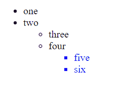

# jQuery 中 find()和 closest()的区别

> 原文:[https://www . geeksforgeeks . org/jquery 中查找和最近的区别/](https://www.geeksforgeeks.org/difference-between-find-and-closest-in-jquery/)

在看 [**之间的区别之前，先找到()**](https://www.geeksforgeeks.org/javascript-array-find-method/) 和 [**最接近的()**](https://www.geeksforgeeks.org/jquery-closest-with-examples/) 方法，让我们简单了解一下这些是什么以及它们是做什么的。

**1。find()方法:**此方法用于获取当前匹配元素集中每个元素的所有过滤后代。

**语法:**

```html
$(selector).find('filter-expression')
```

**参数:**用于过滤后代搜索的选择器表达式、元素或 jQuery 对象。

**返回值:**返回调用 **find()** 方法的元素的所有匹配后代。这个方法遍历 DOM 直到最后一个后代。这意味着它会遍历 DOM 的所有层次，比如孩子、孙子、曾孙等等。

**示例:**在下面的代码**、**中，它会在 [*p*](https://www.geeksforgeeks.org/html-paragraph/) 标签中找到所有的 [*span*](https://www.geeksforgeeks.org/span-tag-html/) 标签，并将其颜色更改为蓝色。

## 超文本标记语言

```html
<!DOCTYPE html>

<head>
    <!-- jQuery library -->
    <script src=
        "https://code.jquery.com/jquery-git.js">
    </script>
</head>

<body>
    <p><span>Hello </span>Geeks!</p>

    <div>
        <p>Hey! <span>How </span>are you</p>
    </div>

    <p>Hello Geeks</p>

    <script>
        $('p').find('span').css('color', 'blue')
    </script>
</body>

</html>
```

**输出:**


**2。closest()方法:**此方法用于获取所选元素的第一个祖先。祖先可以是父母、祖父母、曾祖父母等。

**语法:**

```html
$(selector).closest(filter-expression)
```

**参数:**用于筛选祖先搜索的选择器表达式、元素或 jQuery 对象。

**示例:**该方法一直遍历到文档的根元素，即< HTML >，找到所选元素的第一个祖先。我们有三个级别的无序列表 [< ul >](https://www.geeksforgeeks.org/html-ul-tag/) 标签。在 [< li >](https://www.geeksforgeeks.org/html-li-tag/) 标签上调用最近的()方法后，返回第一个最近的< ul >标签。

## 超文本标记语言

```html
<!DOCTYPE html>

<head>
    <!-- jQuery library -->
    <script src=
        "https://code.jquery.com/jquery-git.js">
    </script>
</head>

<body>
    <ul>
        <li>one</li>
        <li>two</li>
        <ul>
            <li>three</li>
            <li>four</li>
            <ul>
                <li id="select-Me">five</li>
                <li>six</li>
            </ul>
        </ul>
    </ul>
    <script>
        $("#select-Me")
            .closest("ul")
            .css("color", "blue");
    </script>
</body>

</html>
```

**输出:**



**find()与 closure()**

<figure class="table">

| 

find()

 | 

closure()

 |
| --- | --- |
| This method is used to get all filtered descendants of each element in the current matching element set. | This method is used to get the first ancestor of the selected element. |
| This method traverses DOM all the way to the last descendant. | This method traverses DOM to the root element of the document. |
| This method is to look down the tree at children and children's children. | In this way, the tree looks at the parents. |

</figure>