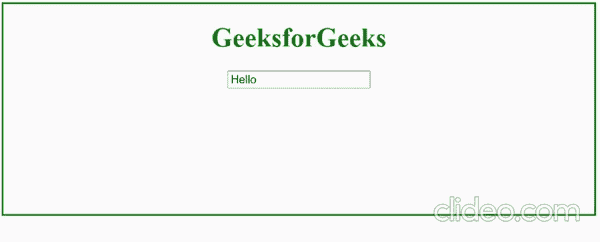

# jQuery 中 html() text()和 val()方法的区别

> 原文:[https://www . geesforgeks . org/html-text-and-val-methods-in-jquery/](https://www.geeksforgeeks.org/difference-between-html-text-and-val-methods-in-jquery/)

在本文中，我们将讨论 html()、text()和 val()方法之间的差异及其用法。

**1。jQuery**[**html()**](https://www.geeksforgeeks.org/jquery-html-method/)**方法:****HTML()**方法用于设置或返回所选元素的内部 HTML。它的工作原理类似于普通 JavaScript 中的 [**innerHTML**](https://www.geeksforgeeks.org/html-dom-innerhtml-property/) 来设置或获取所选元素的内容。上面的代码讲述了 jQuery **html()** 方法和 JavaScript **innerHTML** 之间的相似性。当您运行这段代码时，id 为“演示”的 *div* 的内部 HTML 被更改为“你好，极客”，2 秒钟后 jquery API 执行类似于 JavaScript 的工作。它将把内部 HTML 从“你好极客”变成“欢迎来到极客论坛”。

**语法:**

*   **$()。html():** 它将所选元素的内部 html 作为字符串返回
*   **$()。html('任意字符串'):**设置选中元素的内部 html。

## 超文本标记语言

```html
<!DOCTYPE html>
<html>

<head>
    <script src=
"https://ajax.googleapis.com/ajax/libs/jquery/3.5.1/jquery.min.js">
    </script>
</head>

<body style="border: 2px solid green; 
        min-height: 250px;">

    <div style="display: flex; 
        justify-content: center;">
        <h1 style="color:green">
            GeeksforGeeks
        </h1>
    </div>

    <div id="demo" style="display: flex; 
        justify-content: center;">
    </div>

    <script>
        document.getElementById('demo').innerHTML
                = '<h3>hello Geeks</h3>';

        // After 2 sec this code will executed
        setTimeout(function () {
            $('#demo').html(
                '<h3>Welcome to geeksforgeeks</h3>');
        }, 2000);
    </script>
</body>

</html>
```

**输出:**


示例的输出

**2。** [**text()**](https://www.geeksforgeeks.org/jquery-text-method/) **方法:**jQuery**text()**方法用于设置或获取所选元素的内部文本。它的工作方式类似于普通 JavaScript 中的 **innerText** ，用于设置或获取所选元素的内容。

下面的代码说明了 jQuery **text()** 方法和 JavaScript **innerText 之间的相似性。**当你运行代码时，那么在 *div* 的内部文本的开头，id 为*“demo”被改为“你好，极客”。2 秒钟后，它会变成“欢迎来到极客网站”，4 秒钟后，内部文本会变成“欢迎来到极客网站”。*

***语法:***

*   ***$()。text():** 返回选中元素的内部文本，返回类型为字符串。*
*   ***$()。文本('任意字符串'):**它设置所选元素的内部文本。*

## *超文本标记语言*

```html
*<!DOCTYPE html>
<html>

<head>
    <script src=
"https://ajax.googleapis.com/ajax/libs/jquery/3.5.1/jquery.min.js">
    </script>
</head>

<body style="border:2px solid green;
    min-height:250px;">

    <div style="display:flex;
        justify-content:center;">

        <h1 style="color:green">
            GeeksforGeeks
        </h1>
    </div>

    <div id="demo" style="display:flex;
        justify-content:center;">
    </div>

    <script>
        document.getElementById('demo').innerText
                = 'hello Geeks';

        // Code run after 2 sec
        setTimeout(function () {
            $('#demo').text(
                '<h3>Welcome to geeksforgeeks</h3>');
        }, 2000);

        // Code run after 4 sec
        setTimeout(function () {
            $('#demo').text('Welcome to geeksforgeeks');
        }, 4000);
    </script>
</body>

</html>*
```

***输出:***

*

示例-2 的输出* 

***3。** [**val()**](https://www.geeksforgeeks.org/jquery-val-with-examples/) **方法:**该方法只对输入元素有效，如(输入文字、密码、单词、选择、复选框)获取和设置值。这个方法类似于 JavaScript *值*变量。*

***语法:***

*   ***$()。val():** 返回输入字段的值。*
*   ***$()。val('任意字符串'):**它设置输入的值。*

## *超文本标记语言*

```html
*<!DOCTYPE html>
<html>

<head>
    <script src=
"https://ajax.googleapis.com/ajax/libs/jquery/3.5.1/jquery.min.js">
    </script>
</head>

<body style="border:2px solid green;
    min-height:250px;">

    <div style="display:flex;
        justify-content:center;">

        <h1 style="color:green">
            GeeksforGeeks
        </h1>
    </div>

    <div id="demo" style="display:flex;
        justify-content:center;">
        <input type="text" id="name">
    </div>

    <script>
        document.getElementById('name').value = "Jhon Doe";

        // Run after 2 sec 
        setTimeout(function () {
            alert($('#name').val());
            $('#name').val('Hello');
        }, 2000);
    </script>
</body>

</html>*
```

***输出:***

*

示例-3 的输出* 

***说明:**在开始的这个例子中，输入字段的值是用 JavaScript API 改变的，然后在 2 秒钟后，输入字段的值使用 jQuery **val()** 方法显示在一个警告提示中，该方法返回由 JavaScript API 改变的输入字段的值，并且还使用 jQuery **val()** 方法改变输入字段。*

***JQuery 中 Html()、Text()和 Val()函数的区别和用法。***

<figure class="table"> *| 斯林诺。 | Html method | Text method | Val () method |
| --- | --- | --- | --- |
| one | It can only take one parameter as an independent variable. | It can only take one parameter as an independent variable. | It can only take one parameter as an independent variable. |
| Two | This method is used to get the html code inside. | This method is used to get the text in the selected element. | We can't use this method except for the input field. |
| three | We can't apply this method to input fields. | We can't apply this method to input fields. | We can only apply this method to the input field to get the value entered by the user. |* </figure>