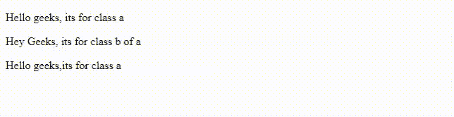
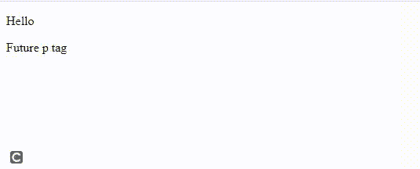

# jQuery 中 live()和 bind()方法的区别

> 原文:[https://www . geesforgeks . org/live-and-bind-methods-in-jquery/](https://www.geeksforgeeks.org/difference-between-live-and-bind-methods-in-jquery/)

在看 jQuery**[**live()**](https://www.geeksforgeeks.org/jquery-live-method/)和 [**bind()**](https://www.geeksforgeeks.org/jquery-bind-with-examples/) 方法的区别之前，让我们先简单了解一下这两种方法。**

****live():** 此方法用于将一个或多个事件处理程序附加到所选元素。我们为每个事件指定一个函数，这样当该事件发生时，相关的函数就会执行。这种方法也适用于未来的元素。当我们讨论这两种方法的区别时，我们会理解这一点。**

****语法:****

```html
$(selector).live(event,function)
```

****参数:****

*   ****事件:**指定要用选择器附加的事件。**
*   ****功能**:是特定事件发生时会执行的功能。**

****示例:**我们正在将[*点击*](https://www.geeksforgeeks.org/how-to-click-on-a-paragraph-and-add-another-paragraph-using-jquery/) 事件附加到*【p】*标签。当我们点击任何*“p”*标签时，与*点击*事件相关联的功能被执行，所有*“p”*标签的颜色变为红色。**

## **超文本标记语言**

```html
<!DOCTYPE html>

<head>
    <!-- jQuery library -->
    <script src=
"http://ajax.googleapis.com/ajax/libs/jquery/1.4.2/jquery.min.js" 
            type="text/javascript">
    </script>
</head>

<body>
    <div class="a">
        <p>Hello geeks</p>

        <div class="b">
            <p>Hey Geeks</p>

        </div>
        <p>Hello geeks</p>

    </div>
    <script>
        $('p').live('click',function () {
            $("p").css('color','red')
        })
    </script>
</body>
</html>
```

****输出:****

**

live()方法** 

****注意:**此方法在 jQuery 1.9 版本中移除，请使用 [**on()**](https://www.geeksforgeeks.org/jquery-on-with-examples/) 方法。**

****bind():** 该方法也用于将事件附加到选择器，并指定事件发生时将执行的函数。此方法仅适用于当前元素。**

****语法:****

```html
$(selector).bind(event,function)
```

****参数:****

*   ****事件:**指定要用选择器附加的事件。**
*   ****功能:**指定特定事件发生时将执行的功能。**

****示例:**以下示例仅演示了 **bind()** 方法及其执行。**

## **超文本标记语言**

```html
<!DOCTYPE html>

<head>
    <!-- jQuery library -->
    <script src=
"http://ajax.googleapis.com/ajax/libs/jquery/1.4.2/jquery.min.js" 
            type="text/javascript">
   </script>
</head>

<body>
    <h1>Hello Geeks</h1>
    <script>
        $('h1').bind('click',function () {
            $("h1").css('color','blue')
        })
    </script>
</body>
</html>
```

****输出:****

**

简单绑定()示例** 

****live()和 bind()方法的区别:**无论是 **live()** 还是 **bind()** 方法几乎是一样的。两者都用于将事件附加到元素。在 **live()** 方法中，事件处理程序附加到元素上，将为现在和将来的元素工作。**

****解释:**假设我们的页面上只有一个“p”标签，并且我们在上面附加了一个点击事件。现在每当我们点击“p”标记时，相关的功能就会被执行。如果我们使用**[**append()**](https://www.geeksforgeeks.org/jquery-append-method/)方法将另一个“p”标签追加到我们的 HTML 中，现在如果我们点击这个“p”标签，事件就会发生，相关的函数就会执行。这意味着 **live()** 方法也适用于未来的元素。****

****另一方面， **bind()** 方法只对当前元素有效。****

******说明:**我们有一个“p”标记，我们已经从 **live()** 和 **bind()** 两种方法在这个标记上附加了点击事件。****

****我们还在运行时向页面添加了另一个“p”标签(未来的“p”标签)。当我们单击第一个“p”标签时，我们会看到两个警告框，一个来自两种方法。但是当我们点击未来的“p”标记时，只有 **live()** 方法被执行，因为 **bind()** 方法对未来的元素不起作用。****

******示例:******

## ****超文本标记语言****

```html
**<!DOCTYPE html>

<head>
    <!-- jQuery library -->
    <script src=
"http://ajax.googleapis.com/ajax/libs/jquery/1.4.2/jquery.min.js" 
            type="text/javascript">
    </script>
</head>

<body>

<p>Hello</p>

    <script>

        $('p').live('click',function () {
            alert('live')
        })
        $('p').bind('click',function () {
            alert('bind')
        })
        $('body').append('<p>Future p tag</p>')
    </script>
</body>

</html>**
```

******输出:******

********