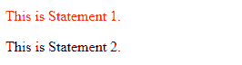

# jQuery 中 on()和 live()或 bind()的区别

> 原文:[https://www . geeksforgeeks . org/live 或 bind-in-jquery 的区别/](https://www.geeksforgeeks.org/difference-between-on-and-live-or-bind-in-jquery/)

jQuery 提供了各种事件处理程序，如()、 **live()** 和 **bind()** 。尽管如此，还是有一些小的不同，下面将讨论。

[**bind()方法:**](https://www.geeksforgeeks.org/jquery-bind-with-examples/) 该方法只将事件附加到预先存在的元素上，即附加事件之前初始化文档的状态。如果事件之后满足选择器条件，bind()将不会在该函数上工作。如果从元素中移除了选择器条件，它也不会起作用。

*   **例:**

    ```html
    <!DOCTYPE html>
    <html>
    <head>
        <!-- CDN for jQuery -->
        <script src=
    "https://code.jquery.com/jquery-3.4.1.js">
        </script>
    </head>
    <body>
        <div class="content">
            <p class="a">This is Statement 1.</p>
            <script>
                /* Here, the bind() works on elements 
                   initialized beforehand only */
                $(".a").bind("click",function(){
                    $(this).css("color","red"); 
                });
            </script>
            <p class="a">This is Statement 2.</p>
            <!-- click() method works on Statement 
                   1 but not on Statement 2\. -->
        </div>
    </body>
    </html>                            
    ```

*   **输出:**
    **点击那些语句前:**
    
    **点击那些语句后:**
    

[**【live()方法:**](https://www.geeksforgeeks.org/jquery-live-method/) 该方法不仅将事件附加到现有元素上，还附加到将来附加的元素上，但是如果从元素中移除选择器条件，则该方法不起作用。

**注意:**live()方法在 jQuery 版本中被弃用，在 1.9 版本中被删除。

*   **例:**

    ```html
    <!DOCTYPE html>
    <html>
    <head>
        <!-- Old CDN for .live() to work in jQuery -->
        <script src=
    "https://ajax.googleapis.com/ajax/libs/jquery/1.7/jquery.min.js">
        </script>
        </head>
    <body>
        <div class="content">
            <p class="a">This is Statement 1.</p>
            <script>
                /* live() method works for elements 
                   appended later as well */
                $(".a").live("click",function(){
                    $(this).css("color","red"); 
                });
            </script>
            <p class="a">This is Statement 2.</p>
            <!-- live() method works on both Statement 
                 1 and Statement 2\. -->
        </div>
    </body>
    </html>                    
    ```

*   **输出:**
    **点击那些语句前:**
    
    **点击那些语句后:**
    

[**on()方法:**](https://www.geeksforgeeks.org/jquery-on-with-examples/) 此方法不仅将事件附加到现有元素，还附加到将来的元素。on()和 live()函数的区别在于，on()方法仍然受支持，并且使用不同的语法模式，这与上述两种方法不同。

*   **例:**

    ```html
    <!DOCTYPE html>
    <html>
    <head>
        <!-- CDN for jQuery -->
        <script src=
    "https://code.jquery.com/jquery-3.4.1.js">
        </script>
    </head>
    <body>
        <div class="content">
            <p class="a">This is Statement 1.</p>
            <script>
                /* Works on all elements within scope 
                   of the document */
                $(document).on("click",".a",function(){
                    $(this).css("color","red"); 
                });
            </script>
            <p class="a">This is Statement 2.</p>
            <!-- on() method works on both Statement
                 1 and Statement 2\. -->
        </div>
    </body>
    </html>                                            
    ```

*   **输出:**
    **点击那些语句前:**
    
    **点击那些语句后:**
    

**以上方法总结的差异:**

| 财产 | 绑定() | 直播() | 打开() |
| 反对 | 是 | 是 | 不 |
| 相异的 | 不 | 是 | 不 |
| 范围 | 预先初始化的元素 | 对于当前和未来的事件绑定 | 对于当前和未来的事件绑定 |
| 语法: | $([选择器])。bind([事件]，[函数])； | $([选择器])。直播([事件]，[功能])； | $(文档)。bind([事件]，[选择器]，[函数])； |