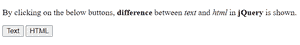
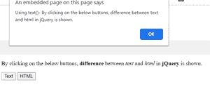
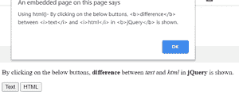

# jQuery 中 text()和 html()方法的区别

> 原文:[https://www . geesforgeks . org/text-和-html-method-in-jquery/](https://www.geeksforgeeks.org/difference-between-text-and-html-method-in-jquery/)

[**Text()方法:**](https://www.geeksforgeeks.org/jquery-text-method/) 此方法返回所选元素的文本内容。它会在设置内容时覆盖所有匹配元素的内容。

**语法:**

*   **返回文字内容:**

    ```
    $(selector).text()
    ```

*   **设置文字内容:**

    ```
    $(selector).text(content)
    ```

*   **使用功能设置文本内容:**

    ```
    $(selector).text(function(index, currentcontent))
    ```

[**html()方法:**](https://www.geeksforgeeks.org/jquery-html-method/) 此方法用于设置或返回所选元素的内容(innerHTML)。它返回第一个匹配元素的内容或设置所有匹配元素的内容。

**语法:**

*   **返回内容:**

    ```
    $(selector).html()
    ```

*   **设置内容:**

    ```
    $(selector).html(content)
    ```

*   **使用功能设置内容:**

    ```
    $(selector).html(function(index, currentcontent))
    ```

**示例:**

```
<!DOCTYPE html>
<html>

<head>
    <script src=
"https://ajax.googleapis.com/ajax/libs/jquery/3.2.1/jquery.min.js">
    </script>

    <script>
        $(document).ready(function () {
            $("#button1").click(function () {
                alert("Using text()- " + $("#demo").text());
            });
            $("#button2").click(function () {
                prompt("Using html()- " + $("#demo").html());
            });
        });
    </script>
</head>

<body>
    <p id="demo">By clicking on the below buttons,
        <b>difference</b> between
        <i>text</i> and <i>html</i> in
        <b>jQuery</b> is shown.
    </p>

    <button id="button1">Text</button>
    <button id="button2">HTML</button>
</body>

</html>
```

**输出:**

**点击按钮前:**



**点击文本按钮后:**



**点击 html 按钮后:**



**text()与 html()方法的区别:**

<figure class="table">

| Text () method | Html () method |
| Sets or returns the text content of the selected element. | Used to set or return the contents of the selected element. |
| This method cannot be used for form input or script. | This method cannot be used for values of script elements. |
| It is used in both XML and HTML documents. | Used for HTML documents only. |
| It is slower than html (). | Twice as fast as ~. Text (). |

</figure>

**支持的浏览器:**

*   谷歌 Chrome
*   微软公司出品的 web 浏览器
*   火狐浏览器
*   歌剧
*   旅行队