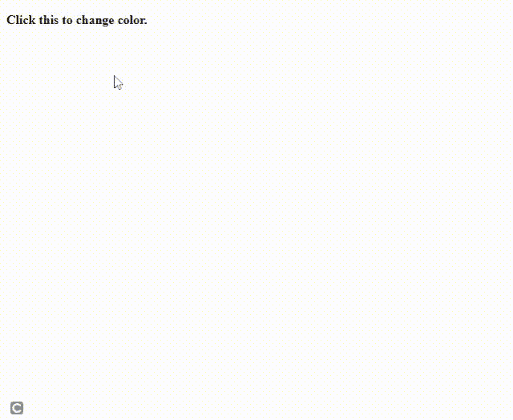
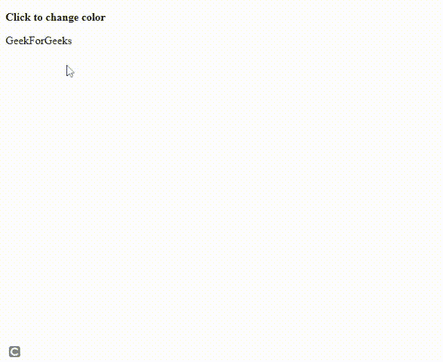

# jQuery 中$(this)和‘this’的区别

> 原文:[https://www . geesforgeks . org/这个和这个在 jquery 中的区别/](https://www.geeksforgeeks.org/difference-between-this-and-this-in-jquery/)

在本文中，我们将学习 jQuery 中[**本**](https://www.geeksforgeeks.org/this-in-javascript/) 和 **$(本)**的区别。

[**这个关键字**](https://www.geeksforgeeks.org/this-in-javascript/) **:** 在 JavaScript 中，**这个**关键字用来指代它所属的对象。**这个** 存储的值是 JavaScript 程序当前的执行上下文。因此，当在函数 **中使用时，该** 的值将根据该函数的定义、调用方式和默认执行上下文而变化。

**示例 1:** 我们将在对象方法中使用**这个**，其中指的是对象的所有者。

## 超文本标记语言

```
<!DOCTYPE html>
<html lang="en">

<head>
    <!-- using jQuery library -->
    <script src=
"https://code.jquery.com/jquery-git.js">
    </script>

</head>

<body>

    <p>The object's value for name: </p>

    <p id="paraID"></p>

    <script>
        const obj = {
            name: "hrithik",
            roll: 36,
            mydata: function () {
                return this.name;
            }
        }
        document.getElementById("paraID")
            .innerHTML = obj.mydata();
    </script>
</body>

</html>
```

**输出:**

```
The object's value for name:

hrithik
```

**示例 2:** 我们将在事件处理程序上使用**这个**关键字，它指的是调用事件的元素。

## 超文本标记语言

```
<!DOCTYPE html>
<html lang="en">

<head>
    <!-- using jQuery library -->
    <script src=
"https://code.jquery.com/jquery-git.js">
    </script>
</head>

<body>
    <p id="clickme">
        <b> Click this to change color.</b> <br>
    </p>

    <script>
        $("#clickme").click(function () {
            this.style.color = "green"
        })
    </script>
</body>

</html>
```

**输出:**



**$(此):**也指其所属的物体。基本上两者都是一样的。但是当**这个**关键字用在 **$()，**里面的时候，那么它就变成了一个 jQuery 对象，现在我们可以在这个方法上使用 jQuery 的所有属性。

**示例:**

## 超文本标记语言

```
<!DOCTYPE html>
<html lang="en">

<head>
    <!-- using jQuery library -->
    <script src=
"https://code.jquery.com/jquery-git.js">
    </script>
</head>

<body>
    <b>
        <p>Click to change color</p>
    </b>

    <p>GeekForGeeks</p>

    <script>
        $("p").click(function () {
            $(this).css("color", "red");
        });
    </script>
</body>

</html>
```

**输出:**



**这个和$(这个)的区别**

**这个**关键字是对调用的 DOM 元素的引用。我们可以在上面调用所有的 DOM 方法。 **$()** 是一个 jQuery 构造函数，在 **$(本)**中，我们只是将**本**作为参数传递，这样我们就可以使用 jQuery 函数和方法。

**示例 1:** 下面的代码将不起作用，因为我们正在 DOM 元素上调用 jQuery 方法。为了更好地理解，请参考输出。隐藏不会发生。

## 超文本标记语言

```
<!DOCTYPE html>
<html lang="en">

<head>
    <!-- using jquery library -->
    <script src=
       "https://code.jquery.com/jquery-git.js">
    </script>

</head>

<body>
    <p class="div1">
        Hello
    </p>

    <script>
        $(".div1").click(function ()
        {
            // this refers to the DOM element 
            // so the following line would fail
            this.hide();
        });
    </script>
</body>

</html>
```

**输出:**


**示例 2:** 这段代码运行良好，因为我们已经将**这个**实现为$()了，现在它变成了一个 jQuery 对象。

## 超文本标记语言

```
<!DOCTYPE html>
<html lang="en">

<head>
    <!-- using jquery library -->
    <script src=
        "https://code.jquery.com/jquery-git.js">
    </script>    
</head>

<body>
    <p class="div1">
        Hello
    </p>

    <script>
        $(".div1").click(function () {
            // this refers to the DOM element 
            //so the following line would fail
            $(this).hide();
        });
    </script>
</body>

</html>
```

**输出:**


**本与$(本)**

<figure class="table">

| 

本

 | $ (Ben) |
| --- | --- |
| It refers to DOM elements. | It also refers to DOM elements. |
| **This** is a native way. | **Put this** in $ (), and it becomes a jQuery object. |
| We can call all DOM methods above, but we can't call jQuery method. | We can call all jQuery methods and functions above, but we can't call DOM methods. |
| **This** only has the universal JavaScript function. | By using **$ (this)** , you enabled the jQuery function for the object. |

</figure>