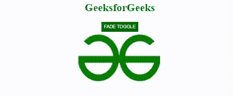

# 解释 jQuery 中淡入淡出效果的概念？

> 原文:[https://www . geesforgeks . org/explain-概念-淡入淡出效果-jquery/](https://www.geeksforgeeks.org/explain-the-concept-of-fade-effect-in-jquery/)

jQuery 中的淡入淡出效果可以使用不同的方法来创建，如 [fadeIn()](https://www.geeksforgeeks.org/jquery-fadein-method/) 、 [fadeOut()](https://www.geeksforgeeks.org/jquery-effect-fadeout-method/) 、 [fadeToggle()](https://www.geeksforgeeks.org/jquery-fadetoggle-method/) 和 [fadeTo()](https://www.geeksforgeeks.org/jquery-fadeto-with-examples/) 。这些方法可以用不同的参数在 jQuery 中创建不同的淡入淡出效果。

*   **fadeIn():** 这个方法是为了让元素隐藏起来有一个淡入淡出的效果。

    **语法:**

    ```html
    $('selector').fadeIn(speed, callback_function);
    ```

*   **fadeOut():** 此方法用于使元素可见到隐藏，并具有淡入淡出效果。

    **语法:**

    ```html
    $('selector').fadeOut(speed, callback_function);
    ```

*   **fadeToggle():** 此方法用于在 *fadeIn()* 和 *fadeOut()* 方法之间切换，具有淡入淡出效果。

    **语法:**

    ```html
    $('selector').fadeToggle(speed, callback_function);
    ```

*   **fadeTo():** 此方法用于将可见元素淡化到参数中参考 1 给出的某种不透明度。

    **语法:**

    ```html
    $('selector').fadeTo(speed, opacity, callback_function);
    ```

下面的例子证实了很少褪色效应的概念。

**示例 1:** 以下代码显示图像在 fadeIn()和 fadeOut()方法之间切换。

## 超文本标记语言

```html
<!DOCTYPE html>
<html lang="en">

<head>
    <meta charset="UTF-8">
    <meta http-equiv="X-UA-Compatible" content="IE=edge">
    <meta name="viewport" 
          content= "width=device-width, initial-scale=1.0">

    <!-- Including jQuery  -->
    <script src="https://code.jquery.com/jquery-3.6.0.min.js" 
            integrity=
"sha256-/xUj+3OJU5yExlq6GSYGSHk7tPXikynS7ogEvDej/m4=" 
        crossorigin="anonymous">
    </script>

    <style>
        body {
            text-align: center;
        }

        h1 {
            color: #006600;
        }

        button {
            color: white;
            background-color: #006600;
            width: auto;
            height: 30px;
        }
    </style>
</head>

<body>
    <h1>GeeksforGeeks</h1>

    <button id="btnfadeToggle">FADE TOGGLE</button>
    <br>

    <!-- Image added using img tag with src attribute -->
    
    

    <script>
        $(document).ready(function() {
            $('#btnfadeToggle').click(function() {
                $('#img1').fadeToggle('slow');
            });
        });
    </script>
</body>

</html>
```

**输出:**



**示例 2:** 下面的代码显示了 jQuery 中的 t he fadeTo() 方法，该方法用于更改所选元素的不透明度。

## 超文本标记语言

```html
<!DOCTYPE html>
<html lang="en">

<head>
    <meta charset="UTF-8">
    <meta http-equiv="X-UA-Compatible" content="IE=edge">
    <meta name="viewport" 
          content= "width=device-width, initial-scale=1.0">

    <!-- Including jQuery  -->
    <script src="https://code.jquery.com/jquery-3.6.0.min.js"
            integrity=
"sha256-/xUj+3OJU5yExlq6GSYGSHk7tPXikynS7ogEvDej/m4=" 
        crossorigin="anonymous">
    </script>

    <style>
        h1 {
            color: #006600;
        }

        button {
            color: white;
            background-color: #006600;
            width: auto;
            height: 30px;
        }

        body {
            text-align: center;
        }
    </style>
</head>

<body>
    <h1>GeeksforGeeks</h1>

    <button id="btnfadeTo">FADE TO</button>
    <br>

    <!-- Image added using img tag with 
        src attribute -->
    
    

    <script>
        $(document).ready(function() {
            $('#btnfadeTo').click(function() {
                $('#img1').fadeTo('slow', 0.4);
            });
        });
    </script>
</body>

</html>
```

**输出:**

