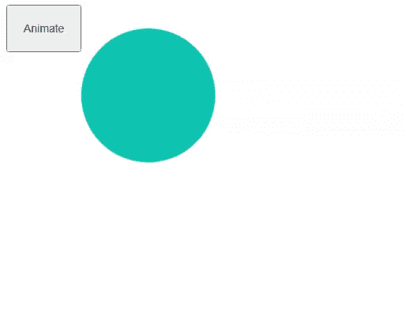

# 解释的用法。jQuery 中的 animate()函数

> 原文:[https://www . geesforgeks . org/explain-the-use-of-animate-function-in-jquery/](https://www.geeksforgeeks.org/explain-the-use-of-animate-function-in-jquery/)

一**介绍:**jQuery[**animate()**](https://www.geeksforgeeks.org/jquery-animate-with-examples/)函数在一组 CSS 属性上执行自定义动画。

**语法:**

```html
(selector).animate(properties [,duration][,easing][,complete])
```

**参数:**

*   **属性(*必需):**这些定义了要动画化的 CSS 属性和值的对象。只有数值(如高度、宽度、左侧等)可以设置动画，而非数值的属性(如背景色)则不能设置动画。除了数值之外，每个属性还可以接受字符串“显示”、“隐藏”和“切换”。
*   **持续时间(可选):**它给出动画将运行多长时间的数字或持续时间。这是以毫秒为单位的。如果未指定，默认值将为 400 毫秒。字符串“快”表示 200 毫秒的值，而字符串“慢”表示 600 毫秒的值。
*   **放松(可选):**它指定动画在动画内不同点的前进速度。默认值是字符串“swing”。“线性”值将以恒定的速度运行动画。
*   **完成(可选)**:动画完成后调用的回调函数。

**示例 1:** 在本例中，我们通过增加圆的高度和宽度来制作圆的动画。我们还使用了一个回调函数，一旦动画完成，它就会发出一条消息。

## 超文本标记语言

```html
<!DOCTYPE html>
<html>

<head>
    <script type="text/javascript" 
src="https://code.jquery.com/jquery-1.12.0.min.js">
    </script>

    <style>
        #circle {
            height: 150px;
            width: 150px;
            margin-top: 30px;
            padding: 10px;
            background-color: #00b3b3;
            border-radius: 50%;
            display: inline-block;
            position: absolute;
        }

        #btn {
            padding: 20px;
            font-size: 14px;
        }
    </style>

    <script>
        $(document).ready(function () {
            $("#btn").click(function () {
                $("#circle").animate({
                    height: "400px",
                    width: "400px"
                }, 3000, animationcomplete);
            });

            function animationcomplete() {
                alert("animation is completed");
            }
        });
    </script>
</head>

<body>
    <button id="btn">Animate</button>
    <div id="circle"></div>
</body>

</html>
```

**输出:**



**示例 2:** 在本例中，我们正在为一个不停地上下跳动的徽标图像制作动画。我们重复调用该函数，这样动画就不会停止，如下面的代码所示。

## 超文本标记语言

```html
<!DOCTYPE html>
<html>

<head>
    <script type="text/javascript" 
src="https://code.jquery.com/jquery-1.12.0.min.js">
    </script>

    <style>
        body {
            display: flex;
            justify-content: center;
            align-items: center;
            background: brown;
        }

        img {
            position: absolute;
            border-radius: 50%;
        }
    </style>

    <script>
        $(document).ready(function () {
            function Bounce() {
                $("#myimg").animate({
                    top: "100px",
                    width: "200px"
                }, 1000, function () {
                    $("#myimg").animate({
                        top: "300px",
                        width: "250px"
                    }, 1000, Bounce)
                });
            }
            Bounce();
        })
    </script>
</head>

<body>
    
</body>

</html>
```

**输出:**

