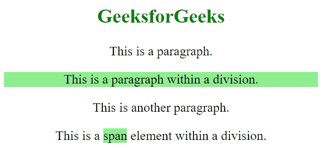

# 使用 jQuery

查找每个分部的所有子代

> 原文:[https://www . geeksforgeeks . org/find-每个部门的所有孩子-使用-jquery/](https://www.geeksforgeeks.org/find-all-children-of-each-division-using-jquery/)

在本文中，我们将看到如何找到 HTML 文档的每个分部元素的所有子元素。

要在 jQuery 中查找所有孩子，只需使用[*。*](https://www.geeksforgeeks.org/jquery-children-with-examples/) 子()[法同*。css()*](https://www.geeksforgeeks.org/jquery-css-method/) 法。

**使用的方法:**

*   **。children():** 此方法返回所选元素的所有直接子元素。
*   **。css():** 此方法用于设置或返回所选元素的一个或多个样式属性。

**进场:**

*   用各种 *div* 元素及其子元素创建 HTML 页面。
*   使用 [*。*](https://www.geeksforgeeks.org/jquery-children-with-examples/) 子()【法】找到分裂元素的子。
*   使用[*。*CSS()](https://www.geeksforgeeks.org/jquery-css-method/)方法，样式那些子元素的划分元素。

**示例:**

## 超文本标记语言

```
<!DOCTYPE html>
<html>
  <head>
    <script src=
"https://code.jquery.com/jquery-git.js">
    </script>
    <meta charset="utf-8" />
    <meta name="viewport" 
          content="width=device-width" />

    <style>
      body {
        text-align: center;
        font-size: 26px;
      }
    </style>
  </head>
  <body>
    <h2 style="color: green">GeeksForGeeks</h2>

    <p>This is a paragraph.</p>

    <div>
      <p>This is a paragraph within a division.</p>
    </div>

    <p>This is another paragraph.</p>

    <div>
      This is a <span>span</span> 
      element within a division.
    </div>
    <script>
      $("div").children()
              .css("background-color", " lightgreen");
    </script>
  </body>
</html>
```

**输出:**在这个例子中，首先我们找到了 *div* 元素的所有子元素，并应用了 CSS 的 [*背景*](https://www.geeksforgeeks.org/css-background/) 属性。分部元素的所有子元素都应该在网页上突出显示。

