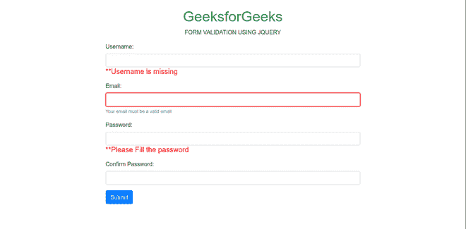
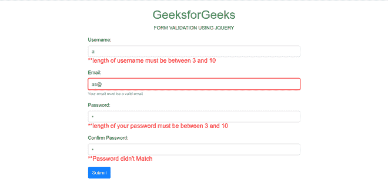
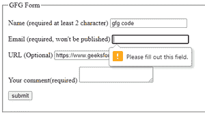
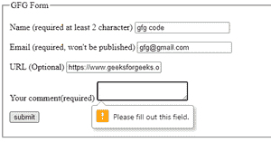
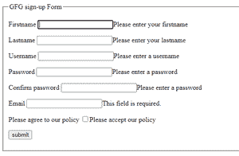
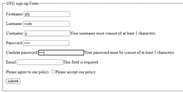

# 使用 jQuery 进行表单验证

> 原文:[https://www.geeksforgeeks.org/form-validation-using-jquery/](https://www.geeksforgeeks.org/form-validation-using-jquery/)

表单验证是确认用户在输入字段中输入的相关信息的过程。在这里，我们将使用 **jQuery** 验证一个由用户名、密码和确认密码组成的简单表单。

**先决条件:**你必须了解 HTML、CSS、JavaScript 和 jQuery 的基础知识。

**进场:**

1.  首先需要创建一个**index.html**文件，该文件由 **Bootstrap 4** 表单组成，以*用户名*、*邮件*、*密码*、*确认密码*为输入字段。在“body”标签的底部，包含“app.js”文件，该文件具有用于表单验证的 **jQuery** 代码。
2.  创建一个 **app.js** 文件，按照下面的代码验证整个表单。
3.  在 **app.js** 文件中，当文档准备好时，隐藏所有错误信息。对所有输入字段执行验证任务，如*用户名、电子邮件、密码和确认密码*。

**index.html:** 下面的 html 代码演示了用户输入的表单设计。

## 超文本标记语言

```html
<!DOCTYPE html>
<html>
<head>
    <!-- Latest compiled and minified CSS -->
    <link rel="stylesheet" href=
    "https://maxcdn.bootstrapcdn.com/bootstrap/
     4.0.0/css/bootstrap.min.css">
    <!-- jQuery library -->
    <script src=
    "https://ajax.googleapis.com/ajax/libs/
     jquery/3.3.1/jquery.min.js">
    </script>
    <!-- Popper JS -->
    <script src=
    "https://cdnjs.cloudflare.com/ajax/libs/
     popper.js/1.12.9/umd/popper.min.js">
    </script>
    <!-- Latest compiled JavaScript -->
    <script src=
    "https://maxcdn.bootstrapcdn.com/bootstrap/
     4.0.0/js/bootstrap.min.js">
    </script>
</head>

<body><br>
    <h1 class="text-center text-success">
        Welcome to GeeksforGeeks
    </h1>

    <p class="text-center">
      FORM VALIDATION USING JQUERY
    </p>

    <div class="container">
      <div class="col-lg-8
           m-auto d-block">
        <form>
          <div class="form-group">
              <label for ="user">
                Username:
              </label>
              <input type="text"
                    name="username" id="usernames"
                    class="form-control">
              <h5 id="usercheck" style="color: red;" >
                    **Username is missing
              </h5>
          </div>

          <div class="form-group">
              <label for="user">
                    Email:
              </label>
              <input type="email" name="email"
                id="email" required
                class="form-control">
              <small id="emailvalid" class="form-text
                text-muted invalid-feedback">
                    Your email must be a valid email
              </small>
          </div>

          <div class="form-group">
              <label for="password">
                    Password:
              </label>
              <input type="password" name="pass"
                id="password" class="form-control">
              <h5 id="passcheck" style="color: red;">
                **Please Fill the password
              </h5>
          </div>

          <div class="form-group">
              <label for="conpassword">
                    Confirm Password:
              </label>
              <input type="password" name="username"
                    id="conpassword" class="form-control">
              <h5 id="conpasscheck" style="color: red;">
                  **Password didn't match
              </h5>
          </div>

          <input type="submit" id="submitbtn"
             value="Submit" class="btn btn-primary">  
        </form>
      </div>
    </div>

    <!--  Including app.js jQuery Script -->
      <script src="app.js"></script>
  </body>
</html>
```

**app.js:** 上面的 HTML 文件中使用了下面的 jQuery 代码进行验证。

## java 描述语言

```html
// Document is ready
$(document).ready(function () {

// Validate Username
    $('#usercheck').hide();   
    let usernameError = true;
    $('#usernames').keyup(function () {
        validateUsername();
    });

    function validateUsername() {
      let usernameValue = $('#usernames').val();
      if (usernameValue.length == '') {
      $('#usercheck').show();
          usernameError = false;
          return false;
      }
      else if((usernameValue.length < 3)||
              (usernameValue.length > 10)) {
          $('#usercheck').show();
          $('#usercheck').html
("**length of username must be between 3 and 10");
          usernameError = false;
          return false;
      }
      else {
          $('#usercheck').hide();
      }
    }

   // Validate Email
    const email =
        document.getElementById('email');
    email.addEventListener('blur', ()=>{
       let regex =
/^([_\-\.0-9a-zA-Z]+)@([_\-\.0-9a-zA-Z]+)\.([a-zA-Z]){2,7}$/;
       let s = email.value;
       if(regex.test(s)){
          email.classList.remove(
                'is-invalid');
          emailError = true;
        }
        else{
            email.classList.add(
                  'is-invalid');
            emailError = false;
        }
    })

   // Validate Password
    $('#passcheck').hide();
    let passwordError = true;
    $('#password').keyup(function () {
        validatePassword();
    });
    function validatePassword() {
        let passwrdValue =
            $('#password').val();
        if (passwrdValue.length == '') {
            $('#passcheck').show();
            passwordError = false;
            return false;
        }
        if ((passwrdValue.length < 3)||
            (passwrdValue.length > 10)) {
            $('#passcheck').show();
            $('#passcheck').html
("**length of your password must be between 3 and 10");
            $('#passcheck').css("color", "red");
            passwordError = false;
            return false;
        } else {
            $('#passcheck').hide();
        }
    }

// Validate Confirm Password
    $('#conpasscheck').hide();
    let confirmPasswordError = true;
    $('#conpassword').keyup(function () {
        validateConfirmPasswrd();
    });
    function validateConfirmPasswrd() {
        let confirmPasswordValue =
            $('#conpassword').val();
        let passwrdValue =
            $('#password').val();
        if (passwrdValue != confirmPasswordValue) {
            $('#conpasscheck').show();
            $('#conpasscheck').html(
                "**Password didn't Match");
            $('#conpasscheck').css(
                "color", "red");
            confirmPasswordError = false;
            return false;
        } else {
            $('#conpasscheck').hide();
        }
    }

// Submit button
    $('#submitbtn').click(function () {
        validateUsername();
        validatePassword();
        validateConfirmPasswrd();
        validateEmail();
        if ((usernameError == true) &&
            (passwordError == true) &&
            (confirmPasswordError == true) &&
            (emailError == true)) {
            return true;
        } else {
            return false;
        }
    });
});
```

**输出:**下面是用户直接点击提交按钮时生成的输出。



以下是用户在表单中输入无效详细信息时生成的输出。



HTML 是网页的基础，通过构建网站和网络应用程序用于网页开发。您可以通过以下 [HTML 教程](https://www.geeksforgeeks.org/html-tutorials/)和 [HTML 示例](https://www.geeksforgeeks.org/html-examples/)从头开始学习 HTML。

CSS 是网页的基础，通过设计网站和网络应用程序用于网页开发。你可以通过以下 [CSS 教程](https://www.geeksforgeeks.org/css-tutorials/)和 [CSS 示例](https://www.geeksforgeeks.org/css-examples/)从头开始学习 CSS。

jQuery 是一个开源的 JavaScript 库，它简化了 HTML/CSS 文档之间的交互，它以其“少写多做”的理念而闻名。
跟随本 [jQuery 教程](https://www.geeksforgeeks.org/jquery-tutorials/)和 [jQuery 示例](https://www.geeksforgeeks.org/jquery-examples/)可以从头开始学习 jQuery。

## 使用内置的 jQuery 验证插件进行验证

在这一部分中，您将了解 jQuery 的内置验证方法。

**例 1 :**

## 超文本标记语言

```html
<!doctype html>
<html>
<head>
<meta charset="utf-8">
<title>Comment Form</title>
  <!-- below we are including the jQuery and jQuery plugin .js files -->
<script src="https://ajax.googleapis.com/ajax/libs/jquery/3.5.1/jquery.min.js"></script>
<script src="https://cdn.jsdelivr.net/jquery.validation/1.16.0/jquery.validate.min.js"></script>
<script src="https://cdn.jsdelivr.net/jquery.validation/1.16.0/additional-methods.min.js"></script>
<script>
  // user have to use id for form and call validate method
$("#commonForm").validate();
</script>
</head>
<body>
<form class="cmxform" id="commonForm" method="get" action="form-handler.html" autocomplete="off">
<fieldset>
<legend>GFG Form</legend>

<p>
<label for="cname">Name <span>(required at least 2 character)</span></label>
  <!--User have to set the constraints in attribute form-->
<input id="cname" name="name" minlength="2" type="text" required></input>
</p>

<p>
<label for="cemail">Email <span>(required, won't be published)</span></label>
<input id="cemail" type="email" name="email" required></input>
</p>

<p>
<label for="curl">URL <span>(Optional)</span></label>
<input id="curl" type="url" name="url" required></input>
</p>

<p>
<label for="ccomment">Your comment<span>(required)</span></label>
<textarea id="ccomment" name="comment" required></textarea>
</p>

<p>
<input class="submit" type="submit" value="submit">
</p>

</fieldset>
</form>
</body>
</html>
```

注意:通过使用文本编辑器创建一个. html 文件来运行上面的代码。



如果我们不填写电子邮件部分



如果我们不填写评论区

**例 2:(重要)**

jQuery 插件简化了客户端的验证代码。

该插件附带了一套有用的验证方法，包括网址和电子邮件验证，同时提供了一个编写自己方法的应用编程接口。

下面的例子对此做了更多的说明。

## 超文本标记语言

```html
<!doctype html>
<html>
<head>
<meta charset="utf-8">
<title>Comment Form</title>
    <!-- below we are including the jQuery and jQuery plugin .js files -->
<script src="https://ajax.googleapis.com/ajax/libs/jquery/3.5.1/jquery.min.js"></script>
<script src="https://cdn.jsdelivr.net/jquery.validation/1.16.0/jquery.validate.min.js"></script>
<script src="https://cdn.jsdelivr.net/jquery.validation/1.16.0/additional-methods.min.js"></script>
<script>
$().ready(function(){

$("#signupForm").validate({
  // in 'rules' user have to specify all the constraints for respective fields
rules : {
firstname : "required",
lastname : "required",
username : {
required : true,
minlength : 2  //for length of lastname
},
password : {
required : true,
minlength : 5
},
confirm_password : {
required : true,
minlength : 5,
equalTo : "#password" //for checking both passwords are same or not
},
email : {
required : true,
email : true
},
agree : "required"
},
    // in 'messages' user have to specify message as per rules
messages : {
firstname : "Please enter your firstname",
lastname : "Please enter your lastname",
username :{
required : "Please enter a username",
minlength : "Your username must consist of at least 2 characters"
},
password : {
required : "Please enter a password",
minlength : "Your password must be consist of at least 5 characters"
},
confirm_password : {
required : "Please enter a password",
minlength : "Your password must be consist of at least 5 characters",
equalTo : "Please enter the same password as above"
},
agree : "Please accept our policy"
}
});
});

</script>
</head>
<body>
<form class="cmxform" id="signupForm" method="get" action="form-handler.html" autocomplete="off">
<fieldset>
<legend>GFG sign-up Form</legend>

<p>
<label for="firstname">Firstname</label>
<input id="firstname" name="firstname" type="text"></input>
</p>

<p>
<label for="lastname">Lastname</label>
<input id="lastname" name="lastname" type="text"></input>
</p>

<p>
<label for="username">Username</label>
<input id="username" name="username" type="text"></input>
</p>

<p>
<label for="password">Password</label>
<input id="password" name="password" type="password"></input>
</p>

<p>
<label for="confirm_password">Confirm password</label>
<input id="confirm_password" name="confirm_password" type="password"></input>
</p>

<p>
<label for="email">Email</label>
<input id="email" name="email" type="email"></input>
</p>

<p>
<label for="agree">Please agree to our policy</label>
<input id="agree" name="agree" type="checkbox"></input>
</p>

<p>
<input class="submit" type="submit" value="submit">
</p>

</fieldset>
</form>
</body>
</html>
```

注意:通过使用文本编辑器创建. html 文件来运行上面的代码。

 