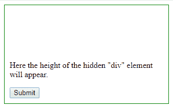
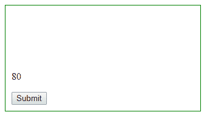
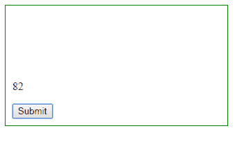

# 获取 jQuery 中隐藏元素的高度

> 原文:[https://www . geesforgeks . org/get-the-height-of-the-hidden-element-in-jquery/](https://www.geeksforgeeks.org/get-the-height-of-the-hidden-element-in-jquery/)

借助**可以隐藏一个 HTML 元素。hide()** jQuery 函数或者我们可以通过让可见性等于隐藏在 CSS 中来轻松隐藏**。我们可以很容易地在 jQuery 中找到这个隐藏元素的高度。
每个 HTML 元素定义了两种高度，即元素的**内部高度**和**外部高度**:**

1.  ****内部高度:**当所选元素不考虑边框宽度时，将考虑该高度。**
2.  ****外部高度:**当考虑所选元素的边框宽度时，会考虑该高度。**

****示例-1:** 这个示例展示了如何计算隐藏元素的 innerHeight。**

```
<!DOCTYPE html>
<html>

<head>
    <script src=
"https://ajax.googleapis.com/ajax/libs/jquery/3.3.1/jquery.min.js">
  </script>

    <script>
        $(document).ready(function() {
            $("#btn1").click(function() {
                var demo = $("div").innerHeight();
                $("#demo").text(demo);
            });
        });
    </script>

    <style>
        div {
            width: 310px;
            height: 80px;
            font-weight: bold;
            color: green;
            font-size: 25px;
            border: 1px solid green;
            visibility: hidden;
        }

        body {
            border: 1px solid green;
            padding: 10px;
            width: 300px;
        }
    </style>
</head>

<body>
    <div>

    </div>

    <p id="demo">
      Here the height of the 
      hidden "div" element will appear.
  </p>

    <button id="btn1">Submit</button>

</body>

</html>
```

****输出:**
**点击前:**

**点击后:**
这里，边框宽度不会加到结果中。
**

****示例-2:** 该示例显示了如何计算隐藏元素的外部高度。**

```
<!DOCTYPE html>
<html>

<head>
    <script src=
"https://ajax.googleapis.com/ajax/libs/jquery/3.3.1/jquery.min.js">
  </script>

    <script>
        $(document).ready(function() {
            $("#btn1").click(function() {
                var demo = $("div").outerHeight();
                $("#demo").text(demo);
            });
        });
    </script>

    <style>
        div {
            width: 310px;
            height: 80px;
            font-weight: bold;
            color: green;
            font-size: 25px;
            border: 1px solid green;
            visibility: hidden;
        }

        body {
            border: 1px solid green;
            padding: 10px;
            width: 300px;
        }
    </style>
</head>

<body>
    <div>

    </div>

    <p id="demo">
       Here the height of the hidden 
      "div" element will appear.
    </p>

    <button id="btn1">Submit</button>

</body>

</html>
```

****输出:**
**点击前:**
**

****点击后:**
这里，边框宽度会加到结果中。
**