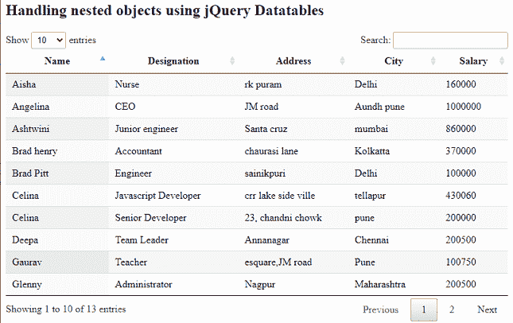
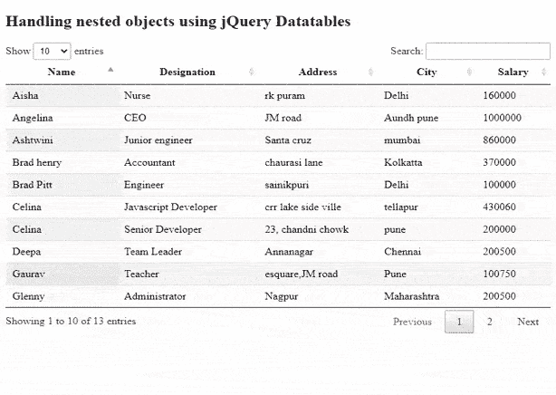

# 使用 jQuery 数据表插件

处理嵌套数据对象

> 原文:[https://www . geesforgeks . org/handling-nested-data-objects-use-jquery-datatables-plugin/](https://www.geeksforgeeks.org/handling-nested-data-objects-using-jquery-datatables-plugin/)

**DataTables** 是一个现代 jQuery 插件，用于为我们的网页的 HTML 表格添加交互和高级控件。这是一个简单易用的插件，为开发人员的自定义更改提供了许多选项。数据表的共同特征是排序、排序、搜索和分页。

数据表可以轻松地从任何嵌套的 JSON 数据源或数组中读取列的信息。开发人员可以根据应用程序的需要尝试许多选项。

代码实现所需的预编译文件如下。

**JavaScript:**

```html
https://cdn.datatables.net/1.10.22/js/jquery.dataTables.min.js
```

CSS:

```html
https://cdn.datatables.net/1.10.22/css/jquery.dataTables.min.css
```

**示例:**以下示例演示了通过客户端处理在数据表中 Ajax 加载嵌套的 JSON 数据对象。使用的选项是*列数据*属性。

以下是许多用户的嵌套数据，包括他们的详细信息，如姓名、地址、职务和工资。以下代码中使用了该示例数据。

**文件名:nesedjsondata . txt**

```html
{
  "data": [
    {
      "name": "Tina Mukherjee",
      "details": {
        "designation": "BPO member",
        "salary": "300000"
      },
      "address": [
        "24,chandni chowk",
        "Pune"
      ]
    },
    {
      "name": "Gaurav",
      "details": {
        "designation": "Teacher",
        "salary": "100750"
      },
      "address": [
        "esquare,JM road",
        "Pune"
      ]
    },
    {
      "name": "Ashtwini",
      "details": {
        "designation": "Junior engineer",
        "salary": "860000"
      },
      "address": [
        "Santa cruz",
        "mumbai"
      ]
    },
    {
      "name": "Celina",
      "details": {
        "designation": "Javascript Developer",
        "salary": "430060"
      },
      "address": [
        "crr lake side ville",
        "tellapur"
      ]
    },
    {
      "name": "Aisha",
      "details": {
        "designation": "Nurse",
        "salary": "160000"
      },
      "address": [
        "rk puram",
        "Delhi"
      ]
    },
    {
      "name": "Brad henry",
      "details": {
        "designation": "Accountant",
        "salary": "370000"
      },
      "address": [
        "chaurasi lane",
        "Kolkatta"
      ]
    },
    {
      "name": "Harry",
      "details": {
        "designation": "Salesman",
        "salary": "130500"
      },
      "address": [
        "32, krishna nagar",
        "Navi mumbai"
      ]
    },
    {
      "name": "Rhovina",
      "details": {
        "designation": "Amazon supporter",
        "salary": "300900"
      },
      "address": [
        "Aparna zone",
        "hyderabad"
      ]
    },
    {
      "name": "Celina",
      "details": {
        "designation": "Senior Developer",
        "salary": "200000"
      },
      "address": [
        "23, chandni chowk",
        "pune"
      ]
    },          
    {
      "name": "Glenny",
      "details": {
        "designation": "Administrator",
        "salary": "200500"
      },
      "address": [
        "Nagpur",
        "Maharashtra"
      ]
    },
    {
      "name": "Brad Pitt",
      "details": {
        "designation": "Engineer",
        "salary": "100000"
      },
      "address": [
        "sainikpuri",
        "Delhi"
      ]
    },
    {
      "name": "Deepa",
      "details": {
        "designation": "Team Leader",
        "salary": "200500"
      },
      "address": [
        "Annanagar",
        "Chennai"
      ]
    },
    {
      "name": "Angelina",
      "details": {
        "designation": "CEO",
        "salary": "1000000"
      },
      "address": [
        "JM road",
        "Aundh pune"
      ]
    }
 ]
}
```

**文件名:index.html**

## 超文本标记语言

```html
<!DOCTYPE html>
<html lang="en">
<head>
  <meta content="initial-scale=1, maximum-scale=1, 
  user-scalable=0" name="viewport" />
  <meta name="viewport" content="width=device-width" />
  <!--Datatable plugin CSS file -->
  <link rel="stylesheet" 
  href=
"https://cdn.datatables.net/1.10.22/css/jquery.dataTables.min.css" />
  <!--jQuery library file -->
  <script type="text/javascript" 
  src="https://code.jquery.com/jquery-3.5.1.js"></script>
  <!--Datatable plugin JS library file -->
  <script type="text/javascript" 
  src=
"https://cdn.datatables.net/1.10.22/js/jquery.dataTables.min.js">
  </script>
</head>
<body>
  <h2>Handling nested objects using jQuery Datatables </h2>
  <!--HTML tables with user data-->
  <table id="tableID" class="display" style="width:100%">
    <thead>
      <tr>
        <th>Name</th>
        <th>Designation</th>
        <th>Address</th>
        <th>City</th>
        <th>Salary</th>
      </tr>
    </thead>
  </table>
  <script>
      // Initialization of datatables
      $(document).ready(function () {
        $('#tableID').DataTable({
          "processing": true,
          "ajax": "nestedJSONdata.txt",
          "columns": [
            { "data": "name" },
            { "data": "details.designation" },
            { "data": "address.0" },
            { "data": "address.1" },
            { "data": "details.salary" }
          ]
        });
      });
  </script>
</body>
</html>
```

**常见错误:**数据表中最常见的错误是*无效的 JSON 响应。*当数据表加载数据时，它需要有效的 JSON。如果在 JSON 结构中遇到无效数据，它将抛出以下警告。

```html
DataTables warning: table id={tableID} - Invalid JSON response
```

其中 *tableID* 是 HTML 表格的 ID，如上面的代码实现。

**输出:**在有效 JSON 的情况下显示以下输出。

*   **执行前:**



*   **执行后:**

