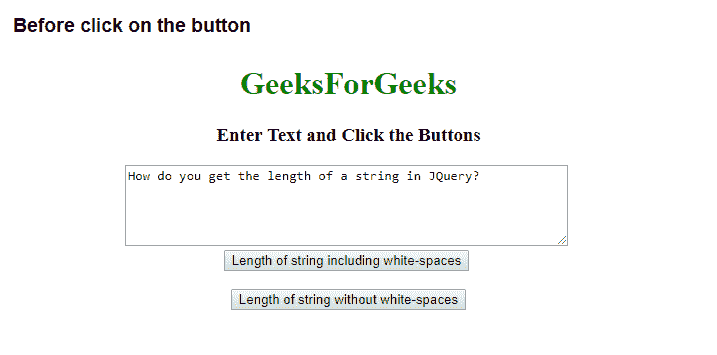
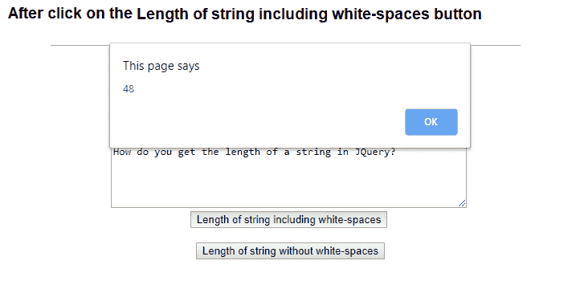
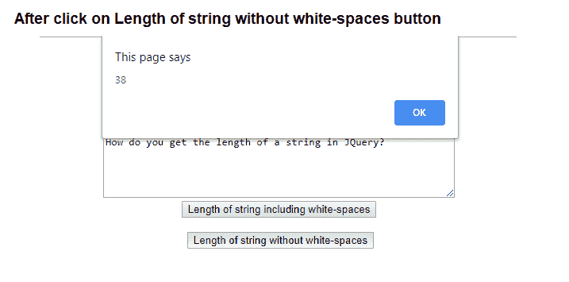
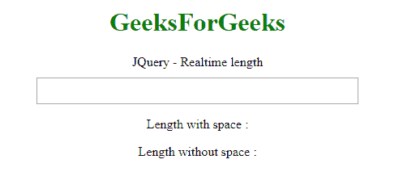

# 如何在 JQuery 中获取字符串的长度？

> 原文:[https://www . geeksforgeeks . org/如何获取 jquery 中的字符串长度/](https://www.geeksforgeeks.org/how-do-you-get-the-length-of-a-string-in-jquery/)

任务是在 JQuery 的帮助下获取字符串的长度。我们可以通过 **jQuery 找到字符串的长度。长度属性**。length 属性包含 jQuery 对象中的元素数量。因此，它可以用来获取或找出字符串中的字符数。

**语法:**

```
$(selector).length
```

**例 1:**

```
<!DOCTYPE html>
<html lang="en">

<head>
    <meta charset="utf-8">
    <title>Find Length of a String Using jQuery</title>
    <script src="https://code.jquery.com/jquery-1.12.4.min.js">
  </script>

    <script type="text/javascript">
        $(document).ready(function() {
            $("button").click(function() {
                var myStr = $("textarea").val();
                if ($(this).hasClass("with-space")) {
                    var withSpace = myStr.length;
                    alert(withSpace);
                } else if ($(this).hasClass("without-space")) {
                    var withoutSpace = myStr.replace(/ /g, '').length;
                    alert(withoutSpace);
                }
            });
        });
    </script>
</head>

<body style="text-align:center;">
    <h1 style="color:green;"> 
        GeeksForGeeks 
    </h1>
    <h3>Enter Text and Click the Buttons</h3>
    <textarea rows="5" cols="60">
      How do you get the length of a string in JQuery?
  </textarea>
    <br>
    <button type="button" class="with-space">
      Length of string including white-spaces
  </button>
    <br>
    <br>
    <button type="button" class="without-space">
      Length of string without white-spaces
  </button>
</body>

</html>
```

**输出:**
之前点击按钮:




**例 2:**

```
<!DOCTYPE html>
<html>

<head>
    <title>
      Find Length of a String Using jQuery
  </title>
    <meta charset="UTF-8">
    <meta name="viewport" 
          content="width=device-width,
                   initial-scale=1.0">
    <script src=
"https://ajax.googleapis.com/ajax/libs/jquery/3.1.1/jquery.min.js">
  </script>

    <script>
        $(function() {
            $('#geeks1').keyup(function() {
                var txtlen = $(this).val().length;
                var txtlennospace = $(this).val().replace(/\s+/g, '').length;
                $('#geeks1_space').text(txtlen);
                $('#geeks1_space_no_space').text(txtlennospace);

            });
        });
    </script>

</head>

<body style="text-align:center;">
    <h1 style="color:green;"> 
        GeeksForGeeks 
    </h1>
    <div style="padding-bottom: 10px;">JQuery - Realtime length</div>
    <div>
        <input style="padding: 7px;" 
               maxlength="60" 
               size="50" 
               type="text"
               id="geeks1" />
        <p>Length with space : 
          <span id="geeks1_space"></span></p>
        <p>Length without space : 
          <span id="geeks1_space_no_space"></span></p>
    </div>
</body>

</html>
```

**输出:**
入文前:
入文后:

T7】