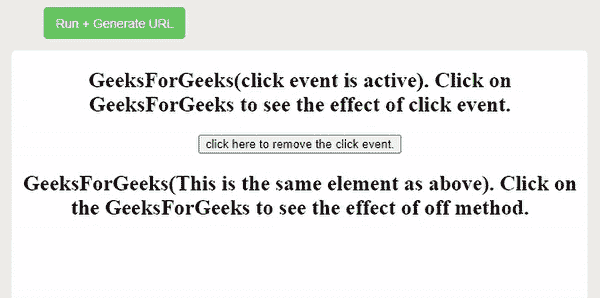

# jquery 怎么做。下班了？

> 原文:[https://www.geeksforgeeks.org/how-does-jquery-off-work/](https://www.geeksforgeeks.org/how-does-jquery-off-work/)

在本文中，我们将了解。jquery 中的 off()方法。JQuery 是一个轻量级且快速的 javascript 库，用于简化 javascript 代码。它比 javascript 更快，因为使用 JQuery 可以更快地执行相同的任务。

**[。关()法](https://www.geeksforgeeks.org/jquery-off-method/) :** 的任务。off()方法是从程序中移除一个事件处理程序。它是 JQuery 中的内置方法，主要目的是移除通过 on()方法附加到 HTML 元素的事件处理程序。

**语法:**

```html
$( selector ).off( event, selector, function( eventObj ), map);
```

**其中**

*   **事件:**从选择的元素中指定事件。
*   **选择器:**指定要移除其附加事件处理程序的元素。
*   **函数:**指定要运行以处理事件的函数的名称，是可选参数。
*   **映射:**它指定一个事件映射，这是一个键值对，其中键指定事件，值指定各自的处理函数。

**工作:**该。JQuery 中的 off()方法用于移除通过 on()方法连接到 HTML 元素的事件处理程序。让我们借助一个例子来理解，假设存在由 on click()方法附加的各种事件，并且如果我们在 off()方法中传递了 click 方法，那么所有的 click 方法都将从网页中移除。

**注意:** **(双星号)在 off()方法中用于从
元素中移除所有委托事件，而不移除非委托事件。

**示例:**

## 超文本标记语言

```html
<!DOCTYPE html>
<html lang="en">

<head>
    <meta charset="utf-8" />
    <title>jQuery off() method</title>

    <script src=
"https://ajax.googleapis.com/ajax/libs/jquery/3.5.1/jquery.min.js">
    </script>

    <style>
        body {
            text-align: center;
        }
    </style>

    <script>
        $(document).ready(function () {
            $("h2").on("click", function () {
                $(this).css("background-color", "green");
            });
            $("button").click(function () {
                $("h2").off("click");
            });
        });
    </script>
</head>

<body>
    <h2>
        GeeksForGeeks(click event is active).
        Click on GeeksForGeeks to see the
        effect of click event.
    </h2>

    <button>
        click here to remove the click event.
    </button>

    <h2>
        GeeksForGeeks(This is the same element as above).
        Click on the GeeksForGeeks to see the effect of
        off method.
    </h2>
</body>

</html>
```

**输出:**



**说明:**从上面的输出可以观察到，点击按钮后‘点击事件’会从网页中移除。基本上。off()是从网页中移除点击事件。