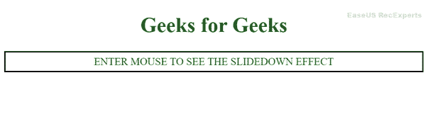
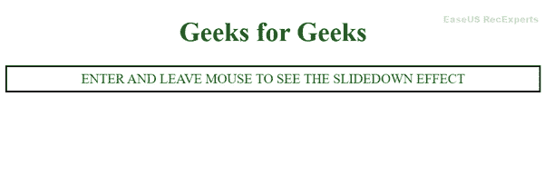
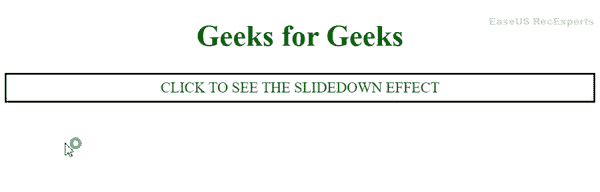

# 【slideDown()函数在 jQuery 事件处理程序中是如何工作的？

> 原文:[https://www . geesforgeks . org/how-slide down-function-works-in-jquery-event-handler/](https://www.geeksforgeeks.org/how-slidedown-function-works-in-jquery-event-handler/)

jQuery 函数 [**slideDown()**](https://www.geeksforgeeks.org/jquery-slidedown-method/) 通过对某个事件处理程序做出反应来创建某种效果。它显示隐藏的内容，具有向下放置内容的效果。其他相关功能有[**【slide up()】**](https://www.geeksforgeeks.org/jquery-slideup-with-examples/)**[**slide toggle()**](https://www.geeksforgeeks.org/jquery-slidetoggle-method/)。这些功能的工作方式也与 **slideDown()** 功能的工作方式相同，但效果不同。**

****语法:****

```html
$('selector').slideDown();
```

```html
$('selector').slideDown(speed, callbackFunction);
```

****注意:**速度值可以是*慢*、*快、*或任意固定的*毫秒*。如果需要，还可以添加回调函数。而要使效果初步显现，内容应该有 [*显示*](https://www.geeksforgeeks.org/css-display-property/) 属性为*无*。**

****示例 1:** 我们通过一些示例来看看 **slideDown()** 函数在 jQuery 中是如何工作的。**

## **超文本标记语言**

```html
<!DOCTYPE html>
<html lang="en">

<head>
    <meta charset="UTF-8">
    <meta http-equiv="X-UA-Compatible" 
        content="IE=edge">
    <meta name="viewport" content=
        "width=device-width, initial-scale=1.0">

    <!-- Including jQuery  -->
    <script src="https://code.jquery.com/jquery-3.6.0.min.js"
        integrity=
        "sha256-/xUj+3OJU5yExlq6GSYGSHk7tPXikynS7ogEvDej/m4="
        crossorigin="anonymous">
    </script>

    <style>
        h1 {
            color: #006600;
        }

        body {
            text-align: center;
        }

        #slider {
            text-align: center;
            padding: 5px;
            border: 2px solid black;
            color: #006600;
        }

        #GFG {
            padding: 5px;
            border: 2px solid black;
            background-color: #006600;
            font-size: xx-large;
            color: whitesmoke;
            height: auto;
            display: none;
        }
    </style>
</head>

<body>
    <h1> Geeks for Geeks</h1>

    <p></p>

    <div id="slider"> 
        ENTER MOUSE TO SEE THE SLIDEDOWN EFFECT 
    </div>

    <div id="GFG">
        Geeks for Geeks
    </div>

    <script>
        $(document).ready(function () {
            $('#slider').mouseenter(function () {
                $('#GFG').slideDown('slow');
            })
        });
    </script>
</body>

</html>
```

****输出:****

****

****示例 2:** 以下示例演示了 jQuery**[**mouse enter()**](https://www.geeksforgeeks.org/jquery-mouseenter-with-examples/)**和 [**mouseleave()**](https://www.geeksforgeeks.org/jquery-mouseleave-with-examples/) 事件。******

## ****超文本标记语言****

```html
**<!DOCTYPE html>
<html lang="en">

<head>
    <meta charset="UTF-8">
    <meta http-equiv="X-UA-Compatible" content="IE=edge">
    <meta name="viewport" content=
        "width=device-width, initial-scale=1.0">

    <!-- Including jQuery  -->
    <script src="https://code.jquery.com/jquery-3.6.0.min.js"
        integrity=
        "sha256-/xUj+3OJU5yExlq6GSYGSHk7tPXikynS7ogEvDej/m4=" 
        crossorigin="anonymous">
    </script>

    <style>
        h1 {
            color: #006600;
        }

        body {
            text-align: center;
        }

        #slider {
            text-align: center;
            padding: 5px;
            border: 2px solid black;
            color: #006600;

        }

        #GFG {
            padding: 5px;
            border: 2px solid black;
            background-color: #006600;
            font-size: xx-large;
            color: whitesmoke;
            height: auto;
            display: none;
        }
    </style>
</head>

<body>
    <h1> Geeks for Geeks</h1>

    <div id="slider">
        ENTER AND LEAVE MOUSE TO 
        SEE THE SLIDEDOWN EFFECT
    </div>

    <div id="GFG">
        Geeks for Geeks
    </div>

    <script>
        $(document).ready(function () {
            $('#slider').mouseenter(function () {
                $('#GFG').slideDown('slow');
            })
            $('#slider').mouseleave(function () {
                $('#GFG').slideDown('slow');
                $('#GFG').css({ 
                    'background-color': 'yellow', 
                    'color': '#006600' 
                });
            })
        });
    </script>
</body>

</html>**
```

******输出:******

********

******示例 3:** 我们还可以为图像添加 **slideDown()** 方法。我们可以在 *div* [**中放置一个图像，点击**](https://www.geeksforgeeks.org/jquery-click-with-examples/) 事件。****

## ****超文本标记语言****

```html
**<!DOCTYPE html>
<html lang="en">

<head>
    <meta charset="UTF-8">
    <meta http-equiv="X-UA-Compatible" content="IE=edge">
    <meta name="viewport" content="width=device-width, initial-scale=1.0">

    <!-- Including jQuery  -->
    <script src="https://code.jquery.com/jquery-3.6.0.min.js"
        integrity="sha256-/xUj+3OJU5yExlq6GSYGSHk7tPXikynS7ogEvDej/m4="
        crossorigin="anonymous">
    </script>

    <style>
        h1 {
            color: #006600;
        }

        body {
            text-align: center;
        }

        #slider {
            text-align: center;
            padding: 5px;
            border: 2px solid black;
            color: #006600;
        }

        #GFG {
            padding: 5px;
            border: 2px solid black;
            height: auto;
            display: none;
        }
    </style>
</head>

<body>
    <h1> Geeks for Geeks</h1>

    <div id="slider">
        CLICK TO SEE THE SLIDEDOWN EFFECT
    </div>

    <div id="GFG">

        <!-- Image added using img tag with src attribute -->
        
        
    </div>

    <script>
        $(document).ready(function () {
            $('#slider').click(function () {
                $('#GFG').slideDown('slow');
            })
        });
    </script>
</body>

</html>**
```

******输出:******

********