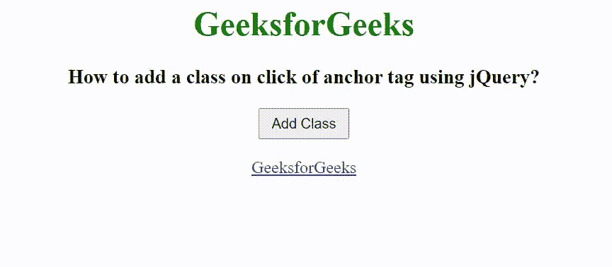

# 如何使用 jQuery 点击锚点标签添加类？

> 原文:[https://www . geesforgeks . org/如何使用-jquery/](https://www.geeksforgeeks.org/how-to-add-a-class-on-click-of-anchor-tag-using-jquery/) 点击锚标签添加类别

在本文中，我们将看到如何使用 jQuery 在点击锚点标签时添加一个类。点击锚点标签添加一个类，我们使用 [**添加类()方法**](https://www.geeksforgeeks.org/jquery-addclass-with-examples/) 。addClass()方法用于向每个选定的元素添加更多的属性。它还可以用于更改选定元素的属性。

**语法:**

```html
$(selector).addClass("active");
```

在下面的例子中，我们创建了一个锚点类元素和一个按钮，当用户点击按钮时，会调用 addClass()方法，这个方法会添加一个名为“active”的类。

**示例:**

## 超文本标记语言

```html
<!DOCTYPE html>
<html>

<head>
    <title>
        How to add a class on click 
        of anchor tag using jQuery?
    </title>

    <script src=
"https://ajax.googleapis.com/ajax/libs/jquery/3.3.1/jquery.min.js">
    </script>

    <style>
        .active {
            font-size: 32px;
            color: green;
            font-weight: bold;
            text-decoration: none;
        }
    </style>

    <script>
        $(document).ready(function() {
            $("#btn").on('click', function() {
                $("a").addClass("active");
            });
        });
    </script>
</head>

<body>
    <center>
        <h1 style="color: green;">
            GeeksforGeeks
        </h1>

        <h3>
            How to add a class on click 
            of anchor tag using jQuery?
        </h3>

        <input type="button" id="btn" 
            value="Add Class" 
            style="padding: 5px 10px;">
        <br><br>

        <a class="" href=
            "https://www.geeksforgeeks.org/">
            GeeksforGeeks
        </a>
    </center>
</body>

</html>
```

**输出:**

