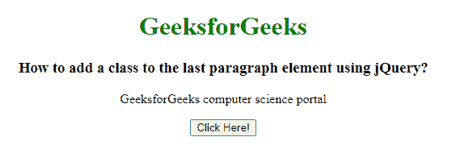

# 如何使用 jQuery 给最后一个段落元素添加一个类？

> 原文:[https://www . geeksforgeeks . org/如何使用-jquery/](https://www.geeksforgeeks.org/how-to-add-a-class-to-the-last-paragraph-element-using-jquery/) 将类添加到最后一段元素中

在本文中，我们将学习使用 jQuery 向最后一个段落元素添加一个类。为了给最后一个段落元素添加一个类，我们使用 **last()** 和 **addClass()** 方法。jQuery **last()** 函数是一个内置函数，用于查找指定元素的最后一个元素。

**语法:**

```html
$(selector).last()
```

**addClass()** 方法用于向每个选定的元素添加更多的类及其各自的属性。它还可以用于更改选定元素的属性。这里，类名可以直接与将要被选择的元素一起使用。

**语法:**

```html
$(selector).addClass(className);
```

**示例:**

## 超文本标记语言

```html
<!DOCTYPE html>
<html lang="en">

<head>
    <style>
        .GFG {
            color: green;
            font-size: 24px;
            font-weight: bold;
        }
    </style>

    <!-- Import jQuery cdn library -->
    <script src=
"https://ajax.googleapis.com/ajax/libs/jquery/3.3.1/jquery.min.js">
    </script>

    <script>
        $(document).ready(function () {
            $("button").click(function () {
                $("p").last().addClass("GFG");
            });
        });
    </script>
</head>

<body style="text-align: center;">
    <h1 style="color: green;">
        GeeksforGeeks
    </h1>

    <h3>
        How to add a class to the last
        paragraph element using jQuery?
    </h3>

    <p>GeeksforGeeks computer science portal</p>

    <button>Click Here!</button>
</body>

</html>
```

**输出:**

**点击按钮前:**



**点击按钮后:**

