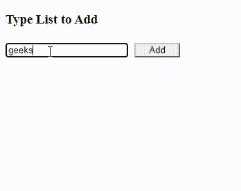

# 如何使用 jQuery 在无序列表元素中添加列表元素？

> 原文:[https://www . geeksforgeeks . org/如何使用-jquery/](https://www.geeksforgeeks.org/how-to-add-a-list-elements-within-an-unordered-list-element-using-jquery/) 在无序列表中添加列表元素

在本文中，我们将看到如何使用 jQuery 向无序列表添加一个列表。因此，我们用来添加列表中项目的函数是–

```html
<script>
    $(document).ready(function() {
        $('.btn').click(function(){
            var content = $('#addList').val();
            var fixingContent='<li>'+content+'</li>';
            $('.List').append(fixingContent);
        })
    }) 
</script>
```

**方法:**首先，我们创建一个按钮，提供将项目添加到列表的功能。

当点击按钮时，然后通过按钮标识，我们将首先存储从文本框到具有其值的变量内容的输入，然后简单地将内容放入**var fixing content = '<Li>T4】span>'+content+'</span></Li>'**

之后，我们只需将内容附加到具有名为**列表的类的列表中。**

**代码实现:**

## 超文本标记语言

```html
<!DOCTYPE html>
<html lang="en">

<head>
    <script src=
"https://ajax.googleapis.com/ajax/libs/jquery/2.1.1/jquery.min.js">
    </script>

    <style>
        .btn {
            width: 66px;
            height: 21px;
            margin: 5px;
            padding: 0px;
            border-color: #b6b6bb;
        }

        #addList {
            border-color: rgb(183, 252, 252);
        }
    </style>

    <script>
        $(document).ready(function() {
            $('.btn').click(function() {
                var content = $('#addList').val();
                var fixingContent = 
                    '<li>' + content + '</li>';

                $('.List').append(fixingContent);
            })
        })
    </script>
</head>

<body>
    <h3 class="head"> Type List to Add</h3>
    <input type="text" id="addList">
    <input type="button" name="add" 
        class="btn" value="Add">
    </button>

    <div class="addTask">
        <ul class="List">

        </ul>
    </div>
</body>

</html>
```

**输出**:

