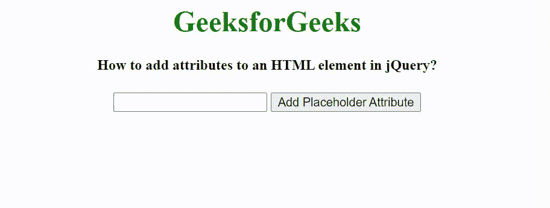

# 如何在 jQuery 中给 HTML 元素添加属性？

> 原文:[https://www . geesforgeks . org/如何向 jquery 中的 html 元素添加属性/](https://www.geeksforgeeks.org/how-to-add-attributes-to-an-html-element-in-jquery/)

给定一个包含一些元素的 HTML 文档，任务是向 HTML 元素添加属性。

**方法:**给定一个包含 **<标签>、<输入>和<按钮>** 元素的 HTML 文档。 **<输入>** 元素包含类型和 id 属性。当用户点击按钮时，jQuery 函数被调用。我们使用 **$(选择器)。attr()** 方法添加属性。这里，我们将占位符属性添加到输入字段中。

**语法:**

```
$("#add-attr").click(function () {
    $("#addAttr").attr("placeholder", "GeeksforGeeks");
});
```

**示例:**

## 超文本标记语言

```
<!DOCTYPE HTML>
<html>

<head>
    <meta http-equiv="Content-Type" content="text/html; charset=utf-8">  
    <script src="https://code.jquery.com/jquery-3.5.1.min.js">
    </script>

    <script>
        $(document).ready(function () {
            $("#add-attr").click(function () {
                $("#addAttr").attr("placeholder", "GeeksforGeeks");
            });
        });
    </script>
</head>

<body style="text-align: center;">
    <h1 style="color: green;">
        GeeksforGeeks
    </h1>

    <h4>
        How to add attributes to an HTML element in jQuery?
    </h4>

    <label for="addAttr"></label>
    <input type="text" id="addAttr">

      <button id="add-attr">Add Placeholder Attribute</button>
</body>

</html>
```

**输出:**

