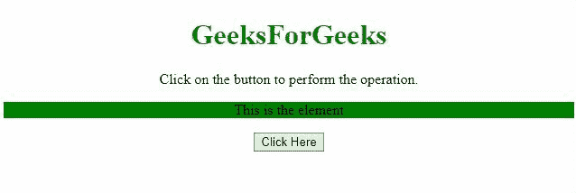

# jQuery 中没有 add class()方法如何给元素添加类？

> 原文:[https://www . geeksforgeeks . org/如何在 jquery 中将类添加到无 addclass 方法的元素中/](https://www.geeksforgeeks.org/how-to-add-class-to-an-element-without-addclass-method-in-jquery/)

任务是在 jQuery 的帮助下，在不使用 **addClass()方法**的情况下，给元素添加一个新的类。下面讨论两种方法:

**方法 1:** 要执行操作，我们可以使用 [**toggleClass()方法**](https://www.geeksforgeeks.org/jquery-toggleclass-with-examples/) 来切换我们想要添加到元素中的类。

*   **例:**

    ```html
    <!DOCTYPE HTML>
    <html>

    <head>
        <title>
            How to add class to an element without
            addClass() method in jQuery ?
        </title>

        <script src=
    "https://ajax.googleapis.com/ajax/libs/jquery/3.4.0/jquery.min.js">
        </script>

        <style>
            #el {
                background: green;
            }

            .newClass {
                color: white;
            }
        </style>
    </head>

    <body style="text-align:center;">

        <h1 style="color:green;">
            GeeksForGeeks
        </h1>

        <p id="GFG_UP"></p>

        <p id="el">This is the element</p>

        <button onclick="GFG_Fun()">
            Click Here
        </button>

        <p id="GFG_DOWN"></p>

        <script>
            var el_up = document.getElementById('GFG_UP');
            var el_down = document.getElementById('GFG_DOWN');

            el_up.innerHTML = "Click on the button to "
                        + "perform the operation.";

            function GFG_Fun() {
                $('#el').toggleClass('newClass');
                el_down.innerHTML = "Class has been added";
            }
        </script>
    </body>

    </html>
    ```

*   **输出:**
    

**方法二:**我们也可以使用 [**attr()方法**](https://www.geeksforgeeks.org/jquery-attr-method/) 和 [**prop()方法**](https://www.geeksforgeeks.org/jquery-prop-with-examples/) 给元素增加一个新的属性‘类’。

*   **例:**

    ```html
    <!DOCTYPE HTML>
    <html>

    <head>
        <title>
            How to add class to an element without
            addClass() method in jQuery ?
        </title>

        <script src=
    "https://ajax.googleapis.com/ajax/libs/jquery/3.4.0/jquery.min.js">
        </script>

        <style>
            #el {
                background: green;
            }

            .newClass {
                color: white;
            }
        </style>
    </head>

    <body style="text-align:center;">

        <h1 style="color:green;">
            GeeksForGeeks
        </h1>

        <p id="GFG_UP"></p>

        <p id="el">This is the element</p>

        <button onclick="GFG_Fun()">
            Click Here
        </button>

        <p id="GFG_DOWN"></p>

        <script>
            var el_up = document.getElementById('GFG_UP');
            var el_down = document.getElementById('GFG_DOWN');

            el_up.innerHTML = "Click on the button to "
                            + "perform the operation.";

            function GFG_Fun() {
                $('#el').attr('class', 'newClass');
                el_down.innerHTML = "Class has been added";
            }
        </script>
    </body>

    </html>
    ```

*   **输出:**
    