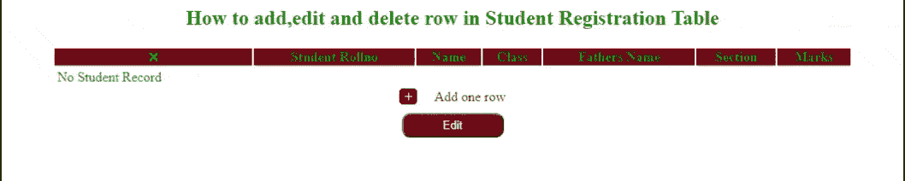

# 如何在 jQuery 中增加编辑和删除表行？

> 原文:[https://www . geeksforgeeks . org/如何添加-编辑-删除-表-行-in-jquery/](https://www.geeksforgeeks.org/how-to-add-edit-and-delete-table-row-in-jquery/)

在本文中，我们将创建一个如何在 jQuery 中添加、编辑和删除表行的示例。为了创建这个功能，我们需要了解 [HTML 表格](https://www.geeksforgeeks.org/html-table-bgcolor-attribute/)、 [jQuery](https://www.geeksforgeeks.org/jquery-tutorials/) 基本功能的基础知识。

**表格行:**HTML 表格是行和列的组合。表格行在水平方向。在本节中，我们将借助一些基本的 jQuery 函数来修改一个表行。

**进场:**

1.  创建了一个带有滚动号、类、父名、节、标记字段的 HTML 表。
2.  最初，该表为空，因此输出显示为“无学生记录”，并带有“编辑”按钮和“添加新行”按钮。
3.  使用 JavaScript 添加新行时，[行对象被克隆到最后一行之后](https://www.geeksforgeeks.org/how-to-clone-a-javascript-object/)。
4.  任何一行都可以删除，如代码所示，使用 jQuery [remove()](https://www.geeksforgeeks.org/jquery-remove/) 方法实现。
5.  使用 jQuery [【停止传播】(](https://www.geeksforgeeks.org/html-dom-stoppropagation-event-method/) )和[event . stop immediate propagation()](https://www.geeksforgeeks.org/jquery-event-stopimmediatepropagation-method/)方法来停止事件调用的传播。
6.  在代码的 CSS 部分，表格行和按钮设计是随着 CSS 淡入淡出 [动画效果](https://www.geeksforgeeks.org/css-animation-and-keyframes-property/) 使用[@关键帧规则](https://www.geeksforgeeks.org/css-animation-and-keyframes-property/) 来处理的。

**示例:**我们举一个在 jQuery 中如何添加、编辑和删除表行的例子。我们创建一个 HTML 表，在这个表中，我们可以在基本 jQuery 函数的帮助下动态执行诸如添加、编辑和删除表行的操作。

## 超文本标记语言

```html
<!DOCTYPE html>
<html>

<head>
    <meta charset="utf-8" />
    <script src=
"https://ajax.aspnetcdn.com/ajax/jQuery/jquery-3.3.1.min.js">
    </script>
    <link rel="stylesheet" href=
"https://use.fontawesome.com/releases/v5.7.2/css/all.css" 
        integrity=
"sha384-fnmOCqbTlWIlj8LyTjo7mOUStjsKC4pOpQbqyi7RrhN7udi9RwhKkMHpvLbHG9Sr"
        crossorigin="anonymous" />

    <style>
        body {
            text-align: center;
            color: green;
        }

        .wrapper {
            width: 90%;
            margin: 5px auto;
        }

        .common {
            width: 100%;
            border: none;
        }

        .common thead th {
            background-color: #791515;
        }

        .trow:first-child {
            display: none;
            margin: 0 auto;
        }

        .trow input {
            border-radius: 5px;
        }

        .controls a {
            text-decoration: none;
            color: #791515;
        }

        .list_add {
            text-decoration: none;
            color: #791515;
        }

        .list_add:before {
            content: "\002b";
            color: white;
            border: 1px solid #791515;
            padding: 0 5px;
            border-radius: 5px;
            background-color: #791515;
            margin-right: 20px;
        }

        .action_btn {
            text-align: center;
        }

        .action_btn input {
            width: 120px;
            padding: 5px;
            border-radius: 10px;
            margin: 10px;
        }

        .action_btn input:first-child {
            background-color: #791515;
            color: white;
        }

        @keyframes fadeout {
            from {
                bottom: 30px;
                opacity: 1;
            }
            to {
                bottom: 0;
                opacity: 0;
            }
        }

        @keyframes fadein {
            from {
                bottom: 0;
                opacity: 0;
            }
            to {
                bottom: 30px;
                opacity: 1;
            }
        }

        .fa-times {
            font-size: 1rem;
        }
    </style>
</head>

<body>
    <h2>
        How to add,edit and delete row 
        in Student Registration Table
    </h2>

    <div class="wrapper">
        <table class="common">
            <thead>
                <tr>
                    <th><i class="fas fa-times"></i></th>
                    <th>Student Rollno</th>
                    <th>Name</th>
                    <th>Class</th>
                    <th>Fathers Name</th>
                    <th>Section</th>
                    <th>Marks</th>
                </tr>
            </thead>
            <tbody>
                <tr class="trow">
                    <td class="controls">
                        <a href="#" class="list_cancel" 
                            title="Delete Row">
                            <i class="fas fa-times"></i>
                        </a>
                    </td>
                    <td>
                        <input type="text" id="rollno" 
                            name="" value="" />
                    </td>
                    <td>
                        <input type="text" class="long" 
                            id="name" name="" value="" />
                    </td>
                    <td>
                        <input type="text" id="class" 
                            name="" value="" />
                    </td>
                    <td>
                        <input type="text" id="fathname" 
                            name="" value="" />
                    </td>
                    <td>
                        <select name="" id="" class="label">
                            <option value="a">A</option>
                            <option value="b">B</option>
                            <option value="c">C</option>
                        </select>
                    </td>
                    <td>
                        <input type="text" class="" 
                            id="marks" name="" value="" />
                    </td>
                </tr>

                <tr class="no_entries_row">
                    <td colspan="7">No Student Record</td>
                </tr>
            </tbody>
        </table>

        <a href="#" class="list_add">Add one row</a>
        <br class="clear" />

        <div class="action_btn">
            <input name="submit" class="action_btn submit"
                type="submit" value="Edit" />
        </div>
    </div>

    <script>
        function addNewRow() {
            var template = $("tr.trow:first");
            $(".no_entries_row").css("display", "none");
            var newRow = template.clone();
            var lastRow = $("tr.trow:last").after(newRow);

            $(".list_cancel").on("click", function(event) {
                event.stopPropagation();
                event.stopImmediatePropagation();
                $(this).closest("tr").remove();
                if ($(".list_cancel").length === 1) {
                    $(".no_entries_row")
                        .css("display", "inline-block");
                }
                console.log($(".list_cancel").length);
            });
            console.log($(".list_cancel").length);
            $("select.label").on("change", function(event) {
                event.stopPropagation();
                event.stopImmediatePropagation();
                $(this).css("background-color", $(this).val());
            });
        }

        $("a.list_add").on("click", addNewRow);
    </script>
</body>

</html>
```

**输出:**



添加编辑删除行