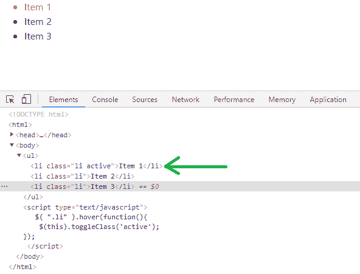
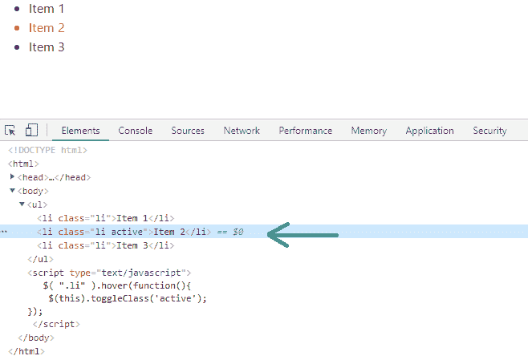
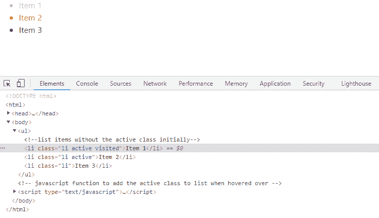

# 如何添加

*   class to active and leave it after hover using jQuery ?

    > 原文:[https://www . geeksforgeeks . org/如何使用-jquery/](https://www.geeksforgeeks.org/how-to-add-li-class-to-active-and-leave-it-after-hover-using-jquery/) 将 li 类添加到活动状态并在悬停后离开它

    Bootstrap 4 是一个开源的 CSS 框架，用于 web 应用程序的前端开发。Bootstrap 与 HTML 和 Javascript 一起丰富了用户界面，以获得更好的用户体验。jQuery 是一个用于执行 Javascript 函数的 Javascript 框架。jQuery 具有类似于 javascript 的功能，但唯一的区别是 jQuery 包含的代码行更少。使用 jQuery 和 CSS，我们可以编写一个代码，演示当光标悬停在列表项上时添加活动类，以及随后当光标移出时移除活动类。

    *   **First Approach:** In the first approach, we use the hover() method of jQuery. The hover() method triggers or registers both the mouseenter and mouseleave events. The hover() method takes two functions as a parameter. The first parameter is the infunction that must be triggered when the mouse enters the selected item and the second parameter is the outfunction that must be executed when the mouse leaves the selected item. The first parameter is required whereas the second parameter is optional. In this example, we specify the infunction only. If only one function is specified, it runs for both the mouseenter and mouseleave events. Also, the toggleClass() method toggles the active class i.e. adds the active class if it is not present in the <li> item else removes the active class.

        **语法:**

        ```html
        hover(infunction, outfunction)
        ```

        **示例:**

        ```html
        <!DOCTYPE html>
        <html>
            <head>
                <!-- CSS only -->
                <link rel="stylesheet"
                      href=
        "https://stackpath.bootstrapcdn.com/bootstrap/4.5.2/css/bootstrap.min.css" 
                      integrity=
        "sha384-JcKb8q3iqJ61gNV9KGb8thSsNjpSL0n8PARn9HuZOnIxN0hoP+VmmDGMN5t9UJ0Z" 
                      crossorigin="anonymous" />
                <!-- JS, Popper.js, jquery -->
                <script src=
        "https://code.jquery.com/jquery-3.5.1.slim.min.js" 
                        integrity=
        "sha384-DfXdz2htPH0lsSSs5nCTpuj/zy4C+OGpamoFVy38MVBnE+IbbVYUew+OrCXaRkfj" 
                        crossorigin="anonymous">
              </script>
                <script src=
        "https://cdn.jsdelivr.net/npm/popper.js@1.16.1/dist/umd/popper.min.js" 
                        integrity=
        "sha384-9/reFTGAW83EW2RDu2S0VKaIzap3H66lZH81PoYlFhbGU+6BZp6G7niu735Sk7lN" 
                        crossorigin="anonymous"></script>
                <script src=
        "https://stackpath.bootstrapcdn.com/bootstrap/4.5.2/js/bootstrap.min.js" 
                        integrity=
        "sha384-B4gt1jrGC7Jh4AgTPSdUtOBvfO8shuf57BaghqFfPlYxofvL8/KUEfYiJOMMV+rV" 
                        crossorigin="anonymous"></script>

                <!--CSS stylesheet-->
                <style type="text/css">
                    .active,
                    li:hover {
                        color: red;
                    }
                </style>
            </head>
            <body>
                <ul>
                    <!--list items without the 
                        active class initially-->
                    <li class="li">Item 1</li>
                    <li class="li">Item 2</li>
                    <li class="li">Item 3</li>
                </ul>

                <!-- javascript function to add the active
                     class to list when hovered over -->
                <script type="text/javascript">
                    $(".li").hover(function () {
                        //toggleClass() switches the active class
                        $(this).toggleClass("active");
                    });
                </script>
            </body>
        </html>
        ```

        **输出**
        

        

        **说明:**输出在网络浏览器的控制台中检查。当光标悬停在列表项上时，我们会在控制台中看到添加到列表项的活动类。当光标悬停在外面时，活动类将从最近悬停的项中移除，并添加到下一项中。

    *   **Second Approach:** In the second approach, we add the outfunction to denote an already list item. Here the active class is added on mouseenter and removed on mouseleave. As the mouseleave event is triggered the visited class is added to the recently visited list item.

        ```html
        <!DOCTYPE html>
        <html>
            <head>
                <!-- CSS only -->
                <link rel="stylesheet"
                      href=
        "https://stackpath.bootstrapcdn.com/bootstrap/4.5.2/css/bootstrap.min.css" 
                      integrity=
        "sha384-JcKb8q3iqJ61gNV9KGb8thSsNjpSL0n8PARn9HuZOnIxN0hoP+VmmDGMN5t9UJ0Z" 
                      crossorigin="anonymous" />
                <!-- JS, Popper.js, jquery -->
                <script src="https://code.jquery.com/jquery-3.5.1.slim.min.js" 
                        integrity=
        "sha384-DfXdz2htPH0lsSSs5nCTpuj/zy4C+OGpamoFVy38MVBnE+IbbVYUew+OrCXaRkfj" 
                        crossorigin="anonymous"></script>
                <script src=
        "https://cdn.jsdelivr.net/npm/popper.js@1.16.1/dist/umd/popper.min.js" 
                        integrity=
        "sha384-9/reFTGAW83EW2RDu2S0VKaIzap3H66lZH81PoYlFhbGU+6BZp6G7niu735Sk7lN" 
                        crossorigin="anonymous"></script>
                <script src=
        "https://stackpath.bootstrapcdn.com/bootstrap/4.5.2/js/bootstrap.min.js" 
                        integrity=
        "sha384-B4gt1jrGC7Jh4AgTPSdUtOBvfO8shuf57BaghqFfPlYxofvL8/KUEfYiJOMMV+rV"
                        crossorigin="anonymous"></script>

                <!--CSS stylesheet-->
                <style type="text/css">
                    .active,
                    li:hover {
                        color: red;
                    }

                    .visited {
                        color: violet;
                    }
                </style>
            </head>
            <body>
                <ul>
                    <!--list items without the
                        active class initially-->
                    <li class="li">Item 1</li>
                    <li class="li">Item 2</li>
                    <li class="li">Item 3</li>
                </ul>

                <!-- javascript function to add the active 
                     class to list when hovered over -->
                <script type="text/javascript">
                    $(".li").hover(
                        function () {
                            //toggleClass() switches the active class
                            $(this).toggleClass("active");
                        },
                        function () {
                            $(this).addClass("visited");
                        }
                    );
                </script>
            </body>
        </html>
        ```

        **输出**
        

        **说明:**输出在网络浏览器的控制台中检查。当光标悬停在列表项上时，我们会在控制台中看到添加到列表项 2 的活动类。此外，列表项 1 以前被访问过，因此被访问的类被添加到列表项 1 中，并且根据 CSS 样式表中被访问类的规范，列表项 1 的颜色变为紫色。