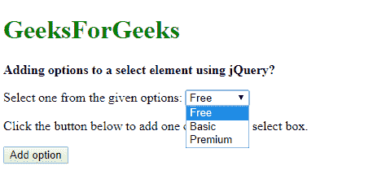
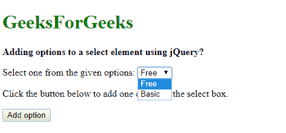
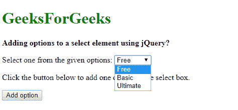
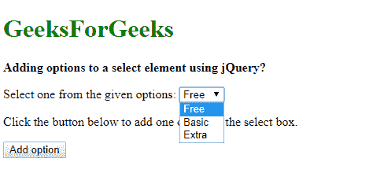

# 如何使用 jQuery 给 select 元素添加选项？

> 原文:[https://www . geeksforgeeks . org/如何使用-jquery/](https://www.geeksforgeeks.org/how-to-add-options-to-a-select-element-using-jquery/) 向选择元素添加选项

可以使用 jQuery 中的 3 种方法向 select 元素添加一个选项:

**方法 1:将选项标签附加到选择框**

要添加的选项是像普通的 HTML 字符串一样创建的。使用 jQuery 选择器选择选择框，并使用 **[追加()方法](https://www.geeksforgeeks.org/jquery-append-method/)** 添加该选项。append()方法将指定的内容作为 jQuery 集合的最后一个子元素插入。因此，该选项被添加到选择元素中。

**语法:**

```html
$('#selectBox').append(`${optionText}`)
```

**示例:**

```html
<!DOCTYPE html>
<html>
<head>
    <title>
      Adding options to a select element using jQuery?
  </title>
</head>

<body>
    <h1 style="color: green">
      GeeksForGeeks
  </h1>
    <b>
      Adding options to a select element using jQuery?
  </b>
    <p>
        Select one from the given options:
        <select id="select1">
            <option value="free">Free</option>
            <option value="basic">Basic</option>
        </select>
    </p>
    <p>
      Click the button below to add 
      one option to the select box.
  </p>

    <button onclick="addOption()">
      Add option
  </button>

    <script src=
"https://code.jquery.com/jquery-3.3.1.min.js">
  </script>
    <script type="text/javascript">
        function addOption() {
            optionText = 'Premium';
            optionValue = 'premium';

            $('#select1').append(`<option value="${optionValue}">
                                       ${optionText}
                                  </option>`);
        }
    </script>
</body>

</html>
```

**输出:**

*   **点击按钮前:**
    
*   **点击按钮后:**
    

**方法 2:使用 Option()构造函数创建新选项**

Option()构造函数用于创建新的选项元素。以文本和选项的值作为参数创建一个新选项。然后使用 append()方法将该元素添加到选择框中。

**语法:**

```html
$('#selectBox').append(new Option(optionText, optionValue))
```

**示例:**

```html
<!DOCTYPE html>
<head>
    <title>Adding options to a select element using jQuery?</title>
</head>
<body>
    <h1 style="color: green">GeeksForGeeks</h1>
    <b>Adding options to a select element using jQuery?</b>
    <p>
        Select one from the given options:
        <select id="select1">
            <option value="free">Free</option>
            <option value="basic">Basic</option>
        </select>
    </p>
    <p>Click the button below to add one option to the select box.</p>
    <button onclick="addOption()">Add option</button>
    <script src="https://code.jquery.com/jquery-3.3.1.min.js"></script>
    <script type="text/javascript">
        function addOption() {
            optionText = 'Ultimate';
            optionValue = 'ultimate';

            $('#select1').append(new Option(optionText, optionValue));
        }
    </script>
</body>
</html>
```

**输出:**

*   **点击按钮前:**
    
*   **点击按钮后:**
    

**方法 3:用值和文本创建一个新的选项元素**

使用选项标签创建了一个新的 jQuery DOM 元素。标签的值是用 val()方法设置的，选项的文本是用 text()方法设置的。然后使用 append()方法将创建的元素添加到选择框中。

**语法:**

```html
$('#selectBox').append($('<option>').val(optionValue).text(optionText))
```

**示例:**

```html
<!DOCTYPE html>
<head>
    <title>Adding options to a select element using jQuery?</title>
</head>
<body>
    <h1 style="color: green">GeeksForGeeks</h1>
    <b>Adding options to a select element using jQuery?</b>
    <p>
        Select one from the given options:
        <select id="select1">
            <option value="free">Free</option>
            <option value="basic">Basic</option>
        </select>
    </p>
    <p>Click the button below to add one option to the select box.</p>
    <button onclick="addOption()">Add option</button>
    <script src="https://code.jquery.com/jquery-3.3.1.min.js"></script>
    <script type="text/javascript">
        function addOption() {
            optionText = 'Extra';
            optionValue = 'extra';

            $('#select1').append($('<option>').val(optionValue).text(optionText));
        }
    </script>
</body>
</html>
```

**输出:**

*   **点击按钮前:**
    
*   **点击按钮后:**
    

jQuery 是一个开源的 JavaScript 库，它简化了 HTML/CSS 文档之间的交互，它以其“少写多做”的理念而闻名。
跟随本 [jQuery 教程](https://www.geeksforgeeks.org/jquery-tutorials/)和 [jQuery 示例](https://www.geeksforgeeks.org/jquery-examples/)可以从头开始学习 jQuery。