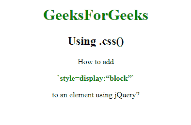
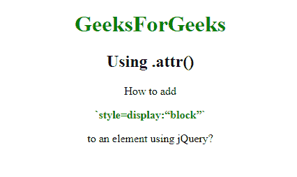
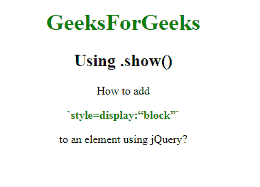

# 如何使用 jQuery 给元素添加` style = display:` block '？

> 原文:[https://www . geesforgeks . org/how-add-style display block-to-a-element-use-jquery/](https://www.geeksforgeeks.org/how-to-add-styledisplayblock-to-an-element-using-jquery/)

任务是在 jQuery 的帮助下向元素添加 style = display:“block”。

*   **。css():** 为匹配元素集设置一个或多个 css 属性。
    **语法:**

    ```
    $("div").css("display", "block")
    ```

    *   **。show():** 显示匹配的元素，大致相当于调用。css(“显示”、“阻止”)。
    **语法:**

    ```
    $("div").show()
    ```

    *   **.attr():** Set one or more attributes for the set of matched elements.
    **Syntax:**

    ```
    $("div").attr("style", "display:block")
    ```

    **例 1:** 使用**。**方法

    ```
    <!DOCTYPE html>
    <html lang="en">

    <head>
        <meta charset="utf-8">
        <title>
          How to add `style=display:“block”`to
          an element using jQuery?
      </title>
        <style>
            p {
                color: green;
                font-weight: bold;
                cursor: pointer;
            }
        </style>
        <script src="https://code.jquery.com/jquery-1.10.2.js">
      </script>
    </head>

    <body style="text-align:center;">
        <h1 style="color:green;">  
            GeeksForGeeks 
        </h1>
        <h2> Using .css()</h2>
        <div>
            How to add
            <p>`style=display:“block”`
          </p> to an element using jQuery?
        </div>
        <script>
            var words = $("p").first().text().split(/\s+/);
            var text = words.join("</span> <span>");
            $("p").css("display", "block");
        </script>

    </body>

    </html>
    ```

    **输出:**
    

    **例 2:** 使用**。**方法

    ```
    <!DOCTYPE html>
    <html lang="en">

    <head>
        <meta charset="utf-8">
        <title>
          How to add `style=display:“block”`
          to an element using jQuery?
      </title>
        <style>
            p {
                color: green;
                font-weight: bold;
                cursor: pointer;
            }
        </style>
        <script src="https://code.jquery.com/jquery-1.10.2.js">
      </script>
    </head>

    <body style="text-align:center;">
        <h1 style="color:green;">  
            GeeksForGeeks 
        </h1>
        <h2> Using .attr()</h2>
        <div>
            How to add
            <p>`style=display:“block”`</p> to an element using jQuery?
        </div>
        <script>
            var words = $("p").first().text().split(/\s+/);
            var text = words.join("</span> <span>");
            $("p").attr("style", "display:block")
        </script>
    </body>

    </html>
    ```

    **输出:**
    

    **例 3:** 使用**。show()** 方法

    ```
    <!DOCTYPE html>
    <html lang="en">

    <head>
        <meta charset="utf-8">
        <title>How to add `style=display:“block”
          `to an element using jQuery?</title>
        <style>
            p {
                color: green;
                font-weight: bold;
                cursor: pointer;
            }
        </style>
        <script src="https://code.jquery.com/jquery-1.10.2.js">
      </script>
    </head>

    <body style="text-align:center;">
        <h1 style="color:green;">  
            GeeksForGeeks 
        </h1>
        <h2> Using .show()</h2>
        <div>
            How to add
            <p>`style=display:“block”`</p>
          to an element using jQuery?
        </div>
        <script>
            var words = $("p").first().text().split(/\s+/);
            var text = words.join("</span> <span>");
            $("div").show();
        </script>

    </body>

    </html>
    ```

    **输出:**
    

    jQuery 是一个开源的 JavaScript 库，它简化了 HTML/CSS 文档之间的交互，它以其“少写多做”的理念而闻名。
    跟随本 [jQuery 教程](https://www.geeksforgeeks.org/jquery-tutorials/)和 [jQuery 示例](https://www.geeksforgeeks.org/jquery-examples/)可以从头开始学习 jQuery。