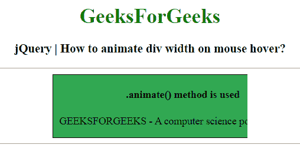

# 如何用 jQuery 制作鼠标悬停时 div 宽度和高度的动画？

> 原文:[https://www . geeksforgeeks . org/how-animate-div-width-height-on-mouse-hover-use-jquery/](https://www.geeksforgeeks.org/how-to-animate-div-width-and-height-on-mouse-hover-using-jquery/)

为了在鼠标悬停时设置 div 宽度和高度的动画，我们可以使用 [jQuery animate()方法](https://www.geeksforgeeks.org/jquery-animate-with-examples/)以及 [mouseenter()](https://www.geeksforgeeks.org/jquery-mouseenter-with-examples/) 和 [mouseleave()](https://www.geeksforgeeks.org/jquery-mouseleave-with-examples/) 方法。

*   **[。animate()方法](https://www.geeksforgeeks.org/jquery-animate-with-examples/):**animate()方法用 CSS 样式改变元素的状态。
    **语法:**

    ```
    $(selector).animate({styles}, para1, para2, para3);
    ```

*   **[。mouseenter()方法](https://www.geeksforgeeks.org/jquery-mouseenter-with-examples/) :** 当鼠标指针移动到所选元素上时，mouseenter()方法工作。
    **语法:**

    ```
    $(selector).mouseenter(function)
    ```

*   **[。mouseleaf()方法](https://www.geeksforgeeks.org/jquery-mouseleave-with-examples/) :** 当鼠标指针离开所选元素时，mouseleaf()方法工作。
    **语法:**

```
$(selector).mouseleave(function)
```

**进场:**

*   使用 **$(选择器)存储要在其上完成动画的 div 元素的实际宽度和高度。width()** 法。
*   当鼠标指针事件被处理时**。鼠标输入()**和**。**方法。
*   当鼠标指针在 div 元素上时，使用**将宽度或高度样式属性更改为 div 元素的新值。动画()方法**。
*   将 div 元素的宽度或高度样式属性更改为以前存储的值。

**示例 1:** 使用 jQuery 制作悬停时 div 宽度的动画。

```
<!DOCTYPE html>
<html>

<head>
    <title>
        How to animate div width and height
        on mouse hover in jQuery ?
    </title>

    <script src=
"https://code.jquery.com/jquery-1.12.4.min.js">
    </script>

    <style type="text/css">
        .box {
            float:center;
            overflow: hidden;
            background: #32a852;
            width: 400px;
            padding: 0px;
        }

        /* Add padding and border to inner
        content for better animation effect */
        .box-inner {
            width: 400px;
            padding: 0px;
            border: 1px solid #000000;
        }
    </style>
</head>

<body>
    <center>
        <h1 style = "color:green;" > 
            GeeksForGeeks 
        </h1> 

        <h3>
            jQuery | How to animate div
            width on mouse hover?
        </h3>
        <hr>

        <div class="box">
            <div class="box-inner">
                <h4>.animate() method is used</h4>

                <p>
                    GEEKSFORGEEKS - A computer 
                    science portal for geeks.
                </p>
            </div>
        </div>
        <hr>

        <script type="text/javascript">
            $(document).ready(function() {
                var divWidth = $(".box").width();

                $(".box").mouseenter(function(){
                    $(this).animate({
                        width: "300"
                    });
                }).mouseleave(function(){
                    $(this).animate({
                        width: divWidth
                    });
                });
            });
        </script>
    </center>
</body>

</html>
```

**输出:**

*   **当指针在 div 元素上时:**
    
*   **当指针不在 div 元素上时:**
    

**示例 2:** 使用 jQuery 制作悬停时 div 高度的动画。

```
<!DOCTYPE html>
<html>

<head>
    <title>
        jQuery | How to animate div width
        and height on mouse hover?
    </title>

    <script src=
"https://code.jquery.com/jquery-1.12.4.min.js">
    </script>

    <style type="text/css">
        .box{
            float:center;
            overflow: hidden;
            background: #32a852;
            width: 400px;
            padding: 0px;
        }

        /* Add padding and border to inner
        content for better animation effect */
        .box-inner{
            width: 400px;
            padding: 0px;
            border: 1px solid #000000;
        }
    </style>
</head>

<body>
    <center>
        <h1 style = "color:green;" > 
            GeeksForGeeks 
        </h1> 

        <h3>
            jQuery | How to animate div
            height on mouse hover?
        </h3>
        <hr>

        <div class="box">
            <div class="box-inner">
                <h4>.animate() method is used</h4>

                <p>
                    GEEKSFORGEEKS - A computer 
                    science portal for geeks.
                </p>
            </div>
        </div><hr>

        <script type="text/javascript">
            $(document).ready(function(){
                var divHeight = $(".box").height();
                $(".box").mouseenter(function(){
                    $(this).animate({
                        height: "250"
                    });
                }).mouseleave(function(){
                    $(this).animate({
                        height: divHeight
                    });
                });
            });
        </script>
    </center>
</body>

</html>
```

**输出:**

*   **当指针在 div 元素上时:**
    
*   **当指针不在 div 元素上时:**
    