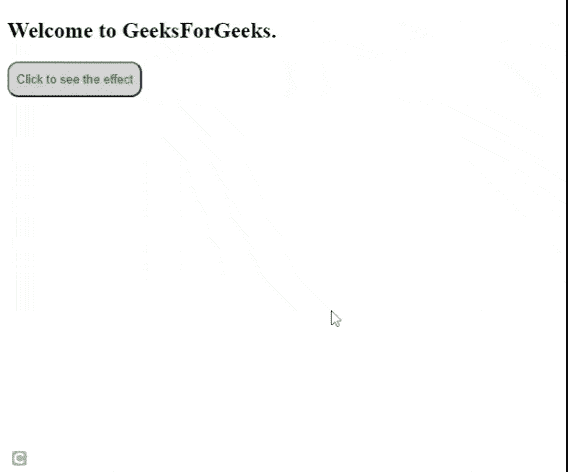

# jQuery add class/remove class 函数如何动画化？

> 原文:[https://www . geesforgeks . org/how-animate-jquery-add class-remove class-functions/](https://www.geeksforgeeks.org/how-to-animate-jquery-addclass-removeclass-functions/)

在本文中，我们将学习使用 jQuery **addClass()** 和 **removeClass()** 函数制作动画。

我们将使用 jQuery 和 jQuery UI。jQuery UI(用户界面)是免费的开源软件，构建在核心强大的 jQuery 库之上。如果要使用 jQuery UI，也必须包含 jQuery。jQuery UI 提供了更多功能，如添加类、颜色动画和宽松等。

我们将使用一些**jQuery UI[**addClass()**](https://www.geeksforgeeks.org/jquery-ui-addclass-method/)和 [**removeClass()**](https://www.geeksforgeeks.org/jquery-removeclass-with-examples/) 方法。**

*   ****addClass()方法:**用于在制作所有样式变化的动画时，为每个目标元素添加指定的类。**

    ****语法:****

     **```
    .addClass(className, [duration], [easing], [callback])
    ```** 
*   ****removeClass()方法:**用于在动画化所有样式更改时从元素中移除类。**

    ****语法:****

    ```
    .removeClass(className, [duration], [easing], [callback])
    ```

****示例:**以下示例演示了使用上述类的动画。我们正在使用 [*setTimeout*](https://www.geeksforgeeks.org/java-script-settimeout-setinterval-method/) 来移除动画后的类。**

## **超文本标记语言**

```
<!DOCTYPE html>
<html>
<head>

   <style>
      #btn {
        padding: 10px 8px;
        color: green;
        background-color: rgba(122, 122, 122, 0.322);
        border-radius: 12px;
      }

      .geeks {
        font-size: 40px;
        color: green;
        font-family: "Segoe UI", Tahoma, Geneva, Verdana, sans-serif;
        text-shadow: 2px 2px 4px #880a0a;
        letter-spacing: 2px;
      }
    </style>
     <!--  JQuery CDN  -->
    <script src=
"https://code.jquery.com/jquery-3.6.0.min.js"
            integrity=
"sha256-/xUj+3OJU5yExlq6GSYGSHk7tPXikynS7ogEvDej/m4="
            crossorigin="anonymous">
    </script>

    <!-- JQuery UI CDN -->
   <script src=
"https://cdnjs.cloudflare.com/ajax/libs/jqueryui/1.12.1/jquery-ui.min.js">
   </script>

    <script>
      $(document).ready(function () {
        $("#btn").click(function () {
          $("h2").addClass("geeks", 2000, myCallback);
        });
        function myCallback() {
          setTimeout(function () {
            $("h2").removeClass("geeks");
          }, 3000);
        }
      });
    </script>
</head>
<body>
<h2>Welcome to GeeksForGeeks.</h2>
<button id="btn">
   Click to see the effect</button>
</body>
</html>
```

****输出:****

**

动画效果**