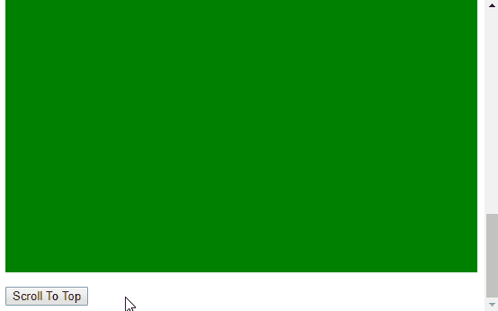
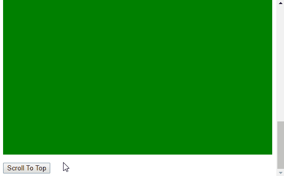

# 如何使用 jQuery 制作 scrollTop 动画？

> 原文:[https://www . geeksforgeeks . org/how-animate-scroll top-using-jquery/](https://www.geeksforgeeks.org/how-to-animate-scrolltop-using-jquery/)

JavaScript 中的 **scrollTop** 属性用于设置或返回任意元素的垂直滚动条位置。将 scrollTop 设置为任何值都会使页面滚动到该位置。默认情况下，滚动会立即发生，并突然滚动到该值。这种滚动可以使用 jQuery 动画化。

[**动画()方法**](https://www.geeksforgeeks.org/jquery-animate-with-examples/) 用于对一组 CSS 属性执行自定义动画。它通过逐步改变属性的值来创建动画效果。只有具有数值的属性才能被激活。动画可以用两个附加参数来修改，这有助于改变动画的速度。

此方法与 scrollTop 属性一起使用，以使页面上的滚动具有动画效果。jQuery 选择器用于选择页面的“html”和“body”标签。这样做是为了确保与某些浏览器的兼容性，在这些浏览器中，只选择 body 元素不起作用。

animate()方法与 styles 参数中的 scrollTop 属性一起用于此选定元素。动画的*速度*和*缓和*可以根据需要改变。

**语法:**

```html
$("html, body").animate({ scrollTop: scrollPosition });
```

**示例 1:** 本示例使用默认速度制作滚动动画。

```html
<!DOCTYPE html>
<html>

<head>
    <title>
        How to animate scrollTop with jQuery?
    </title>

    <script src=
        "https://code.jquery.com/jquery-3.4.1.min.js">
    </script>

    <style>
        .scrollable {
            background-color: green;
            height: 1000px;
        }
    </style>
</head>

<body>
    <h1 style="color: green">
        GeeksForGeeks
    </h1>

    <b>
        How to animate scrollTop with jQuery?
    </b>

    <p>
        Click on the button to scroll
        to the top of the page.
    </p>

    <p class="scrollable">
        This is a large div to
        help in scrolling.
    </p>

    <button onclick="scrollTopAnimated()">
        Scroll To Top
    </button>

    <script type="text/javascript">
        function scrollTopAnimated() {
            $("html, body").animate({ scrollTop: "0" });
        }
    </script>
</body>

</html>
```

**输出:**


**示例 2:** 本示例以 3000 的速度制作滚动动画。

```html
<!DOCTYPE html>
<html>

<head>
    <title>
        How to animate scrollTop with jQuery?
    </title>

    <script src=
        "https://code.jquery.com/jquery-3.4.1.min.js">
    </script>

    <style>
        .scrollable {
            background-color: green;
            height: 1000px;
        }
    </style>
</head>

<body>
    <h1 style="color: green">
        GeeksForGeeks
    </h1>

    <b>
        How to animate scrollTop with jQuery?
    </b>

    <p>
        Click on the button to scroll to the
        top of the page.
    </p>

    <p class="scrollable">
        This is a large div to help in scrolling.
    </p>

    <button onclick="scrollTopAnimated()">
        Scroll To Top
    </button>

    <script type="text/javascript">
        function scrollTopAnimated() {
            $("html, body").animate(
                { scrollTop: "0" }, 3000);
        }
    </script>
</body>

</html>
```

**输出:**


jQuery 是一个开源的 JavaScript 库，它简化了 HTML/CSS 文档之间的交互，它以其“少写多做”的理念而闻名。
跟随本 [jQuery 教程](https://www.geeksforgeeks.org/jquery-tutorials/)和 [jQuery 示例](https://www.geeksforgeeks.org/jquery-examples/)可以从头开始学习 jQuery。