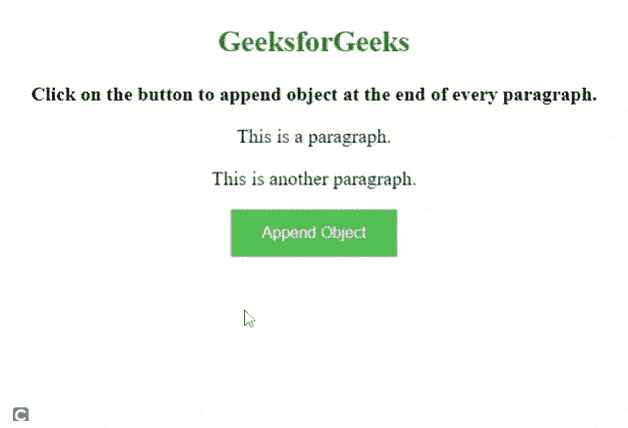

# 如何使用 jQuery 将 jQuery 对象追加到所有段落？

> 原文:[https://www . geesforgeks . org/how-append-a-jquery-object-to-all-段落-use-jquery/](https://www.geeksforgeeks.org/how-to-append-a-jquery-object-to-all-paragraphs-using-jquery/)

在本文中，我们将看到如何使用 jQuery 将一个 jQuery 对象追加到所有段落中。追加意味着我们向现有元素添加一些东西。对象用于定义外部资源的容器，如页面、图片、媒体播放器或插件应用程序。

**使用的方法:**

*   [**【ready()】方法:**](https://www.geeksforgeeks.org/jquery-ready-with-examples/) 此方法用于指定 DOM 完全加载时要执行的函数。
*   [**click()方法:**](https://www.geeksforgeeks.org/jquery-click-with-examples/) 该方法用于触发 click 事件，或者附加一个函数在 click 事件发生时运行。
*   [**追加()方法:**](https://www.geeksforgeeks.org/jquery-append-method/) 此方法用于在所选元素的末尾插入指定内容。

**进场:**

*   创建带有段落[*<>*](https://www.geeksforgeeks.org/html-paragraph/)元素的 HTML 页面。
*   接下来，编写一个脚本将对象追加到段落元素中。

**示例:**

## 超文本标记语言

```
<!DOCTYPE html>
<html>

<head>
    <script src=
"https://ajax.googleapis.com/ajax/libs/jquery/3.5.1/jquery.min.js">
    </script>

    <style>
        body {
            text-align: center;
            font-size: 20px;
        }

        button {
            background-color: #4CAF50;
            /* Green */
            border: none;
            color: white;
            padding: 15px 32px;
            text-align: center;
            text-decoration: none;
            display: inline-block;
            font-size: 16px;
        }

        object {
            font-size: 30px;
            color: lightgreen;
            background-color: green;
        }
    </style>

    <script>
        $(document).ready(function () {
            $("button").click(function () {
                $("p").append(
                    "<object>This is object</object>.");
            });
        });
    </script>
</head>

<body>
    <h2 style="color:green">GeeksforGeeks</h2>
    <b>
        Click on the button to append object 
        at the end of every paragraph.
    </b>

    <p>This is a paragraph.</p>

    <p>This is another paragraph.</p>

    <button>Append Object</button>
</body>

</html>
```

**输出:**



追加对象