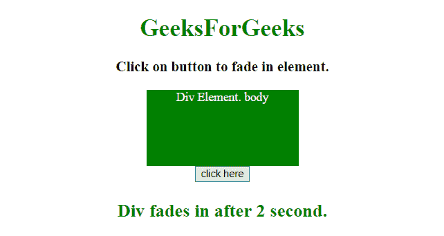
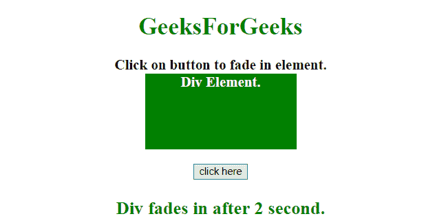

# 如何使用 jQuery 在两秒内追加一个元素？

> 原文:[https://www . geeksforgeeks . org/如何使用-jquery/](https://www.geeksforgeeks.org/how-to-append-an-element-in-two-seconds-using-jquery/) 在两秒内追加元素

给定一个 HTML 元素，任务是在 JQuery 的帮助下使用 fadeIn 效果在几秒钟后在文档中追加一个元素。

**进场:**

*   选择要追加元素的目标元素。
*   使用 **[appendTo()](https://www.geeksforgeeks.org/jquery-appendto-with-examples/)** 或 **[append()](https://www.geeksforgeeks.org/jquery-append-method/) 方法之一**来追加元素。

**示例 1:** 在本例中，< div >元素使用 **append()方法**被追加到<主体>元素中。

```html
<!DOCTYPE HTML> 
<html> 

<head> 
    <title> 
        How to append an element in
        two seconds using jQuery ?
    </title>

    <style>
        #div {
            background: green;
            height: 100px;
            width: 200px;
            margin: 0 auto;
            color: white;
            display: none;
        }
    </style>

    <script src = 
"https://ajax.googleapis.com/ajax/libs/jquery/3.4.0/jquery.min.js">
    </script>
</head> 

<body style = "text-align:center;"> 

    <h1 style = "color:green;" > 
        GeeksForGeeks 
    </h1>

    <p id = "GFG_UP" style =
        "font-size: 19px; font-weight: bold;">
    </p>

    <div id = "div">Div Element.</div>

    <button onClick = "GFG_Fun()">
        click here
    </button>

    <p id = "GFG_DOWN" style =
        "color: green; font-size: 24px; font-weight: bold;">
    </p>

    <script>
        $('#GFG_UP').text("Click on button to fade in element.");

        function GFG_Fun() {
            $('#div').append("body").fadeIn(2000);
            $('#GFG_DOWN').text("Div fades in after 2 second."); 
        }
    </script> 
</body> 

</html>
```

**输出:**

*   **点击按钮前:**
    
*   **点击按钮后:**
    

**示例 2:** 在本示例中，使用 **appendTo()方法**将< div >元素追加到< p >元素中。

```html
<!DOCTYPE HTML> 
<html> 

<head> 
    <title> 
        How to append an element in
        two seconds using jQuery ?
    </title>

    <style>
        #div {
            background: green;
            height: 100px;
            width: 200px;
            margin: 0 auto;
            color: white;
            display: none;
        }
    </style>

    <script src = 
"https://ajax.googleapis.com/ajax/libs/jquery/3.4.0/jquery.min.js">
    </script>
</head> 

<body style = "text-align:center;"> 

    <h1 style = "color:green;"> 
        GeeksForGeeks 
    </h1>

    <p id = "GFG_UP" style =
        "font-size: 19px; font-weight: bold;">
    </p>

    <div id = "div">Div Element.</div>

    <button onClick = "GFG_Fun()">
        click here
    </button>

    <p id = "GFG_DOWN" style = 
        "color: green; font-size: 24px; font-weight: bold;">
    </p>

    <script>
        $('#GFG_UP').text("Click on button to fade in element.");

        function GFG_Fun() {
            $('#div').appendTo("p").fadeIn(2000);
            $('#GFG_DOWN').text("Div fades in after 2 second."); 
        }
    </script> 
</body> 

</html>
```

**输出:**

*   **点击按钮前:**
    
*   **点击按钮后:**
    