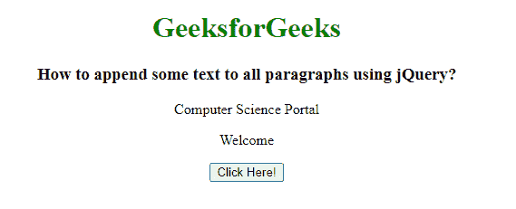
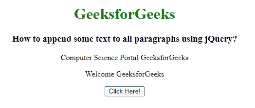

# 如何使用 jQuery 给所有段落追加一些文字？

> 原文:[https://www . geeksforgeeks . org/如何使用-jquery/](https://www.geeksforgeeks.org/how-to-append-some-text-to-all-paragraphs-using-jquery/) 在所有段落中添加一些文本

在本文中，我们将使用 jQuery 向所有段落元素添加一些文本。为了给所有段落元素添加一些文本，我们使用 **append()** 和**document . createtextnode()**方法。

**jQuery append()** 方法用于在所选元素的末尾插入一些内容。

**语法:**

```html
$(selector).append( content, function(index, html) )
```

**示例:**

## 超文本标记语言

```html
<!DOCTYPE html>
<html lang="en">

<head>

    <!-- Import jQuery cdn library -->
    <script src=
"https://ajax.googleapis.com/ajax/libs/jquery/3.3.1/jquery.min.js">
    </script>

    <script>
        $(document).ready(function () {
            $("button").click(function () {
                $("p").append(document
                .createTextNode(" GeeksforGeeks"));
            });
        });
    </script>
</head>

<body style="text-align: center;">
    <h1 style="color: green;">
        GeeksforGeeks
    </h1>

    <h3>
        How to append some text to
        all paragraphs using jQuery?
    </h3>

    <p>
        Computer Science Portal
    </p>

    <p>Welcome</p>

    <button>Click Here!</button>
</body>

</html>
```

**输出:**

**点击按钮前:**



**点击按钮后:**

