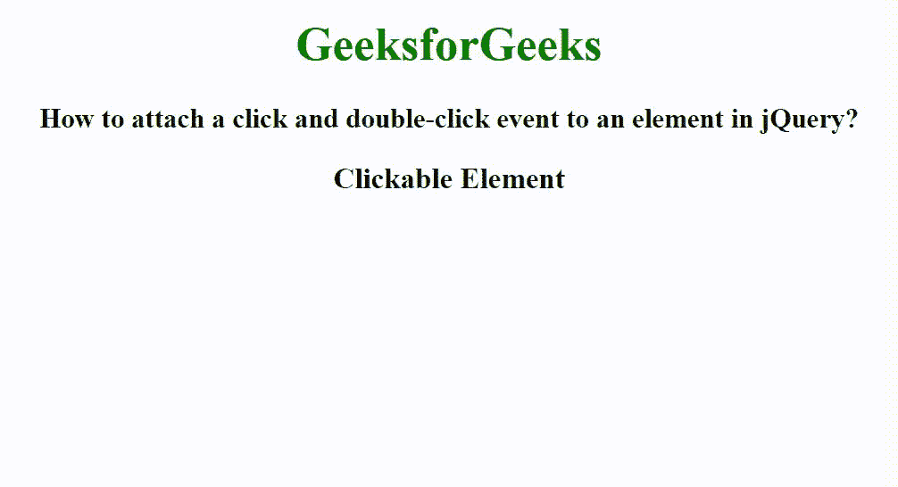

# 如何在 jQuery 中给元素附加一个点击双击事件？

> 原文:[https://www . geesforgeks . org/如何将单击并双击事件附加到 jquery 中的元素/](https://www.geeksforgeeks.org/how-to-attach-a-click-and-double-click-event-to-an-element-in-jquery/)

在本文中，我们将看到如何将单击和双击事件附加到 jQuery 中的元素。要附加单击和双击事件，请使用单击和 dbclick 事件。这些事件附带 [bind()方法](https://www.geeksforgeeks.org/jquery-bind-with-examples/)。此方法用于为选定的元素附加一个或多个事件处理程序，此方法指定事件发生时要运行的函数。另外，我们使用 [appendTo()方法](https://www.geeksforgeeks.org/jquery-appendto-with-examples/)将结果附加到元素中。

**语法:**

```
$(element).bind(click, function() { })
$(element).bind(dbclick, function() { })
```

**示例:**

## 超文本标记语言

```
<!DOCTYPE html>
<html>

<head>
    <title>
        How to attach a click and double-click
        event to an element in jQuery?
    </title>

    <script src=
"https://ajax.googleapis.com/ajax/libs/jquery/3.3.1/jquery.min.js">
    </script>

    <script>
        $(document).ready(function () {
            $(".clickable_ele").bind("click", function () {
                $("<h4>Single click Event called</h4>")
                .appendTo(".res");
            });

            $(".clickable_ele").bind("dblclick", function () {
                $("<h4>Double click Event called</h4>")
                .appendTo(".res");
            });
        });
    </script>

    <style>
        body {
            text-align: center;
        }

        h1 {
            color: green;
        }

        .clickable_ele {
            font-size: 20px;
            font-weight: bold;
        }
    </style>
</head>

<body>
    <h1>GeeksforGeeks</h1>

    <h3>
        How to attach a click and double-click
        event to an element in jQuery?
    </h3>

    <div class="clickable_ele">
        Clickable Element
    </div>

    <div class="res"></div>
</body>

</html>
```

**输出:**

