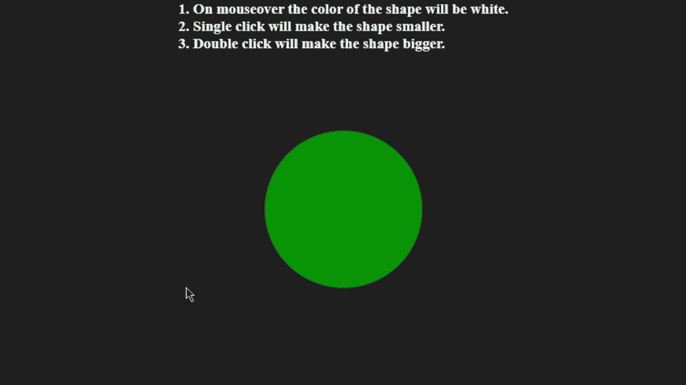

# 如何在 jQuery 中给元素附加 1 个以上的事件处理程序？

> 原文:[https://www . geeksforgeeks . org/如何将 1 个以上的事件处理程序附加到 jquery 中的元素/](https://www.geeksforgeeks.org/how-to-attach-more-than-1-event-handlers-to-elements-in-jquery/)

在事件处理程序的帮助下，我们可以在 HTML 元素上设置 jQuery 中可用的特定事件。在 jQuery 中，有许多事件可用，如 [click()](https://www.geeksforgeeks.org/jquery-click-with-examples/) 、 [mouseover()](https://www.geeksforgeeks.org/jquery-mouseover-with-examples/) 、 [dblclick()](https://www.geeksforgeeks.org/jquery-dblclick-with-examples/) 等。在本文中，我们将学习如何将多个事件处理程序附加到元素上。在 jQuery 中，我们可以很容易地在任何元素上添加一个或多个事件处理程序。

**示例:**在本例中，我们将在一个 div 上添加三种不同的事件处理程序，并分别检查所有事件。第一个事件是 click()，当我们单击 div 时，它会缩小，第二个事件是 dblclick()，当我们双击 div 元素时，它会变大，第三个事件是 mouseover，当我们将指针移动到 div 时，它会改变颜色。这就是我们如何在单个 div 元素上实现三个不同的事件处理程序。

## 超文本标记语言

```html
<!DOCTYPE html>
<html lang="en">

<head>
    <!-- jQuery CDN link -->
    <script src=
"https://ajax.googleapis.com/ajax/libs/jquery/3.6.0/jquery.min.js">
    </script>

    <style>

        /* Required css code */
        * {
            margin: 0;
            padding: 0;
            box-sizing: border-box;
            background-color: rgb(32, 32, 32);
        }

        .main {
            display: flex;
            align-items: center;
            justify-content: center;
            flex-direction: column;
        }

        #shape {
            height: 200px;
            width: 200px;
            background-color: green;
            border-radius: 100%;
            margin: 100px;
        }
    </style>
</head>

<body>

    <!-- Shape is inscribed in main container -->

    <div class="main">
        <div id="shape"></div>
    </div>

    <script>

        // Required jQuery code
        $(document).ready(function() {
            $("#shape").click(function() {
                $(this).animate({
                    height: "50px",
                    width: "50px"
                });
            });

            $("#shape").dblclick(function() {
                $(this).animate({
                    height: "300px",
                    width: "300px"
                });
            });

            $("#shape").mouseover(function() {
                $(this).css("background-color", "white");
            });
        });
    </script>
</body>

</html>
```

**输出:**

