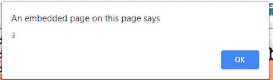

# 如何用 JQuery 计算一个字符串的字数？

> 原文:[https://www . geesforgeks . org/如何使用-jquery 计算字符串中的字数/](https://www.geeksforgeeks.org/how-to-calculate-the-number-of-words-in-a-string-using-jquery/)

为了计算字符串中的字数，我们可以使用 JQuery split()方法以及 trim()或不使用 trim()方法。
**。split()方法**只需通过指定的字符和**将一个字符串拆分为一个子字符串数组。修剪()方法**去除前导和尾随空格。

**语法:**

```html
string.split(separator, limit)
```

**Approach:**

*   从 HTML 元素中获取字符串。*   根据空格将字符串拆分为子字符串。*   Count the number of substrings.

    **示例 1:** 使用 trim()方法，从字符串中删除开始和结束空格

    ```html
    <!DOCTYPE html>
    <html>

    <head>
        <title>How to calculate the number 
          of words in a string using Javascript?</title>
        <script src="https://code.jquery.com/jquery-1.12.4.min.js">
      </script>
    </head>

    <body style="text-align:center;">
        <h1 style="color:green;"> 
            GeeksForGeeks 
        </h1>
        <h3>How to calculate the number of words
          in a string using Javascript?</h3>
        <textarea> Geeks For GEEKS </textarea>
        <br>
        <button type="button">Click</button>
        <script type="text/javascript">
            $(document).ready(function() {
                $("button").click(function() {
                    // reduce the whitespace from both sides of a string. 
                    var geeks1 = $.trim($("textarea").val());
                    //split a string into an array of substrings
                    var geek = geeks1.split(" ")
                        // count number of elements
                    alert(geek.length);
                });
            });
        </script>
    </body>

    </html>
    ```

    **输出:**

    *   **之前点击按钮:**
        
    *   **点击按钮后:**
        

    **例 2:** 无修剪()方法

    ```html
    <!DOCTYPE html>
    <html>

    <head>
        <title>Calculate the number
          of Words in a String</title>

    </head>

    <body style="text-align:center;">
        <h1 style="color:green;"> 
            GeeksForGeeks 
        </h1>
        <h3>How to calculate the number of
          words in a string using Javascript?</h3>
        <p id="geeks1"></p>
        <br>
        <button onclick="myFunction()">Click</button>
        <p id="geeks"></p>

        <script>
            var str = "Geeks For Geeks";
            document.getElementById("geeks1").innerHTML = str;

            function myFunction() {
                var res = str.split(" ");
                document.getElementById(
                  "geeks").innerHTML = res.length;
            }
        </script>
    </body>

    </html>
    ```

    **输出:**

    *   **之前点击按钮:**
        
    *   **点击按钮后:**
        