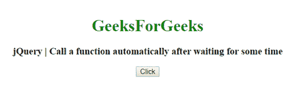
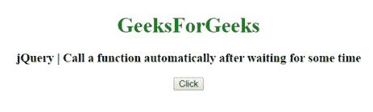

# 如何使用 jQuery 等待一段时间后自动调用函数？

> 原文:[https://www . geesforgeks . org/如何使用 jquery 自动调用函数/](https://www.geeksforgeeks.org/how-to-call-a-function-automatically-after-waiting-for-some-time-using-jquery/)

为了在等待一段时间后自动运行一个功能，我们使用了 jQuery [**delay()方法**](https://www.geeksforgeeks.org/jquery-delay-with-examples/) 。
The **。jQuery 中的 delay()方法**，用于设置一个定时器来延迟队列中下一个项目的执行。

**语法:**

```
$(selector).delay(para1, para2);
```

**进场:**

*   当点击按钮时，使用**将过程延迟到特定时间段。延时()方法**。
*   Functions or process is queued using **.queue() method**.

    进程或功能执行后，所有执行的功能使用**出列。出列()方法**。

**例 1:**

```
<!DOCTYPE html>
<html>

<head>
    <title>How to call a function automatically 
      after waiting for some time using jQuery</title>
    <script src="https://code.jquery.com/jquery-1.12.4.min.js">
  </script>
    <style type="text/css">
        img {
            display: none;
        }
    </style>
</head>

<body>
    <center>
        <h1 style="color:green;"> 
        GeeksForGeeks 
    </h1>
        <h3>How to call a function automatically 
          after waiting for some time using jQuery</h3>
        <button type="button" class="show-image">Click</button>
        
        <script type="text/javascript">
            function showImg() {
                $("img").fadeIn(1500);
            }

            $(document).ready(function() {
                $(".show-image").click(function() {
                    $(this).text('Wait...').delay(1000).queue(function() {
                        $(this).hide();
                        showImg();
                        $(this).dequeue();

                    });
                });
            });

        </script>
    </center>
</body>

</html>
```

**输出:**


**例 2:** 连同报警方法

```
<!DOCTYPE html>
<html>

<head>
    <title>How to call a function automatically 
      after waiting for some time using jQuerye</title>
    <script src="https://code.jquery.com/jquery-1.12.4.min.js">
  </script>
    <style type="text/css">
        img {
            display: none;
        }
    </style>
</head>

<body>
    <center>
        <h1 style="color:green;"> 
        GeeksForGeeks 
    </h1>
        <h3>How to call a function automatically 
      after waiting for some time using jQuery</h3>
        <button type="button" class="show-image">
          Click
      </button>
        
        <script type="text/javascript">
            function showImg() {
                $("img").fadeIn(1500);
            }
            $(document).ready(function() {
                $(".show-image").click(function() {
                    $(this).text('Wait...').delay(1000).queue(function() {
                        $(this).hide();
                        showImg();
                        $(this).dequeue();
                        alert("Waiting time is over");
                    });
                });
            });
        </script>
    </center>
</body>

</html>
```

**输出:**
