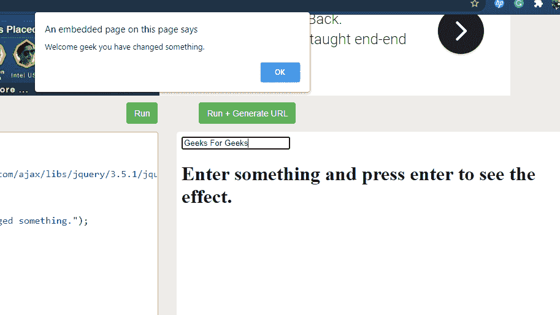

# 如何使用 jQuery 在 div 内容发生变化时调用函数？

> 原文:[https://www . geeksforgeeks . org/如何使用-jquery/](https://www.geeksforgeeks.org/how-to-call-a-function-when-content-of-a-div-changes-using-jquery/) 调用 div 内容更改时的函数

任务是当 div 的内容改变时调用一个函数。您可以使用称为**的内置方法来完成此任务。change()** 。简单地说，每当字段被更改时，我们就调用一个会弹出窗口的函数。

**。change():** 此方法仅在元素或字段发生一些变化时才会触发。它接受一个可选函数作为执行某种工作的参数。

**语法:**

```
$(selector).change(function())
```

**选择器:**它将选择一个我们必须在其上执行该任务的元素。

**function():** 它是一个可选参数，用于指定当所选元素发生更改事件时要运行的函数。

**方法 1:** 在这种方法中，我们将实现它的执行，而不采用任何参数，如函数。

*   首先，创建一个带有一些值和 *onChange* 属性的输入框。
*   创建一个按钮，并将其映射到您在没有任何参数的情况下编写变更方法的脚本。

**说明:**当你点击一个按钮触发输入域的变化事件发生时，弹出窗口将出现并显示输入域中出现的任何内容。

**例 1:**

## 超文本标记语言

```
<!DOCTYPE html>
<html>

<head>
    <script src=
"https://ajax.googleapis.com/ajax/libs/jquery/3.5.1/jquery.min.js">
    </script>

    <script>
        $(document).ready(function(){
            $("button").click(function(){
                $("input").change();
            });
        });
    </script>
</head>

<body>
    <p>
     <h1>
        Press enter to see the pop-up. 
        which says whatever written in the 
        input field 
     </h1>
    </p>

    <p>Enter anything you wish to: 
        <input value="GeeksForGeeks" 
        onchange="alert(this.value)" 
        type="text"></p>
    <button>
        Trigger change event for input field
    </button>
</body>

</html>
```

**输出:**

**点击前:**


**点击后:**


**方法 2:** 在这种方法中，我们将借助函数作为 change 方法中的参数来实现它的执行。

*   创建文本类型的输入字段。
*   将输入元素映射到 change()方法，并编写一些文本在函数调用时显示。

**说明:**当您在输入栏中输入内容并按回车键时，变更事件将运行并执行该功能，并显示写在该功能中的消息。

**例 2:**

## 超文本标记语言

```
<!DOCTYPE html>
<html>

<head>
    <script src=
"https://ajax.googleapis.com/ajax/libs/jquery/3.5.1/jquery.min.js">
    </script>

    <script>
        $(document).ready(function(){
            $("input").change(function(){
                alert("Welcome geek you have changed something.");
            });
        });
    </script>
</head>

<body>
    <input type="text">
    <p><h1>
        Enter something and press enter to see the effect.
    <h1></p>
</body>

</html>
```

**输出:**

