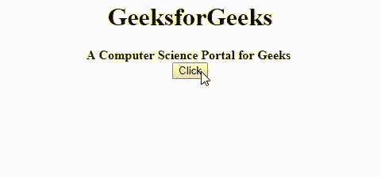
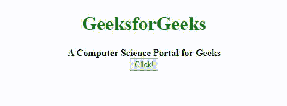

# jQuery 中上一个函数完成后如何调用函数？

> 原文:[https://www . geeksforgeeks . org/如何在 jquery 中完成前一个函数后调用函数/](https://www.geeksforgeeks.org/how-to-call-functions-after-previous-function-is-completed-in-jquery/)

任务是在 JavaScript 中顺序执行一系列函数。也就是说，在第一个功能完成执行后，只执行功能二**。**

****语法:****

```
functionName();
```

****进场:**这个问题可以通过多种方式解决。**

*   **我们可以在函数一的末尾修复(硬编码)一个回调函数。这样做可以确保回调函数总是在函数一完成执行时被调用。然而，这种方法的一个问题是，我们不能在运行时更改回调函数。我们要么删除这一行代码，要么修改它。**
*   **另一种方法是将回调函数作为参数传递给函数一，并使函数一在其生命周期结束时调用这个新的回调函数。这种方法更加灵活，因为它允许我们在运行时更改回调函数，而无需实际修改任何代码行。**

**让我们详细看一下它们。**

****示例 1:** 在本例中，我们将在函数一的末尾修复(硬编码)一个回调函数。**

```
<!DOCTYPE html>
<html>

<head>
    <title>
        Call a function after
        completing a function
    </title>
</head>

<body>
    <center>

        <!-- gfg variable with no value initially -->
        <h1>GeeksforGeeks</h1>
        <b>A Computer Science Portal for Geeks</b>
        <br>
        <button>Click</button>
        <p></p>
        <script src=
"https://code.jquery.com/jquery-3.4.1.min.js">
        </script>
        <script type="text/javascript">
            $('button').click(function() {
                console.log("Button clicked!");

                // Task is to execute callbackFirst
                // function first and then execute
                // callbackSecond function.
                callbackFirst();
            });

            function callbackFirst() {
                console.log("First Function start");
                for (var i = 1; i < 10; i++) {
                    $('p').append(i + " ");
                }
                console.log("First Function end");

                // Execute callbackSecond() now as its
                // the end of callbackFirst()
                callbackSecond();
            }

            function callbackSecond() {
                console.log("Second Function start");
                $('body').css({
                    'background-color': 'gray'
                });
                $('h1').css({
                    'color': 'green'
                });
                console.log("Second Function end");
            }
        </script>
    </center>
</body>

</html>
```

****输出:**

**在控制台点击按钮后:****

```
Button clicked!
First Function start
First Function end
Second Function start
Second Function end
```

****示例 2:** 在这个示例中，我们将一个回调函数作为参数传递给函数一，这样它就可以在执行结束时调用这个新的回调函数。任务是先执行 callbackSecond 函数，然后执行 callback second 函数。首先将 callbackSecond 作为参数传递给回调。**

```
<!DOCTYPE html>
<html>
  <head>
    <title>Call a function after completeing a function</title>
  </head>
<body>
    <center>
        <h1 style="color: green;">GeeksforGeeks</h1>
      <b>A Computer Science Portal for Geeks</b><br>
        <button style="color: green;">Click!</button>
        <p></p>
        <script src=
"https://code.jquery.com/jquery-3.4.1.min.js">
        </script>
        <script type="text/javascript">
            $('button').click(function() {
                console.log("Button clicked!");

                // Execute callbackSecond at the end
                // of its execution
                callbackFirst(callbackSecond);
            });

            function callbackFirst(callbackFn) {
                console.log("First Function start");
                for (var i = 1; i < 10; i++) {
                    $('p').append(i + " ");
                }
                console.log("First Function end");

                /* Execute callbackFn() now as its
                   the end of callbackFirst() This 
                   function was passed as a parameter */
                callbackFn();
            }

            function callbackSecond() {
                console.log("Second Function start");
                $('body').css({
                    'background-color': 'green'
                });
                $('h1').css({
                    'color': 'black'
                });
                console.log("Second Function end");
            }
        </script>
    </center>
</body>

</html>
```

****输出:**

**在控制台点击按钮后:****

```
Button clicked!
First Function start
First Function end
Second Function start
Second Function end
```

**jQuery 是一个开源的 JavaScript 库，它简化了 HTML/CSS 文档之间的交互，它以其“少写多做”的理念而闻名。
跟随本 [jQuery 教程](https://www.geeksforgeeks.org/jquery-tutorials/)和 [jQuery 示例](https://www.geeksforgeeks.org/jquery-examples/)可以从头开始学习 jQuery。**