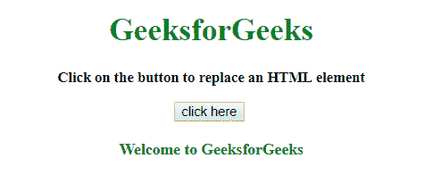
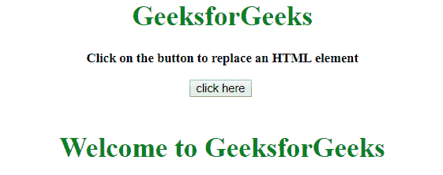

# 如何使用 jQuery 更改 HTML 元素名称？

> 原文:[https://www . geesforgeks . org/how-to-change-an-html-element-name-use-jquery/](https://www.geeksforgeeks.org/how-to-change-an-html-element-name-using-jquery/)

给定一个 HTML 文档，任务是用另一个元素替换一个 HTML 元素。例如:我们可以用

# 元素改变一个元素**，而不改变任何其他属性。
**进场:**** 

*   选择需要更改的 HTML 元素。
*   复制对象中前一个元素的所有属性。
*   用新元素替换上一个元素。

**示例 1:** 该示例说明了上述方法。

## 超文本标记语言

```html
<!DOCTYPE HTML> 
<html> 

<head> 
    <title> 
        JQuery | Change an element type.
    </title>

    <script src=
"https://ajax.googleapis.com/ajax/libs/jquery/3.4.1/jquery.min.js">
    </script>
</head> 

<body style = "text-align:center;"> 

    <h1 style = "color:green;" > 
        GeeksforGeeks 
    </h1>

    <p id = "GFG_UP" style =
            "font-size: 15px; font-weight: bold;">
    </p>

    <button onclick = "GFG_Fun()">
        click here
    </button>

    <br><br>

    <b style = "color:green; font-weight: bold;">
        Welcome to GeeksforGeeks
    </b>

    <script> 
        var up = document.getElementById('GFG_UP');
        up.innerHTML = "Click on the button to "
                    + "replace an HTML element";

        function GFG_Fun() {

            var attribute = { };

            $.each($("b")[0].attributes, function(id, atr) {
                attribute[atr.nodeName] = atr.nodeValue;
            });
            $("b").replaceWith(function () {
                return $("<h1 />",
                    attribute).append($(this).contents());
            });
        }
    </script> 
</body> 

</html>
```

**输出:**

*   **点击按钮前:**



*   **点击按钮后:**



**示例 2:** 该示例使用上述方法，但使用不同的方式复制属性。

## 超文本标记语言

```html
<!DOCTYPE HTML> 
<html> 

<head> 
    <title> 
        JQuery | Change an element type.
    </title>

    <script src=
"https://ajax.googleapis.com/ajax/libs/jquery/3.4.1/jquery.min.js">
    </script>
</head> 

<body id = "body" style = "text-align:center;"> 

    <h1 style = "color:green;" > 
        GeeksforGeeks 
    </h1>

    <p id = "GFG_UP" style =
            "font-size: 15px; font-weight: bold;">
    </p>

    <button onclick = "GFG_Fun()">
        click here
    </button>

    <br><br>

    <b style = 
            "color:green; font-weight: bold;">
        Welcome to GeeksforGeeks
    </b>

    <script> 
        var up = document.getElementById('GFG_UP');
        up.innerHTML = "Click on the button to "
                    + "replace an HTML element";

        function GFG_Fun() {
            var oldElement = $("b");
            var newElement = $("<h1>");

            for(var i=0; i<oldElement[0].attributes.length; i++) {
                var Attr = oldElement[0].attributes[i].nodeName;
                var AttrVal = oldElement[0].attributes[i].nodeValue;
                newElement.attr(Attr, AttrVal);
            }
            newElement.html(oldElement.html());
            oldElement.replaceWith(newElement);
        }
    </script> 
</body> 

</html>
```

**输出:**

*   **点击按钮前:**


*   **点击按钮后:**

