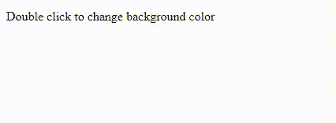

# 如何使用 jQuery 双击改变段落背景色？

> 原文:[https://www . geeksforgeeks . org/如何更改背景颜色-双击段落-使用-jquery/](https://www.geeksforgeeks.org/how-to-change-background-color-of-paragraph-on-double-click-using-jquery/)

在本文中，我们将看到如何使用 jQuery 更改段落的背景颜色。要更改背景颜色，我们使用 on()方法。on()方法用于侦听元素上的事件。这里我们要使用 **dblclick** 事件。为了改变背景颜色，我们将使用 css()方法。这个方法帮助我们动态添加 CSS 属性。更多细节可以参考[这篇文章](https://www.geeksforgeeks.org/how-to-add-css-properties-to-an-element-dynamically-using-jquery/)。

**语法:**

```html
$("p").on({
    dblclick: function(){
        $(this).css("property", "value");
    }
});
```

在这里，我们已经在主体标签内创建了一个段落，即

元素。我们在上面添加了双击事件。如果有人双击该段落，背景颜色将根据给定值切换。

**示例 1:** 在本例中，我们将使用 css()方法，动态地为段落元素添加背景颜色。

## 超文本标记语言

```html
<!DOCTYPE html>
<html lang="en">

<head>
    <script src=
"https://ajax.googleapis.com/ajax/libs/jquery/3.2.1/jquery.min.js">
    </script>

    <script>
        $(document).ready(function () {
            var toggle = true; // Toggle state
            $("p").on({
                dblclick: function () {
                    if (toggle) {

                        // Change background to red
                        $(this).css("background-color", "red");
                        toggle = false;
                    } else {

                        // Change background to default
                        $(this).css("background-color", "white");
                        toggle = true;
                    }
                }
            });
        });
    </script>
</head>

<body>
    <p>Double click to change background color</p>
</body>

</html>
```

**Output:**

**示例 2:** 在本例中，我们将使用 addClass()和 removeClass()方法动态添加或移除 CSS。

## 超文本标记语言

```html
<!DOCTYPE html>
<html lang="en">

<head>
    <script src=
"https://ajax.googleapis.com/ajax/libs/jquery/3.2.1/jquery.min.js">
    </script>

    <style>
        .toggle {
            background-color: green;
        }
    </style>

    <script>
        $(document).ready(function () {
            var toggle = true; // Toggle state
            $("p").on({
                dblclick: function () {
                    if (toggle) {

                        // Add class toggle to the paragraph
                        $(this).addClass("toggle");
                        toggle = false;
                    } else {

                        // Remove class toggle to the paragraph
                        $(this).removeClass("toggle");
                        toggle = true;
                    }
                }
            });
        });
    </script>
</head>

<body>
    <p>Hello GeeksforGeeks</p>
</body>

</html>
```

**Output:**
