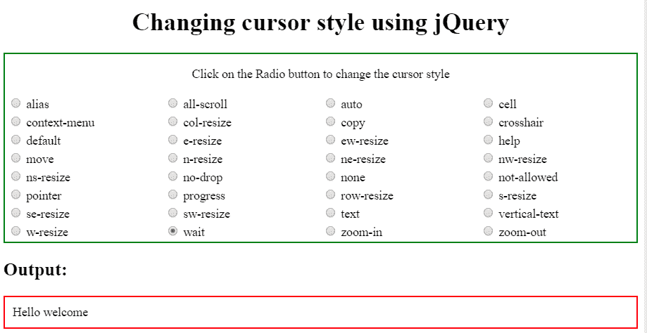

# 如何使用 jQuery 改变光标样式？

> 原文:[https://www . geesforgeks . org/how-change-cursor-style-using-jquery/](https://www.geeksforgeeks.org/how-to-change-cursor-style-using-jquery/)

光标样式用于指定鼠标光标指向元素时要显示的内容。

**光标值:**

*   **别名:**该属性用于显示光标指示要创建的内容。
*   **全滚动:**在该属性中，光标表示滚动。
*   **自动:**这是浏览器设置光标的默认属性。
*   **单元格:**在该属性中，光标表示选择了一个单元格或一组单元格。
*   **上下文菜单:**在该属性中，光标表示上下文菜单可用。
*   **col-resize:** 在该属性中，光标表示可以水平调整列的大小。
*   **复制:**在该属性中，光标表示要复制的内容。
*   **十字准线:**在该属性中，光标呈现为十字准线。
*   **默认:**默认光标。
*   **e-resize:** 在此属性中，光标指示框的边缘将向右移动。
*   **ew-resize:** 在该属性中，光标表示双向调整光标大小。
*   **帮助:**在该属性中，光标表示帮助可用。
*   **移动:**在该属性中，光标表示要移动的东西
*   **n-调整大小:**在该属性中，光标指示要上移的框的边缘。
*   **ne-resize:** 在该属性中，光标指示框的一条边要向上和向右移动。
*   **nesw-resize:** 该属性表示双向调整光标大小。
*   **ns-resize:** 该属性表示双向调整光标大小。
*   **NW-调整大小:**在该属性中，光标指示框的边缘将上下移动。
*   **nwse-resize:** 该属性表示双向调整光标大小。
*   **不拖放:**在该属性中，光标表示被拖动的项目不能放在这里。
*   **无:**该属性表示没有为元素渲染光标。
*   **不允许:**在该属性中，光标表示不会执行请求的动作。
*   **指针:**在该属性中，光标是指针，表示链接
*   **进度:**在该属性中，光标表示程序正忙。
*   **行-调整大小:**在该属性中，光标表示行可以垂直调整大小。
*   **s-调整大小:**在该属性中，光标指示要向下移动的框的边缘。
*   **se-resize:** 在该属性中，光标指示要向下和向右移动的框的边缘。
*   **sw-resize:** 在该属性中，光标指示框的边缘将被向下和向左移动。
*   **文本:**在该属性中，光标表示可以选择的文本。
*   **URL:** 在该属性中，自定义游标的 URL 列表以逗号分隔，列表末尾有一个通用游标。
*   **竖排文字:**在该属性中，光标表示可以选择的竖排文字。
*   **w-调整大小:**在此属性中，光标指示框的边缘将向左移动。
*   **等待:**在该属性中，光标表示程序正忙。
*   **放大:**在该属性中，光标表示有东西可以放大。
*   **缩小:**在该属性中，光标表示有东西可以缩小。
*   **初始值:**该属性用于设置为默认值。
*   **继承:**从其父元素继承。

**语法:**

```html
$(selector).style.cursor = ”cursor_property_value”;
```

**示例:**

```html
// Change the cursor on complete document
$(document).style.cursor = "alias"; 

// Change the cursor on particular element 
$("p").style.cursor = "alias"; 

// Change the cursor on particular element using class
$(".curs").style.cursor = "wait"; 

// Change the cursor on particular element using id
$("#curs").style.cursor = "crosshair"; 

```

**实现:**本例使用 jQuery css()函数显示不同的光标样式。

```html
<!DOCTYPE html>
<html>
    <head>
        <title>
            How to change cursor style using jQuery ?
        </title>

        <script src=
"https://ajax.googleapis.com/ajax/libs/jquery/3.3.1/jquery.min.js">
        </script>

        <script type="text/javascript">
            $(document).ready(function() {
                $("input[type='radio']").click(function() {
                    var radioValue = $("input[name='cursor']:checked").val();

                    if(radioValue) {
                        $("#block").css("cursor", radioValue );
                    }});
            });
    </script>
    </head>

    <body>
        <h1 align="center">
            Changing cursor style using jQuery
        </h1>

        <div style="border:2px solid green">

            <table width="100%" style="table-layout:fixed;">

                <p align="center">
                    Click on the Radio button to
                    change the cursor style
                </p>

                <tr>
                    <td>
                        <input type="radio" name="cursor" value="alias" >
                        alias 
                    </td>
                    <td>
                        <input type="radio" name="cursor" value="all-scroll" >
                        all-scroll
                    </td>
                    <td>
                        <input type="radio" name="cursor" value="auto" >
                            auto
                    </td>
                    <td>
                        <input type="radio" name="cursor" value="cell" >
                        cell
                    </td>
                </tr>

                <tr> 
                    <td>
                        <input type="radio" name="cursor" value="context-menu" >
                        context-menu
                    </td>
                    <td>
                        <input type="radio" name="cursor" value="col-resize" >
                        col-resize
                    </td>
                    <td>
                        <input type="radio" name="cursor" value="copy" >
                        copy
                    </td>
                    <td>
                        <input type="radio" name="cursor" value="crosshair" >
                        crosshair
                    </td>
                </tr>

                <tr>
                    <td>
                        <input type="radio" name="cursor" value="default" >
                        default
                    </td>
                    <td>
                        <input type="radio" name="cursor" value="e-resize" >
                        e-resize
                    </td>
                    <td>
                        <input type="radio" name="cursor" value="ew-resize" >
                        ew-resize
                    </td>
                    <td>
                        <input type="radio" name="cursor" value="help" >
                        help
                    </td>
                </tr>

                <tr> 
                    <td>
                        <input type="radio" name="cursor" value="move" >
                        move
                    </td>
                    <td>
                        <input type="radio" name="cursor" value="n-resize" >
                        n-resize
                    </td>
                    <td>
                        <input type="radio" name="cursor" value="ne-resize" >
                        ne-resize
                    </td>
                    <td>
                        <input type="radio" name="cursor" value="nw-resize" >
                        nw-resize
                    </td>
                </tr>

                <tr> 
                    <td>
                        <input type="radio" name="cursor" value="ns-resize" >
                        ns-resize
                    </td>
                    <td>
                        <input type="radio" name="cursor" value="no-drop" >
                        no-drop
                    </td>
                    <td>
                        <input type="radio" name="cursor" value="none" >
                        none
                    </td>
                    <td>
                        <input type="radio" name="cursor" value="not-allowed" >
                        not-allowed
                    </td>
                </tr>

                <tr> 
                    <td>
                        <input type="radio" name="cursor" value="pointer" >
                        pointer
                    </td>
                    <td>
                        <input type="radio" name="cursor" value="progress" >
                        progress
                    </td>
                    <td>
                        <input type="radio" name="cursor" value="row-resize" >
                        row-resize
                    </td>
                    <td>
                        <input type="radio" name="cursor" value="s-resize" >
                        s-resize
                    </td>
                </tr>

                <tr>
                    <td>
                        <input type="radio" name="cursor" value="se-resize" >
                        se-resize
                    </td>
                    <td>
                        <input type="radio" name="cursor" value="sw-resize" >
                        sw-resize
                    </td>
                    <td>
                        <input type="radio" name="cursor" value="text" >
                        text
                    </td>
                    <td>
                        <input type="radio" name="cursor" value="vertical-text" >
                        vertical-text
                    </td>
                </tr>

                <tr> 
                    <td>
                        <input type="radio" name="cursor" value="w-resize" >
                        w-resize
                    </td>
                    <td>
                        <input type="radio" name="cursor" value="wait" >
                        wait
                    </td>
                    <td>
                        <input type="radio" name="cursor" value="zoom-in" >
                        zoom-in
                    </td>
                    <td>
                        <input type="radio" name="cursor" value="zoom-out" >
                        zoom-out
                    </td>
                </tr>
            </table>
        </div>

        <section>
            <label>
                <h1>Output:</h1>
            </label> 

            <div id="block" style="padding:10px;border:2px solid red;">
                Hello welcome
            </div>
        </section>
    </body>

</html>                    
```

**输出:**
