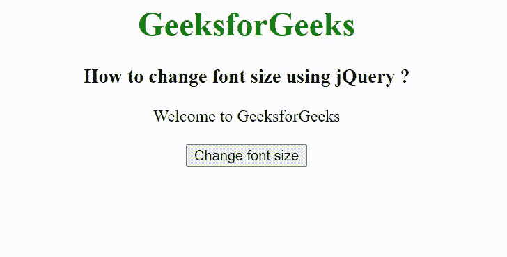

# 如何使用 jQuery 改变字体大小？

> 原文:[https://www . geesforgeks . org/how-change-font-size-use-jquery/](https://www.geeksforgeeks.org/how-to-change-font-size-using-jquery/)

在本文中，我们将看到如何使用 jQuery 更改元素的字体大小。要改变一个元素的字体大小，我们将使用 [css()方法](https://www.geeksforgeeks.org/jquery-css-method/)。

**css()方法**用于更改所选元素的样式属性。

**语法:**

```html
$(selector).css(property)
```

**返回值**:返回所选元素的属性值。

在下面的例子中，我们创建了一个包含一些文本的 div 元素，还创建了一个按钮元素。当用户点击按钮时，调用 css()方法，该方法将**字号属性值设置为 32px。**

**示例:**

## 超文本标记语言

```html
<!DOCTYPE html>
<html lang="en">

<head>
    <meta charset="UTF-8">
    <meta http-equiv="X-UA-Compatible" content="IE=edge">
    <meta name="viewport" content=
        "width=device-width, initial-scale=1.0">

    <!-- Including jQuery -->
    <script src="
https://ajax.googleapis.com/ajax/libs/jquery/3.3.1/jquery.min.js">
    </script>
</head>

<body>
    <center>
        <h1 style="color: green;">
            GeeksforGeeks
        </h1>

        <h3>
            How to change font size using jQuery?
        </h3>

        <div id="content">Welcome to GeeksforGeeks</div>
        <br>

        <button>Change font size</button>
    </center>

    <script>
        $(document).ready(function() {
            $('button').click(function() {
                $("#content").css("fontSize", "32px");
            });
        });
    </script>
</body>

</html>
```

**输出:**

