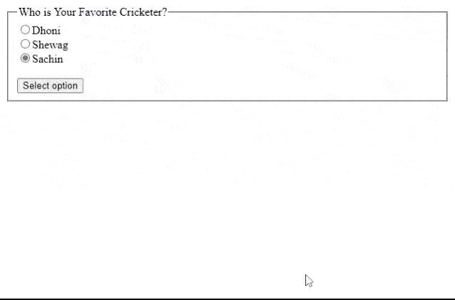

# 如何在 jQuery 中编程改变单选按钮状态？

> 原文:[https://www . geesforgeks . org/how-change-单选按钮-state-programmable-in-jquery/](https://www.geeksforgeeks.org/how-to-change-radio-button-state-programmatically-in-jquery/)

在本文中，我们将使用 jQuery 更改单选按钮的选定选项。要选择单选按钮的值，我们可以将*“选中”*设置为所需选项。对于属性的设置，我们可以使用 jQuery 中的 [**prop()**](https://www.geeksforgeeks.org/jquery-prop-with-examples/) 方法。

**语法:**

```html
$(selector).prop("checked", true); 
```

**注意:**选择器，是需要选择的无线电选项元素。

**示例:**让我们创建一个单选按钮组来选择最喜欢的板球运动员。我们创建了一个无线电选项。默认情况下，将选择“沙欣”。当我们点击按钮时，将选择程序中给出的“Dhoni”选项。

## 超文本标记语言

```html
<!DOCTYPE html>
<html>
  <head>
    <meta charset="utf-8" />
    <script src=
"https://ajax.googleapis.com/ajax/libs/jquery/1.8.3/jquery.min.js">
    </script>
  </head>
  <body>
    <fieldset>
      <legend>Who is Your Favorite Cricketer?</legend>
      <input type="radio" 
             name="favorite" 
             value="Dhoni" />Dhoni<br />
      <input type="radio" 
             name="favorite" 
             value="Shewag" />Shewag<br />
      <input type="radio" 
             name="favorite" checked 
             value="Sachin" />Sachin<br />
      <br />
      <button id="selectID">Select option</button>
    </fieldset>

    <script>
      $("#selectID").on("click", function () {
        selectRadio();
      });
      function selectRadio() {
        let radioOption = jQuery("input:radio[value=Dhoni]");

        // This will select the radio button
        radioOption.prop("checked", true);
      }
    </script>
  </body>
</html>
```

**输出:**



更改无线电状态