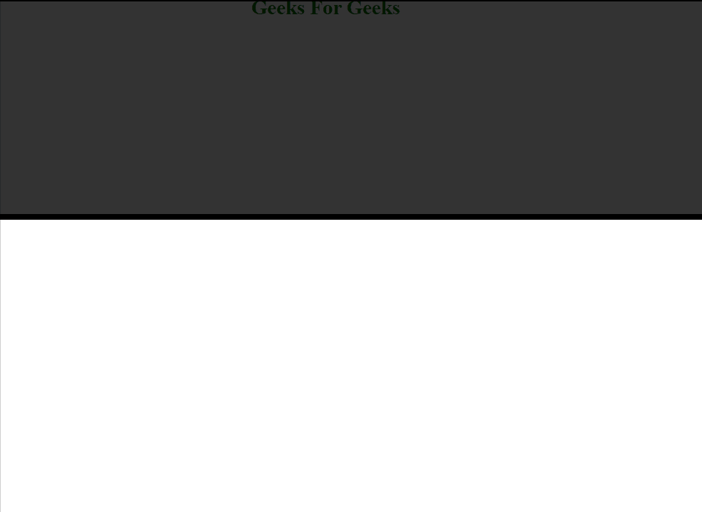

# 如何使用 jQuery 改变卷轴上元素的样式？

> 原文:[https://www . geeksforgeeks . org/如何使用-jquery/](https://www.geeksforgeeks.org/how-to-change-style-of-elements-on-scroll-using-jquery/) 更改滚动元素的样式

我们给出了一个包含一些 CSS 属性的 HTML 文档，任务是在使用 jQuery 滚动页面后，将 CSS 属性更改为特定的元素。为了改变滚动时元素的样式，我们得到元素内容水平或垂直滚动的像素数。

下面的示例说明了如何在元素滚动时更改元素的样式。当元素滚动时，改变元素样式的一种方法是改变元素所属的类。

**示例:**

## 超文本标记语言

```html
<!DOCTYPE html>
<html>

<head>
    <title>
        How to change style of elements 
        on scroll using jQuery?
    </title>

    <script src=
"https://ajax.googleapis.com/ajax/libs/jquery/3.3.1/jquery.min.js">
    </script>

    <style>
        .classinitial {
            height: 200px;
            background-color: rgba(255, 255, 255, 0.5);
            position: fixed;
            top: 200;
            width: 100%;
            transition: all 0.5s;
            background-clip: border-box;
            border-width: 5px;
            border-style: solid;
        }

        .classfinal {
            height: 100px;
            background-color: rgba(0, 0, 0, 0.8);
            position: fixed;
            top: 200;
            width: 100%;
            transition: all 0.5s;
            border-width: 8px;
            border-style: solid;
        }

        .wrapper {
            height: 2000px;
            padding-top: 200px;
            color: green;
            text-align: center;
            font-size: larger;
            font-weight: bold;
        }
    </style>
</head>

<body>
    <header class="classinitial"></header>
    <div class="wrapper">
        Geeks For Geeks
    </div>

    <script>
        $(function () {
            var header = $(".classinitial");
            $(window).scroll(function () {
                var scroll = $(window).scrollTop();

                if (scroll >= 155) {
                    header.removeClass('classinitial')
                            .addClass("classfinal");
                } else {
                    header.removeClass("classfinal")
                            .addClass('classinitial');
                }
            });
        });
    </script>
</body>

</html>
```

上面的代码在 CSS 样式属性的帮助下，为初始类和最终类(根据代码称为 classinitial 和 classfinal)都添加了样式。下面是 JavaScript 代码，它有助于改变 html 代码中的头元素的类。

如果页面垂直滚动了 155 个像素，jQuery 代码会将 header 元素的类从 classinitial 翻转到 classfinal。否则它会将类从 classfinal 翻转到 classinitial。为此，在上面的代码中使用了 jQuery 方法 addClass()和 removeClass()。这里，scrollTop()函数用于获取元素滚动的像素数，并将其保存在名为 scroll 的变量中。

**输出:**

