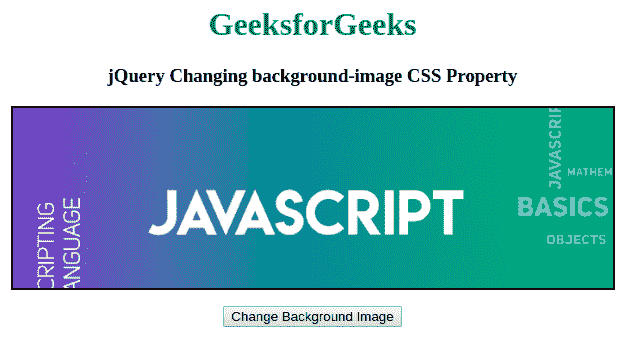
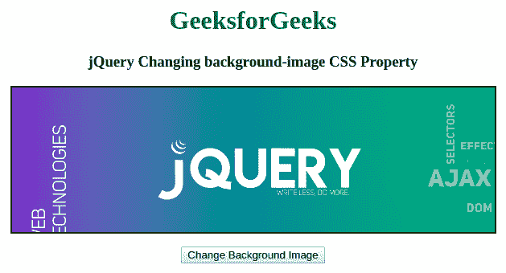

# 如何使用 jQuery 改变背景图像？

> 原文:[https://www . geeksforgeeks . org/如何使用-jquery/](https://www.geeksforgeeks.org/how-to-change-the-background-image-using-jquery/) 更改背景图像

要使用 jQuery 更改背景图像，可以使用 **jQuery CSS()方法**。为此，使用 **url()** 函数符号指定整个属性值。

**方法:**假设我们有一个图像 URL 存储在一个变量中，然后使用 [css()方法](https://www.geeksforgeeks.org/jquery-css-method/)改变背景图像的值。

以下示例说明了上述方法:

**示例:**

```

<!DOCTYPE html>
<html lang="en">

<head>
    <title>
    jQuery Changing background-image CSS Property
    </title>
    <style>
        .box {
            width: 700px;
            height: 220px;
            border: 2px solid black;
            background-repeat: no-repeat;
            background-image: url(
"https://www.geeksforgeeks.org/wp-content/uploads/javascript-768x256.png");
        }
        h1{
            color:green;
        }
    </style>
    <script src="https://code.jquery.com/jquery-1.12.4.min.js"></script>
    <script>
        $(document).ready(function() {
            // Change background image of a div by clicking on the button
            $("button").click(function() {
                var imageUrl = 
"https://www.geeksforgeeks.org/wp-content/uploads/jquery-banner-768x256.png";
                $(".box").css("background-image", "url(" + imageUrl + ")");
            });
        });
    </script>
</head>

<body>
    <center>
    <h1>GeeksforGeeks</h1>
    <h3>
    jQuery Changing background-image CSS Property
    </h3>
    <div class="box"></div>
    <p>
        <button type="button">
            Change Background Image
        </button>
    </p>
    </center>
</body>

</html>                    
```

**输出:**

*   **点击按钮前:**
    *   **After Clicking on the button:**
    

    jQuery 是一个开源的 JavaScript 库，它简化了 HTML/CSS 文档之间的交互，它以其“少写多做”的理念而闻名。
    跟随本 [jQuery 教程](https://www.geeksforgeeks.org/jquery-tutorials/)和 [jQuery 示例](https://www.geeksforgeeks.org/jquery-examples/)可以从头开始学习 jQuery。